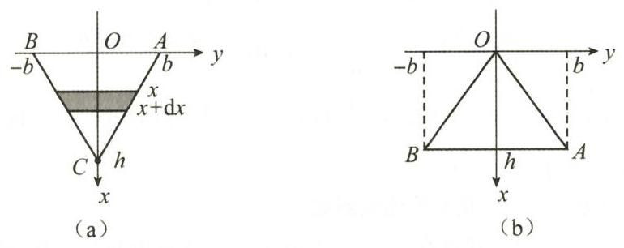
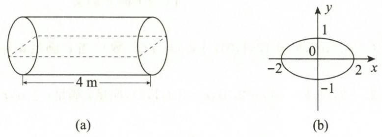

==========【第三章 一元函数积分学及其应用】==========

# 第三章 一元函数积分学及其应用

## 基础题

### 一、选择题

**(1)** 设 $f(x)$ 是连续函数，且 $f(x)\ne0$，若 $\displaystyle\int xf(x)\,dx=\arcsin x+C$，则 $\displaystyle\int\frac{dx}{f(x)}=$（　）.

A. $\dfrac13(1-x^2)^{3/2}+C$  
B. $\dfrac23(1-x^2)^{3/2}+C$  
C. $-\dfrac13(1-x^2)^{3/2}+C$  
D. $-\dfrac23(1-x^2)^{3/2}+C$

**(2)** 设 $f(x)$ 是连续函数，$F(x)$ 是 $f(x)$ 的原函数，则（　）.

A. 当 $f(x)$ 为奇函数时，$F(x)$ 必为偶函数  
B. 当 $f(x)$ 为偶函数时，$F(x)$ 必为奇函数  
C. 当 $f(x)$ 为周期函数时，$F(x)$ 必为周期函数  
D. 当 $f(x)$ 为单调函数时，$F(x)$ 必为单调函数

**(3)** 设 $\displaystyle\int_{-\infty}^{+\infty}f(x)\,dx=a$（$a$ 为常数），$f(x)$ 为偶函数，$\displaystyle F(x)=\int_{-\infty}^x f(t)\,dt$，则对任意 $x_0\in(-\infty,+\infty)$，$F(-x_0)=$（　）.

A. $-F(x_0)$  
B. $F(x_0)$  
C. $\displaystyle\frac a2-\int_0^{x_0}f(x)\,dx$  
D. $\displaystyle a-\int_0^{x_0}f(x)\,dx$

**(4)** 设 $F(x)$ 是 $\sin x^2$ 的一个原函数，则 $d[F(x^2)]=$（　）.

A. $\sin x^4\,dx$  
B. $\sin x^2\,d(x^2)$  
C. $2x\sin x^2\,dx$  
D. $2x\sin x^4\,dx$

**(5)** 设

$$
f(x)=
\begin{cases}
\sin x,&0\le x<\pi,\\
2,&\pi\le x\le2\pi,
\end{cases}
\qquad F(x)=\int_0^x f(t)\,dt,
$$

则（　）.

A. $x=\pi$ 是 $F(x)$ 的跳跃间断点  
B. $x=\pi$ 是 $F(x)$ 的可去间断点  
C. $F(x)$ 在 $x=\pi$ 处连续但不可导  
D. $F(x)$ 在 $x=\pi$ 处可导

**(6)** $\displaystyle f(x)=\begin{cases}x^2+1,&x\le0,\\ \cos x,&x>0\end{cases}$ 的一个原函数为（　）.

A. $\displaystyle F(x)=\begin{cases}\frac13x^3+x,&x\le0,\\ \sin x+1,&x>0\end{cases}$  
B. $\displaystyle F(x)=\begin{cases}\frac13x^3+x+1,&x\le0,\\ \sin x+2,&x>0\end{cases}$  
C. $\displaystyle F(x)=\begin{cases}\frac13x^3+x+1,&x\le0,\\ \sin x,&x>0\end{cases}$  
D. $\displaystyle F(x)=\begin{cases}\frac13x^3+x,&x\le0,\\ \sin x,&x>0\end{cases}$

**(7)** $\displaystyle\lim_{n\to\infty}\sum_{k=1}^n\int_k^{k+1}\frac{dx}{x\sqrt{x-1}}=$（　）.

A. $1$  
B. $\dfrac\pi2$  
C. $\pi$  
D. $2\pi$

**(8)** 设 $f(x)$ 在 $[0,1]$ 上连续，$f(x)>0,f'(x)<0,f''(x)>0$，记 $\displaystyle M=\int_0^1f(x)\,dx,\ N=f(1),\ P=\frac12[f(0)+f(1)]$，则（　）.

A. $M<N<N$  
B. $N<M<P$  
C. $P<M<N$  
D. $P<N<M$

**(9)** 设 $f(x)$ 在 $[0,+\infty)$ 上连续，且 $\displaystyle f(x)>\int_0^x f(t)\,dt\ (x\ge0)$，当 $0<a<b$ 时，下列选项中正确的是（　）.

A. $\displaystyle\int_0^bf(x)\,dx>\int_0^af(x)\,dx>\int_0^{(a+b)/2}f(x)\,dx$  
B. $\displaystyle\int_0^af(x)\,dx>\int_0^bf(x)\,dx>\int_0^{(a+b)/2}f(x)\,dx$  
C. $\displaystyle\int_0^af(x)\,dx>\int_0^{(a+b)/2}f(x)\,dx>\int_0^bf(x)\,dx$  
D. $\displaystyle\int_0^bf(x)\,dx>\int_0^{(a+b)/2}f(x)\,dx>\int_0^af(x)\,dx$

**(10)** 设

$$
I_1=\int_0^\pi\frac{x\sin^2x}{1+e^{\cos^2x}}\,dx,\qquad
I_2=\int_0^\pi\frac{\sin^2x}{1+e^{\cos^2x}}\,dx,\qquad
I_3=\int_0^{\pi/2}\frac{\cos^2x}{1+e^{\sin^2x}}\,dx,
$$

则（　）.

A. $I_1>I_2>I_3$  
B. $I_3>I_2>I_1$  
C. $I_2>I_1>I_3$  
D. $I_3>I_1>I_2$

**(11)** 设 $f(x)$ 在 $[0,1]$ 上是凹函数，且非负连续，$f(0)=0$，则下列选项中正确的是（　）.

A. $\displaystyle4\int_0^{1/2}f(x)\,dx\le\int_0^1f(x)\,dx$  
B. $\displaystyle4\int_0^{1/2}f(x)\,dx\ge\int_0^1f(x)\,dx$  
C. $\displaystyle8\int_0^{1/2}f(x)\,dx\le\int_0^1f(x)\,dx$  
D. $\displaystyle8\int_0^{1/2}f(x)\,dx\ge\int_0^1f(x)\,dx$

**(12)** 设 $\displaystyle\lim_{x\to0}\frac1{\sin x-ax}\int_b^x\frac{t^2}{\sqrt{1+t^2}}\,dt=c$，且 $c\ne0$，则（　）.

A. $a=1,b=0,c=-2$  
B. $a=1,b=-2,c=-2$  
C. $a=0,b=1,c=-2$  
D. $a=1,b=1,c=1$

**(13)** 设函数 $y=f(x)$ 由

$$
\begin{cases}
x=\displaystyle\int_0^t2e^{-u^2}\,du,\\[6pt]
y=\displaystyle\int_0^t\sin(t-u)\,du
\end{cases}
$$

确定，则当 $x\to0$ 时，$f(x)$ 是 $x^2$ 的（　）.

A. 高阶无穷小  
B. 等价无穷小  
C. 同阶但不等价无穷小  
D. 低阶无穷小

**(14)** 下列反常积分中收敛的是（　）.

A. $\displaystyle\int_1^{+\infty}\frac{dx}{x^2\sqrt{1+x}}$  
B. $\displaystyle\int_0^1\frac{dx}{\ln(1+x)}$  
C. $\displaystyle\int_{-1}^1\frac{dx}{\sin x}$  
D. $\displaystyle\int_{-\infty}^{+\infty}\frac{x}{\sqrt{1+x^2}}\,dx$

**(15)** 已知 $\displaystyle\int_1^{+\infty}\left(\frac{2x^2+ax+b}{2x^2+bx}-1\right)dx=1\ (b>0)$，则（　）.

A. $a=e-1,b=e$  
B. $a=b=2(e-1)$  
C. $a=e,b=e-1$  
D. $a=b=2e-1$

**(16)** 已知积分 $\displaystyle I=\int_2^{+\infty}\left(e^{\frac{\ln x}{x^a}}-1\right)dx$ 收敛，则 $a$ 的取值范围为（　）.

A. $(-\infty,0)$  
B. $(0,1]$  
C. $(1,+\infty)$  
D. $[1,+\infty)$

### 二、填空题

**(1)** 设 $F(x)$ 是 $f(x)$ 的一个原函数，$F\left(\dfrac\pi4\right)=0$，当 $\dfrac\pi4<x<\dfrac\pi2$ 时，$F(x)>0$，$\displaystyle F(x)f(x)=\frac{\ln(\tan x)}{\sin x\cos x}$，则 $f(x)=\underline{\qquad}$.

**(2)** 设对任意 $x$，有 $f(x+4)=f(x)$，且 $f'(x)=1+|x|,\ x\in(-2,2],\ f(0)=1$，则 $f(9)=\underline{\qquad}$.

**(3)** 设 $\displaystyle F(x)=\int_0^x tf(x^2-t^2)\,dt$，$f(x)$ 在 $x=0$ 某邻域内可导，且 $f(0)=0,f'(0)=1$，则 $\displaystyle\lim_{x\to0}\frac{F(x)}{x^4}=\underline{\qquad}$.

**(4)** 设 $f(x)$ 可导，对任意 $x,y$，有 $\displaystyle f(x+y)=\int_x^{x+y}\frac{t(t^2+1)}{f(t)}\,dt+f(x)$，且 $f(1)=\sqrt2$，则 $f(x)=\underline{\qquad}$.

**(5)** 设 $f(x)$ 在 $[0,+\infty)$ 上可导，$f(0)=0$，$y=f(x)$ 的反函数为 $g(x)$，若

$$
\int_x^{x+f(x)}g(t-x)\,dt=x^2\ln(1+x),
$$

则 $f(1)=\underline{\qquad}$.

**(6)** 极限 $\displaystyle\lim_{x\to0}\frac{\displaystyle\int_0^x\left[\int_0^{u^2}\arctan(1+t)\,dt\right]du}{x(1-\cos x)}=\underline{\qquad}$.

**(7)** $\displaystyle\lim_{x\to+\infty}\frac{\int_0^x|\sin t|\,dt}{x}=\underline{\qquad}$.

**(8)** 设 $\displaystyle\int_1^{+\infty}\frac{dx}{x(a+x^3)}=\frac13\ln2\ (a>0)$，则 $a=\underline{\qquad}$.

**(9)** 函数 $\displaystyle y=\frac{x^2}{\sqrt{1-x^2}}$ 在 $\left[\dfrac12,\dfrac{\sqrt3}{2}\right]$ 上的平均值为 $\underline{\qquad}$.

**(10)** 设 $\displaystyle f(x)=\int_0^{a-x}e^{t(2a-t)}\,dt\ (a>0),\ x\in[0,a]$，则曲线 $y=f(x)$ 与两坐标轴所围成图形的面积为 $\underline{\qquad}$.

**(11)** 曲线 $\displaystyle y=\frac{\sqrt{x}}{1+x^2}$ 绕 $x$ 轴旋转一周所得的旋转体，将它在 $x=0$ 与 $x=\xi\ (\xi>0)$ 之间部分的体积记为 $V(\xi)$，且 $\displaystyle V(a)=\frac12\lim_{\xi\to+\infty}V(\xi)$，则 $a=\underline{\qquad}$.

**(12)** 曲线 $\displaystyle r=a\sin^3\frac\theta3\ (a>0,0\le\theta\le3\pi)$ 的弧长 $s=\underline{\qquad}$.

**(13)** 曲线 $\displaystyle y=\int_{-\pi/2}^x\sqrt{\cos t}\,dt$ 的全长 $s=\underline{\qquad}$.

**(14)** 设 $D$ 是由曲线 $y=\sin x+1$ 与直线 $x=0,x=\pi,y=0$ 所围平面图形，则 $D$ 绕 $x$ 轴旋转一周所得旋转体的体积 $V=\underline{\qquad}$.

**(15)** 设 $n$ 为正数，$\displaystyle\lim_{x\to0}\left(\frac{n-x}{n+x}\right)^{2/x}=\int_{1/n}^{+\infty}xe^{-4x}\,dx$，则 $n=\underline{\qquad}$.

**(16)** 设质点以速度 $\sqrt t\,e^{-\sqrt t}\ (t\ge0)\text{ m/s}$ 做直线运动，则质点从开始运动到停止运动经过的路程为 $\underline{\qquad}\text{ m}$，它从 $t=0$ 到 $t=4\text{ s}$ 时间段内的平均速度为 $\underline{\qquad}\text{ m/s}$.

### 三、解答题

**(1)** 求下列积分：

**(I)** $\displaystyle\int\frac{2^x\cdot3^x}{9^x-4^x}\,dx$；

**(II)** $\displaystyle\int\frac{dx}{x^2(1-x^4)}$；

**(III)** $\displaystyle\int\frac{dx}{x^4(1+x^2)}$；

**(IV)** $\displaystyle\int\frac{\arctan x}{x^2(1+x^2)}\,dx$；

**(V)** $\displaystyle\int\frac{x+\ln(1-x)}{x^2}\,dx$.

**(2)** 求下列积分：

**(I)** $\displaystyle\int\frac{dx}{x(1+\sqrt x)}$；

**(II)** $\displaystyle\int\frac{xe^x}{\sqrt{e^x-1}}\,dx$；

**(III)** $\displaystyle\int\frac{x^3}{\sqrt{1+x^2}}\,dx$；

**(IV)** $\displaystyle\int\frac{dx}{(2x^2+1)\sqrt{1+x^2}}$；

**(V)** $\displaystyle\int\frac{\arctan\sqrt{x-1}}{x\sqrt{x-1}}\,dx$；

**(VI)** $\displaystyle\int\sqrt{\frac{x}{1-x\sqrt x}}\,dx$.

**(3)** 求下列积分：

**(I)** $\displaystyle\int\frac{dx}{\sin^2x\cos^4x}$；

**(II)** $\displaystyle\int\frac{dx}{1+\sin x}$；

**(III)** $\displaystyle\int\frac{\sin x}{\sin x+\cos x}\,dx$；

**(IV)** $\displaystyle\int\frac{3\sin x+\cos x}{\sin x+2\cos x}\,dx$；

**(V)** $\displaystyle\int\frac{dx}{\sin2x+2\sin x}$；

**(VI)** $\displaystyle\int\frac{dx}{a^2\sin^2x+b^2\cos^2x}\quad(a^2+b^2>0)$.

**(4)** 求下列积分：

**(I)** $\displaystyle\int\arctan\sqrt x\,dx$；

**(II)** $\displaystyle\int\frac{\ln x}{(1-x)^2}\,dx$；

**(III)** $\displaystyle\int\frac{x^2e^x}{(x+2)^2}\,dx$；

**(IV)** $\displaystyle\int\sin(\ln x)\,dx$；

**(V)** $\displaystyle\int\frac1{x^2}\sqrt{\frac{1-x}{1+x}}\,dx$；

**(VI)** $\displaystyle\int e^{2x}(1+\tan x)^2\,dx$.

**(5)** 求下列积分：

**(I)** $\displaystyle\int_{-\pi/4}^{\pi/4}\left(x^2\ln\frac{1+x}{1-x}-\cos x\right)dx$；

**(II)** $\displaystyle\int_{-1}^1(2+\sin x)\sqrt{1-x^2}\,dx$；

**(III)** $\displaystyle\int_{-2}^2(x+|x|)e^{-|x|}\,dx$；

**(IV)** $\displaystyle\int_{-1}^1\frac{2x^2+x(e^x+e^{-x})}{1+\sqrt{1-x^2}}\,dx$.

**(6)** 求下列积分：

**(I)** $\displaystyle\int_0^2(x-1)^2\sqrt{2x-x^2}\,dx$；

**(II)** $\displaystyle\int_0^\pi(e^{-\cos x}-e^{\cos x})\,dx$.

**(7)** 求下列积分：

**(I)** $\displaystyle\int_{-3}^2\min\{2,x^2\}\,dx$；

**(II)** $\displaystyle\int_{-1}^x(1-|t|)\,dt\quad(x\ge-1)$.

**(III)** $\displaystyle\int_{-1}^1|x-y|e^x\,dx\quad(|y|\le1)$；

**(IV)** $\displaystyle\int_0^\pi\sqrt{1-\sin x}\,dx$.

**(8)** 求下列积分：

**(I)** $\displaystyle\int_{-\pi/2}^{\pi/2}(x+\sin^2x)\cos^2x\,dx$；

**(II)** $\displaystyle\int_0^1x(1-x^4)^{3/2}\,dx$；

**(III)** $\displaystyle\int_0^\pi t\sin t\,dt$；

**(IV)** $\displaystyle\int_0^1\left[\sqrt{2x-x^2}+\sqrt{(1-x^2)^3}\right]dx$.

**(9)** 求下列积分：

**(I)** $\displaystyle\int_1^{+\infty}\frac{dx}{e^{x+1}+e^{3-x}}$；

**(II)** $\displaystyle\int_{1/2}^{3/2}\frac{dx}{\sqrt{|x-x^2|}}$.

**(10)** 设 $\displaystyle f(x)=\int_0^{\pi/2}|x-t|\sin t\,dt,\ x\in(-\infty,+\infty)$，求 $f(x)$ 的单调区间与极值.

**(11)** 设 $\displaystyle F(x)=\int_0^{|\sin x|}f(tx^2)\,dt$，其中 $f(x)$ 为连续函数，求 $F'(x)$，并讨论 $F'(x)$ 在 $x=0$ 处的连续性.

**(12)** 设 $f(x)$ 在 $[0,a]$ 上具有二阶导数 $(a>0)$，且 $f(x)>0,f''(x)>0$，证明：

$$
\int_0^af(x)\,dx>af\left(\frac a2\right).
$$

**(13)** 设 $f(x)$ 在 $[a,b]$ 上连续且单调增加，证明：

$$
\int_a^bxf(x)\,dx\ge\frac{a+b}{2}\int_a^bf(x)\,dx.
$$

**(14)** 求 $\displaystyle f(x)=\int_0^x\frac{2t-1}{t^2-t+1}\,dt$ 在 $[-1,1]$ 上的最大值与最小值.

**(15)** 设曲线 $y=\sin x\ \left(0\le x\le\dfrac\pi2\right)$、直线 $y=k\ (0\le k\le1)$ 与 $x=0$ 所围面积为 $S_1$，$y=\sin x\ \left(0\le x\le\dfrac\pi2\right)$、$y=k$ 与 $x=\dfrac\pi2$ 所围面积为 $S_2$，求 $S=S_1+S_2$ 的最小值.

**(16)** 设星形线

$$
\begin{cases}
x=a\cos^3t,\\
y=a\sin^3t
\end{cases}
\quad(0\le t\le2\pi,a>0).
$$

求：

**(I)** 所围面积 $A$；

**(II)** 弧长 $L$；

**(III)** 绕 $x$ 轴旋转一周所得体积 $V$ 和表面积 $S$.

**(17)** 设立体图形的底是介于 $y=x^2-1$ 和 $y=0$ 之间的平面区域，而它的垂直于 $x$ 轴的任一截面是等边三角形，求立体体积 $V$.

## 综合题

### 一、选择题

**(1)** 设在 $(-1,1)$ 内 $f(x)$ 是奇函数，$F(x)$ 是 $f(x)$ 在 $(-1,1)$ 内的一个原函数，则在 $(-1,1)$ 内 $f(x)+F(x)$（　）.

A. 是可导的偶函数  
B. 是连续的奇函数  
C. 存在原函数  
D. 存在原函数且原函数为奇函数

**(2)** 设 $\displaystyle f(x)=\lim_{n\to\infty}\frac{\ln(e^n+x^n)}n\ (x>0)$，则 $\displaystyle F(x)=\int_1^xf(t)\,dt$ 在区间 $[1,+\infty)$ 上（　）.

A. 不连续  
B. 连续但不可导  
C. 可导但二阶不可导  
D. 二阶可导

**(3)** 设 $\displaystyle I_1=\int_0^{\pi/2}\sin(\sin x)\,dx,\ I_2=\int_0^{\pi/2}\cos(\sin x)\,dx$，则（　）.

A. $I_1<1<I_2$  
B. $I_2<1<I_1$  
C. $1<I_1<I_2$  
D. $I_1<I_2<1$

**(4)** 设

$$
I_1=\int_0^1\ln(1+x)\,dx,\quad
I_2=\int_0^1\frac{\arctan x}{1+x}\,dx,\quad
I_3=\int_0^1\sqrt{\ln(1+x)}\,dx,
$$

则（　）.

A. $I_3>I_1>I_2$  
B. $I_3>I_2>I_1$  
C. $I_1>I_2>I_3$  
D. $I_2>I_3>I_1$

**(5)** 设

$$
I_1=\int_0^{\pi/2}\frac{\cos x}{1+x^2}\,dx,\quad
I_2=\int_0^{\pi/2}\frac{\sin x}{1+x^2}\,dx,\quad
I_3=\int_0^{\pi/2}\frac{\sin x}{(1+x)^2}\,dx,
$$

则（　）.

A. $I_1>I_2>I_3$  
B. $I_3>I_2>I_1$  
C. $I_2>I_1>I_3$  
D. $I_3>I_1>I_2$

**(6)** 设 $f(x)$ 在 $[0,1]$ 上可导，$f(x)>0,f'(x)<0$，$F(x)=\displaystyle\int_0^x f(t)\,dt$，则在 $x\in(0,1)$ 内，有（　）.

A. $xF(1)>2\displaystyle\int_0^1F(x)\,dx$  
B. $F(1)>2\displaystyle\int_0^1F(x)\,dx$  
C. $F(x)<2\displaystyle\int_0^1F(x)\,dx$  
D. $F(x)>2\displaystyle\int_0^1F(x)\,dx$

**(7)** 设函数 $f(x)$ 在 $[0,a] (a>0)$ 上有二阶连续导数，且 $f(0)=0,f''(x)>0$，则下列选项中正确的是（　）.

A. $3\displaystyle\int_0^a xf(x)\,dx<2\displaystyle\int_0^a af(x)\,dx$  
B. $3\displaystyle\int_0^a xf(x)\,dx>2\displaystyle\int_0^a af(x)\,dx$  
C. $2\displaystyle\int_0^a xf(x)\,dx>3\displaystyle\int_0^a af(x)\,dx$  
D. $2\displaystyle\int_0^a xf(x)\,dx<3\displaystyle\int_0^a af(x)\,dx$

**(8)** 设 $f(x)$ 二阶可导，则下列结论中正确的是（　）.

① 当 $f'(x)<0$ 时，则 $\displaystyle\int_{-\pi}^{\pi}f(x)\sin x\,dx<0$；  
② 当 $f'(x)<0$ 时，则 $\displaystyle\int_{-\pi}^{\pi}f(x)\sin x\,dx>0$；  
③ 当 $f''(x)>0$ 时，则 $\displaystyle\int_{-\pi}^{\pi}f(x)\cos x\,dx>0$；  
④ 当 $f''(x)>0$ 时，则 $\displaystyle\int_{-\pi}^{\pi}f(x)\cos x\,dx<0$.

A. ②③  
B. ①②  
C. ②④  
D. ①④

**(9)** 设反常积分 $\displaystyle\int_1^{+\infty}x^k\left(e^{-\cos(1/x)}-e^{-1}\right)\,dx$ 收敛，则下列选项中正确的是（　）.

A. $k>-1$  
B. $k<-1$  
C. $k>1$  
D. $k<1$

**(10)** 设螺线 $r=\theta\ (0\le\theta\le2\pi)$ 与极轴所围区域的面积为 $A$，则 $A=$（　）.

A. $\displaystyle\lim_{n\to\infty}\sum_{i=1}^n\frac{4\pi^3i^2}{n^3}$  
B. $\displaystyle\lim_{n\to\infty}\sum_{i=1}^n\frac{4\pi^3i^2}{n^2}$  
C. $\displaystyle\lim_{n\to\infty}\sum_{i=1}^n\frac{8\pi^3i^2}{n^3}$  
D. $\displaystyle\lim_{n\to\infty}\sum_{i=1}^n\frac{2\pi^3i^2}{n^2}$

**(11)** 设 $f(x)$ 有连续导数，$f(0)=0,f'(0)=6$，

$$
\alpha(x)=\int_0^{x^3}f(t)\,dt,\qquad
\beta(x)=\left[\int_0^x f(t)\,dt\right]^3,
$$

则当 $x\to0$ 时，$\alpha(x)$ 与 $\beta(x)$ 是（　）.

A. 同阶但非等价无穷小  
B. 等价无穷小  
C. 高阶无穷小  
D. 低阶无穷小

**(12)** 已知方程

$$
\int_1^x\frac{\ln t}{1+t}\,dt+\int_1^{1/x}\frac{\ln t}{1+t}\,dt=a\quad(x>0)
$$

有实根，则 $a$ 的取值范围为（　）.

A. $(0,+\infty)$  
B. $[0,+\infty)$  
C. $(0,1)$  
D. $[1,+\infty)$

**(13)** 设反常积分 $\displaystyle\int_0^{+\infty}\frac{\ln(1+x)}{x^p}\,dx$ 收敛，则（　）.

A. $0<p<2$  
B. $1<p<2$  
C. $0<p\le1$  
D. $p>1$

**(14)** 设积分 $\displaystyle I=\int_1^{+\infty}\frac{dx}{x^p\ln^q x}\ (p>0,q>0)$ 收敛，则（　）.

A. $p>1$ 且 $q<1$  
B. $p>1$ 且 $q>1$  
C. $p<1$ 且 $q<1$  
D. $p<1$ 且 $q>1$

**(15)** 积分 $\displaystyle\int_0^{+\infty}\frac{x^{1-p}\arctan x}{2+x^p}\,dx\ (p>0)$ 收敛，则 $p$ 的取值范围（　）.

A. $1<p<3$  
B. $2<p<3$  
C. $1\le p<2$  
D. $0<p<3$

**(16)** 已知 $\displaystyle I=\int_0^{+\infty}\left(\frac1{\sqrt{x^2+4}}-\frac{a}{x+2}\right)\,dx$ 收敛，则（　）.

A. $a=1,I=\ln4$  
B. $a>1,I=\ln2$  
C. $a=1,I=\ln2$  
D. $a<1,I=\ln4$

### 二、填空题

**(1)** 设 $f(x)$ 在 $[a,b]$ 上连续，若 $x_0\in[a,b],x\in[a,b]$，则极限

$$
\lim_{\Delta x\to0}\frac1{\Delta x}\int_{x_0}^{x}\left[f(t+\Delta x)-f(t)\right]dt=\underline{\qquad}.
$$

**(2)** 设 $f(x)$ 在 $\left(0,\dfrac\pi2\right)$ 内可导，$f(x)>0,\displaystyle\lim_{x\to0^+}f(x)=1$，且

$$
\lim_{t\to0}\left[\frac{f(x+t\sin x)}{f(x)}\right]^{1/t}
=e^{\frac{\sin x-x\cos x}{x}},
$$

则 $f(x)=\underline{\qquad}$.

**(3)** 双纽线 $(x^2+y^2)^2=x^2-y^2$ 围成的平面图形的面积为 $\underline{\qquad}$.

**(4)** 心形线 $r=1+\cos\theta$ 的全长为 $\underline{\qquad}$.

**(5)** 曲线 $\displaystyle\theta=\frac12\left(r+\frac1r\right)$ 在区间 $r\in[1,3]$ 上的弧长为 $\underline{\qquad}$.

**(6)** 闭曲线 $(x^2+y^2)^3=x^4+y^4$ 所围区域的面积 $S=\underline{\qquad}$.

**(7)** 设 $f(x)$ 在 $(0,+\infty)$ 内可导，且 $f'(1)=3$，$f(x)$ 的反函数为 $g(x)$，且

$$
\int_2^{f(\ln x+1)}g(t)\,dt=x\ln x,
$$

则 $g'(3)=\underline{\qquad}$.

**(8)** 设 $f(2)=\dfrac12,f'(2)=0$，且 $\displaystyle\int_0^2f(x)\,dx=1$，则

$$
I=\int_0^1x^2f''(2x)\,dx=\underline{\qquad}.
$$

**(9)** 设 $f(x)$ 在 $[0,+\infty)$ 上可导，$\ln(1+x)$ 是 $f(x)$ 的一个原函数，且

$$
F(x)=\lim_{t\to\infty}t^2\left[f\left(2x+\frac1t\right)-f(2x)\right]\sin\frac xt,
$$

则 $F(x)$ 在 $[0,1]$ 上的平均值为 $\underline{\qquad}$.

**(10)** 已知 $\displaystyle\int_0^{+\infty}\frac{\sin x}{x}\,dx=\frac\pi2$，则

$$
I=\int_0^{+\infty}\frac{\sin^2x}{x^2}\,dx=\underline{\qquad}.
$$

**(11)** $\displaystyle\int_1^{+\infty}\frac1{\sqrt{x}}\ln\frac{x+1}{x}\,dx=\underline{\qquad}$.

**(12)** $\displaystyle\lim_{n\to\infty}\sum_{k=1}^n\left[\frac{k}{2n^2+k}+\ln\left(\frac{n+k}{n}\right)^{1/n}\right]=\underline{\qquad}$.

**(13)** $\displaystyle\lim_{x\to0^+}\frac1{\ln\frac1x}\int_x^{+\infty}\frac{e^{-t}}t\,dt=\underline{\qquad}$.

**(14)** $\displaystyle\int_1^2\left[\frac1{x\ln^2x}-\frac1{(x-1)^2}\right]dx=\underline{\qquad}$.

**(15)** 设 $f(x)$ 满足

$$
\int_0^x f(t-x)\,dt=x+\frac12x^2+\ln|1-x|,
$$

则 $y=f(x)$ 的斜渐近线方程为 $\underline{\qquad}$.

**(16)** 已知曲线 $y=y(x)$ 上任一点 $(x,y)$ 处的切线斜率为 $\displaystyle\frac1{x\sqrt{x^2-1}}$，且曲线通过点 $(-2,0)$，则该曲线方程为 $y=\underline{\qquad}$.

**(17)** 设

$$
f(t)=\lim_{n\to\infty}\sum_{i=1}^n
\frac{t-1}{[n+(t-1)i]\sqrt{\dfrac{t-1}{n}i}}\quad(t>1),
$$

则 $\displaystyle\lim_{t\to+\infty}f(t)=\underline{\qquad}$.

### 三、解答题

**(1)**

**(I)** 设 $\displaystyle f(x)=\int_1^x\frac{dt}{\sqrt{1+t^4}}$，求 $\displaystyle I=\int_0^1x^2f(x)\,dx$；

**(II)** 设 $\displaystyle f(x)=\int_1^{x^2}e^{-t^2}\,dt$，求 $\displaystyle I=\int_0^1xf(x)\,dx$.

**(2)** 设 $\displaystyle f(\sin^2x)=\frac{x}{\sin x}$，求 $\displaystyle I=\int\frac{\sqrt{x}}{\sqrt{1-x}}f(x)\,dx$.

**(3)** 计算积分 $\displaystyle I=\int e^{\sin x}\cdot\frac{x\cos^3x-\sin x}{\cos^2x}\,dx$.

**(4)** 计算 $\displaystyle I=\int\frac{e^{-\sin x}\cdot\sin2x}{\sin^4\left(\frac\pi4-\frac x2\right)}\,dx$.

**(5)** 设 $\displaystyle f(\ln x)=\frac{\ln(1+x)}x$，求 $\displaystyle I=\int f(x)\,dx$.

**(6)** 设 $f'(x)=\arctan(x-1)^2,f(0)=0$，求 $\displaystyle I=\int_0^1f(x)\,dx$.

**(7)** 求极限

$$
\lim_{x\to0}\frac{\dfrac12\displaystyle\int_0^2x\sqrt{4-x^2u^2}\,du-2x}{\sqrt{1+2x^3}-1}.
$$

**(8)** 设 $f(x)$ 在 $(-\infty,0]$ 上连续，且满足

$$
\int_0^x tf(t^2-x^2)\,dt=\frac{x^2}{1+x^2}-\frac12\ln(1+x^2),
$$

求函数 $f(x)$ 及其极值.

**(9)** 设 $f(x)$ 在 $[1,+\infty)$ 上可导，$f(1)=2$，且满足

$$
\lim_{t\to0}\frac{f[(x+t)^2]-f(x^2+t)}{(2x-1)t}=1-2\ln x,
$$

求 $f(x)$ 及 $f(x)$ 的极值.

**(10)** 计算 $\displaystyle\lim_{x\to0}\frac{\int_0^{2x}\left|1-\frac tx\right|\sin t\,dt}{x^2}$.

**(11)** 设可导函数 $y=f(x)$ 由方程 $e^{x-2y}-x^2y=1$ 确定，计算

$$
\lim_{x\to1^+}\frac{\sin(x-1)}{\sqrt{(x-1)^3}}\int_0^1f(t\sqrt{x-1})\,dt.
$$

**(12)** 设 $f(x)$ 满足

$$
e^{-x}-\frac{x^2}{2}=1+\int_0^x f(t-x)\,dt,
$$

求 $f(x)$ 在 $(-\infty,+\infty)$ 内的最值.

**(13)** 证明：$\displaystyle\lim_{n\to\infty}\int_0^1\frac{x^n}{1+x}\,dx=0$.

**(14)** 求极限

$$
\lim_{n\to\infty}\left(
\frac{2^{1/n}}{n+1}+\frac{2^{2/n}}{n+\frac12}+\cdots+\frac{2^{n/n}}{n+\frac1n}
\right).
$$

**(15)** 求极限 $\displaystyle\lim_{n\to\infty}\frac1n\sqrt[n]{n(n+1)(n+2)\cdots(2n-1)}$.

**(16)** 设 $f(x)$ 是连续的偶函数，函数 $g(x)$ 连续，且满足 $g(x)\cdot g(-x)=1$.

**(I)** 证明：$\displaystyle\int_{-a}^a\frac{f(x)}{1+g(x)}\,dx=\int_0^a f(x)\,dx$；

**(II)** 计算 $\displaystyle\int_{-\pi/4}^{\pi/4}\frac{dx}{(1+e^x)\cos^2x}$.

**(17)** 设 $\displaystyle\int_0^{+\infty}f(x)\,dx$ 收敛，且

$$
f(x)=\frac1{1+x^2}-\frac{e^{-x}}{1+e^x}\int_0^{+\infty}f(x)\,dx,
$$

求 $\displaystyle\int_0^{+\infty}f(x)\,dx$.

**(18)** 设 $\displaystyle a_n=\int_0^\pi x\sin^nx\,dx\ (n=1,2,\cdots)$.

**(I)** 证明：$\displaystyle a_n=\frac{n-1}{n}a_{n-2}\ (n=3,4,\cdots)$；

**(II)** 求 $\displaystyle\lim_{n\to\infty}\frac{a_n}{a_{n-1}}$.

**(19)**

**(I)** 求积分 $\displaystyle I_n=\int\frac1{(x^2+a^2)^n}\,dx\ (n\ge1,a>0)$ 的递推关系；

**(II)** 计算 $\displaystyle I=\int\frac{3x+4}{(x^2+2x+2)^2}\,dx$.

**(20)** 证明：$\displaystyle f(x)=\int_0^x(t-t^2)\sin^{2n}t\,dt\ (x>0)$ 的最大值为 $f(1)$，且

$$
f(1)\le\frac1{(2n+2)(2n+3)}.
$$

**(21)** 设 $f(x)$ 在 $[a,b]$ 上二阶可导，且 $f''(x)>0$，证明：

$$
f\left(\frac{a+b}{2}\right)
<\frac1{b-a}\int_a^b f(x)\,dx
<\frac{f(a)+f(b)}2.
$$

**(22)** 设 $f(x)$ 在 $[a,b]\ (a<b)$ 上连续，且

$$
\int_a^b f(x)\,dx=\int_a^bxf(x)\,dx=0,
$$

证明：至少存在不同的 $\xi_1,\xi_2\in(a,b)$，使得 $f(\xi_1)=f(\xi_2)=0$.

**(23)** 设 $y=f(x)$ 在 $[0,1]$ 上是非负连续函数.

**(I)** 证明：存在 $x_0\in(0,1)$，使得在 $[0,x_0]$ 上以 $f(x_0)$ 为高的矩形面积，等于在 $[x_0,1]$ 上以 $y=f(x)$ 为曲边的曲边梯形面积；

**(II)** 又设 $f(x)$ 在 $(0,1)$ 内可导，且 $\displaystyle f'(x)>-\frac{2f(x)}x$，证明：（I）中的 $x_0$ 是唯一的.

**(24)** 设 $f(x)$ 在 $(-\infty,+\infty)$ 内连续，且满足 $f(x+T)=f(x),T>0,f(-x)=f(x)$.

**(I)** 证明：$\displaystyle\int_0^{nT}xf(x)\,dx=\frac{n^2T}{2}\int_0^T f(x)\,dx$（$n$ 为正整数）；

**(II)** 计算 $\displaystyle I=\int_0^{n\pi}x|\cos x|\,dx$.

**(25)** 设曲线 $y=a\sqrt{x}\ (a>0)$ 与 $y=\ln\sqrt{x}$ 在点 $(x_0,y_0)$ 处有公切线. 求：

**(I)** 常数 $a$ 及点 $(x_0,y_0)$；

**(II)** 两曲线与 $x$ 轴所围图形绕 $x$ 轴旋转一周所得旋转体的体积.

**(26)** 求曲线

$$
4y=\int_0^2x\sqrt{12-x^2u^2}\,du\quad(x\ge0)
$$

的全长.

**(27)** 设平面图形 $D$ 由 $x^2+y^2\le2x$ 与 $y\ge x$ 确定，求图形 $D$ 绕直线 $x=2$ 旋转一周所得旋转体的体积.

**(28)** 求曲线 $y=e^{-x}\sqrt{\sin x}\ (x\ge0)$ 绕 $x$ 轴旋转所得旋转体的体积.

**(29)** 设摆线

$$
\begin{cases}
x=a(t-\sin t),\\
y=a(1-\cos t)
\end{cases}
\quad(0\le t\le2\pi,a>0)
$$

与 $x$ 轴所围平面图形为 $D$. 求：

**(I)** $D$ 绕 $x$ 轴、$y$ 轴各旋转一周所得旋转体的体积；

**(II)** $D$ 绕直线 $y=2a$ 旋转一周所得旋转体的体积.

**(30)** 求圆 $(x-2)^2+y^2=1$ 绕 $y$ 轴旋转一周所得旋转体的表面积.

**(31)** 求双纽线 $r^2=a^2\cos2\theta\ (a>0)$ 绕极轴旋转所成旋转曲面的面积.

**(32)** 设 $f(x)=x^n\sqrt{1-x^2},x\in[0,1]$ 与 $y=0$ 所围平面区域的面积为 $S_n$，$g(x)=\sin^{n/2}x,x\in\left[0,\dfrac\pi2\right]$ 与 $y=0$ 所围平面区域绕 $x$ 轴旋转一周所得体积为 $V_n\ (n=1,2,\cdots)$，求极限 $\displaystyle\lim_{n\to\infty}\frac{\pi S_n}{V_n}$.

**(33)** 设曲线 $y=\sin x$ 在 $x\in[0,n\pi]\ (n=1,2,\cdots)$ 上与 $x$ 轴所围成的区域为 $D$，$D$ 绕 $y$ 轴旋转一周所得旋转体的体积为 $a_n$.

**(I)** 求 $a_n$；

**(II)** 求极限 $\displaystyle\lim_{n\to\infty}\sum_{k=1}^n\frac{2k\pi^2}{a_n}\sin\frac{k\pi}{2n}$.

**(34)** 将半径为 $R$ 的球沉入水中，它与水面相切，设球的密度与水的密度相等，现将球从水中取出，问至少需要做功多少？

**(35)** 设如图（a）和（b）所示为同一等腰三角形薄板，已知其底为 $2b$、高为 $h$，将其垂直放入静水中，图（a）是其底与水面相齐，图（b）是其顶点与水面相齐，设图（a）与图（b）薄板一侧所受压力分别为 $P_1$ 和 $P_2$，求 $\dfrac{P_2}{P_1}$.

**(36)** 求曲线 $y=3-|x^2-1|$ 与 $x$ 轴围成封闭图形绕直线 $y=3$ 旋转所得旋转体的体积.

**(37)** 设心形线 $r=4(1+\cos\theta)$ 与 $\theta=0,\theta=\dfrac\pi2$ 所围图形为 $D$，求 $D$ 绕极轴旋转一周所得旋转体的体积.

**(38)** 设 $D$ 位于曲线 $\displaystyle y=\frac1{x(\ln x)^{a+1}}\ (a>0,2\le x<+\infty)$ 下方、$x$ 轴上方的无界区域. 求：

**(I)** $D$ 的面积 $S(a)$；

**(II)** $S(a)$ 的最小值.

**(39)** 设 $f(x)$ 连续且严格单调递减.

**(I)** 证明：当 $x\in(0,1)$ 时，有 $\displaystyle x\int_0^1f(t)\,dt<\int_0^x f(t)\,dt<xf(0)$；

**(II)** 若 $\displaystyle\int_0^1f(t)\,dt\ge0,f(0)\le1,x_0\in(0,1),x_n=\int_0^{x_{n-1}}f(t)\,dt\ (n=1,2,\cdots)$，证明：$\displaystyle\lim_{n\to\infty}x_n$ 存在，并求其值.

**(40)** 设有一质量为 $m$ 的均匀杆 $AB$，$A$、$B$ 的坐标分别为 $\left(-\dfrac l2,0\right)$ 与 $\left(\dfrac l2,0\right)$，单位质量的质点 $C$ 的坐标为 $(0,a)\ (a>0)$.

**(I)** 求杆 $AB$ 与质点 $C$ 的相互吸引力；

**(II)** 当质点 $C$ 沿 $y$ 轴正向移向无穷远处时，求克服吸引力所做的功.

**(41)** 设非负函数 $f(x)$ 在区间 $[0,1]$ 上有连续的二阶导数，且 $f(0)=1,f''(x)<0$，证明：

**(I)** 当 $x\in[0,1]$ 时，有 $\displaystyle\int_0^x f(t)\,dt\ge\frac12[xf(x)+x]$；

**(II)** $\displaystyle\int_0^1\left(\frac23-x\right)f(x)\,dx\ge\frac16$.

## 拓展题

### 解答题

**(1)** 如图（a）所示，在水平放置的椭圆底柱形容器内存放液体（密度为 $\rho$，单位：$\mathrm{kg/m^3}$），容器长为 $4\mathrm m$，椭圆方程为 $\displaystyle\frac{x^2}{4}+y^2=1$（单位：$\mathrm m$），如图（b）所示.

**(I)** 当液面在过点 $(0,y)\ (-1\le y\le1)$ 处的水平线时，问容器内液体的体积是多少？

**(II)** 当容器内存满了液体后，平均每分钟从容器顶端抽出 $0.16\mathrm{m^3}$ 的液体，当液面降至 $y=0$ 处时，求液体下降的速度.

**(III)** 问抽出全部液体需做多少功？

**(2)** 设 $f(x)$ 在 $[a,b]$ 上有二阶导数，且 $f(a)=f(b)=0,f''(x)<0$，证明：当 $x\in(a,b)$ 时，有

$$
0<f(x)<\frac2{b-a}\int_a^b f(x)\,dx.
$$

**(3)** 设 $f(x)$ 在 $[a,b]$ 上有连续的二阶导数.

**(I)** 证明：

$$
\int_a^b f(x)\,dx
=\frac12(b-a)[f(a)+f(b)]
+\frac12\int_a^b(x-a)(x-b)f''(x)\,dx;
$$

**(II)** 记 $\displaystyle M=\max_{x\in[a,b]}\{|f''(x)|\}$，证明：

$$
\left|\int_a^b f(x)\,dx-\frac12(b-a)[f(a)+f(b)]\right|
\le\frac{(b-a)^3}{12}M.
$$

**(4)** 设 $f(x)$ 在 $[0,+\infty)$ 上有连续的二阶导数，且 $|f''(x)|\le1$.

**(I)** 证明：$\displaystyle\left|\int_0^1f(x)\,dx-f\left(\frac12\right)\right|\le\frac1{24}$.

**(II)** 若对任意的 $x\in[0,+\infty)$，有 $f(x)=f(x+1)$，$n$ 为正整数. 证明：

$$
\left|\int_0^n f(x)\,dx\right|\le n\left[\frac16+|f(0)|\right].
$$
