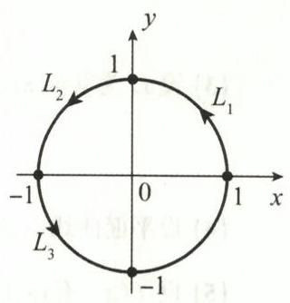

# 第九章 曲线积分与曲面积分

## 基础题

### 一、选择题

**(1)** 设 $L$ 为圆周 $x^2+y^2=2x$，则 $\displaystyle I=\int_Lx\,ds=$（　）.

A. $2\pi$  
B. $\pi$  
C. $1$  
D. $0$

**(2)** 设 $S$ 为球面 $(x-a)^2+(y-b)^2+(z-c)^2=1$（$a,b,c$ 均大于零），则 $\displaystyle I=\iint_S(x+y+z)dS=$（　）.

A. $4\pi$  
B. $4\pi(a+b+c)$  
C. $0$  
D. $\dfrac43\pi(a+b+c)$

**(3)** 设 $S:x^2+y^2+z^2=R^2\ (z\ge0)$，$S_1$ 为 $S$ 在第一卦限的部分，则（　）.

A. $\displaystyle\iint_Sx\,dS=4\iint_{S_1}x\,dS$  
B. $\displaystyle\iint_Sy\,dS=4\iint_{S_1}y\,dS$  
C. $\displaystyle\iint_Sz\,dS=4\iint_{S_1}z\,dS$  
D. $\displaystyle\iint_Sxyz\,dS=4\iint_{S_1}xyz\,dS$

**(4)** 设 $D=\{(x,y)\mid(x-1)^2+(y-1)^2\le2\}$，$L$ 为 $D$ 的边界曲线，取顺时针方向，

$$
I_1=\int_Lx\,dx+\frac{(x+y)^2}{8}dy,
$$

$$
I_2=\int_Lx\,dx+\frac{(x-y)^2}{8}dy,
\qquad
I_3=\int_L\frac{(x+y)^2}{8}dx+y\,dy,
$$

则（　）.

A. $I_1>I_2>I_3$  
B. $I_3>I_2>I_1$  
C. $I_2>I_3>I_1$  
D. $I_2>I_1>I_3$

### 二、填空题

**(1)** 设 $S$ 为平面 $x+y+z=4$ 被圆柱面 $x^2+y^2=1$ 截出的有限部分，则 $\displaystyle I=\iint_Sz\,dS=\underline{\qquad}$.

**(2)** 设 $L$ 为 $x^2+y^2=R^2\ (y\ge0)$ 上由点 $A\left(-\dfrac R{\sqrt2},\dfrac R{\sqrt2}\right)$ 到点 $B(R,0)$ 的一段弧，则 $\displaystyle\int_Ly\,ds=\underline{\qquad}$，$\displaystyle\int_Ly\,dx=\underline{\qquad}$.

**(3)** 设 $L$ 为球面 $x^2+y^2+z^2=R^2$ 与平面 $x+y+z=0$ 的交线，则 $\displaystyle I=\oint_L(z+x^2)ds=\underline{\qquad}$.

**(4)** 设曲线 $L$ 为 $x^2+y^2+z^2=\dfrac92$ 与 $x+z=1$ 的交线，则 $\displaystyle I=\oint_L(x^2+y^2+z^2)ds=\underline{\qquad}$.

**(5)** 设曲面 $S:|x|+|y|+|z|=1$，则 $\displaystyle I=\iint_S(x+y+|z|)dS=\underline{\qquad}$.

**(6)** 设 $\Sigma:(x-a)^2+(y-a)^2+(z-a)^2=2a^2\ (a>0)$，则 $\displaystyle I=\iint_\Sigma(x+y+z-\sqrt3a)dS=\underline{\qquad}$.

**(7)** 设 $L$ 为点 $(1,-1,2)$ 到点 $(2,1,3)$ 的直线段，则 $\displaystyle I=\int_L(x^2+y^2+z^2)ds=\underline{\qquad}$.

**(8)** 设曲线 $L$ 为上半圆周 $y=\sqrt{1-x^2}$，则 $\displaystyle\int_L(x-y)^2e^{x^2+y^2}ds=\underline{\qquad}$.

**(9)** 设立体 $\Omega$ 为 $x^2+y^2+z^2\le2z$，其密度 $\rho(x,y,z)=x^2$，则 $\Omega$ 的质量为 $\underline{\qquad}$.

### 三、解答题

**(1)** 设 $L$ 为由 $r=a\ (a>0),\theta=0$ 和 $\theta=\dfrac\pi4$ 所围凸平面区域的边界，$(r,\theta)$ 为极坐标，计算

$$
I=\int_Le^{\sqrt{x^2+y^2}}ds.
$$

**(2)** 设 $L$ 为 $\left(x-\dfrac12\right)^2+y^2=\dfrac14\ (y\ge0)$ 上从点 $O(0,0)$ 到点 $A(1,0)$ 的一段弧，计算

$$
I=\int_L[3+(2-\sqrt2)y+e^x\sin y]dx+(\sqrt2x+e^x\cos y)dy.
$$

**(3)** 计算积分 $\displaystyle I=\oint_L\frac{x\,dy-y\,dx}{x^2+y^2}$，其中

**(I)** $L$ 为 $(x+2)^2+(y-2)^2=1$，取逆时针方向；

**(II)** $L$ 为 $x^2+y^2=1$，取逆时针方向；

**(III)** $L$ 为 $\displaystyle\frac{x^2}{a^2}+\frac{y^2}{b^2}=1$，取逆时针方向.

**(4)** 设 $L:x^2+y^2=R^2\ (R>1)$，取逆时针方向，计算

$$
I=\oint_L\frac{x\,dy-y\,dx}{4x^2+9y^2}.
$$

**(5)** 设曲线 $L:x^2+y^2=R^2\ (R>0)$，取逆时针方向，问 $R$ 为何值时，积分

$$
I(R)=\oint_Ly^3dx+(3x-x^3)dy
$$

取得最大值，并求最大值.

**(6)** 设平面力场为 $\boldsymbol F=(2xy^3-y^2\cos x)\boldsymbol i+(1-2y\sin x+3x^2y^2)\boldsymbol j$，求质心在 $\boldsymbol F$ 作用下，沿 $L:2x=\pi y^2$ 从点 $O(0,0)$ 到点 $A\left(\dfrac\pi2,1\right)$ 所做的功 $W$.

**(7)** 计算 $\displaystyle I=\int_L\frac{x\,dy-y\,dx}{x^2+y^2}$，其中 $L$ 是从点 $A(1,1)$ 沿直线到点 $B(-1,0)$，再沿曲线 $y=x^2-1$ 到点 $C(1,0)$.

**(8)** 设

$$
P(x,y)=\frac{x\left(\sqrt{x^2+y^2}\right)^k}{y},\qquad
Q(x,y)=-\frac{x^2\left(\sqrt{x^2+y^2}\right)^k}{y^2},\qquad
D=\{(x,y)\mid y>0\}.
$$

**(I)** 若积分 $\displaystyle I=\int_LPdx+Qdy$ 在 $D$ 内与路径无关，求 $k$ 的值；

**(II)** 在 $D$ 内求函数 $u(x,y)$，使得 $du=Pdx+Qdy$，并计算 $\displaystyle I=\int_{(1,1)}^{(2,2)}Pdx+Qdy$.

**(9)** 设曲线 $L$ 为 $z=4-x^2-y^2$ 与 $z=3$ 的交线，从 $z$ 轴正向看是逆时针方向，计算

$$
I=\oint_Lx^2y^3dx+zdy+ydz.
$$

**(10)** 设曲线 $L$ 为锥面 $z=\sqrt{x^2+y^2}$ 与圆柱面 $x^2+y^2=2x$ 的交线，从 $z$ 轴正向往负向看去，$L$ 为逆时针方向，计算

$$
I=\int_L(y^2+z^2)dx+(z^2-x^2)dy+(x^2+y^2)dz.
$$

**(11)** 设曲面 $S$ 为上半圆锥 $z=\sqrt{x^2+y^2}$ 被圆柱面 $x^2+y^2=2ax\ (a>0)$ 所截出的有限部分，计算

$$
I=\iint_S(x^2y+yz^2+z^2x)dS.
$$

**(12)** 设 $S$ 为 $z=x^2+y^2$ 介于 $z=0$ 与 $z=1$ 之间部分的下侧，计算

$$
I=\iint_Sx^2dy\,dz+zdx\,dy.
$$

**(13)** 设 $S$ 为曲面 $4-y=x^2+z^2$ 上 $y\ge0$ 的部分，取外侧，计算

$$
I=\iint_Syz\,dy\,dz+(x^2+z^2)y\,dz\,dx+xy\,dx\,dy.
$$

**(14)** 设曲面为 $z=\sqrt{x^2+y^2}$ 介于 $z=1$ 与 $z=2$ 之间的部分，取上侧，计算

$$
I=\iint_Sxz^2dy\,dz+y^2dz\,dx+zx\,dx\,dy.
$$

**(15)** 设 $S$ 是 $x^2+y^2=1,z=-1,z=1$ 所围成的圆柱体的全表面，计算

$$
I=\iint_{S_{\text{外}}}\frac{x\,dy\,dz+z^2dx\,dy}{x^2+y^2+z^2}
$$

（$S_{\text{外}}$ 表示外侧）.

**(16)** 一个体积为 $V$，表面积为 $S$（不含底面）的雪堆，融化速度为 $\displaystyle\frac{dV}{dt}=-aS$，其中 $a>0$ 为常数，设在融化期间雪堆的形状保持为

$$
z=h-\frac{x^2+y^2}{h}\quad(z>0),
$$

其中 $h=h(t)$，问一个高度为 $h_0\ (h_0>0)$ 的雪堆全部融化需要多长时间？

## 综合题

### 一、选择题

**(1)** 设曲线 $L$ 为 $x^2+y^2=1$，取逆时针方向，$f(x,y)>0$，$f(x,-y)=f(x,y)$. $L_1,L_2,L_3$ 如图 9 所示，记

$$
I_1=\int_{L_1}f(x,y)dx,\qquad
I_2=\int_{L_2}f(x,y)ds,\qquad
I_3=\int_{L_3}f(x,y)dx,
$$

则（　）.

A. $I_1>I_2>I_3$  
B. $I_2>I_3>I_1$  
C. $I_3>I_2>I_1$  
D. $I_2>I_1>I_3$

**(2)** 设 $L$ 为闭曲线 $|x|+|y|=1$，取逆时针方向，则 $\displaystyle I=\oint_L\frac{ax\,dy-by\,dx}{|x|+|y|}=$（　）.

A. $8(a+b)$  
B. $2(a+b)$  
C. $8(a-b)$  
D. $2(a-b)$

**(3)** 设 $L$ 为平面光滑简单闭曲线，取逆时针方向，$L$ 所围区域的面积为 $S$，则（　）.

A. $\displaystyle S=\oint_Ly\,dy-x\,dx$  
B. $\displaystyle S=\frac12\oint_Lx\,dy-y\,dx$  
C. $\displaystyle S=\oint_Lx\,dy-y\,dx$  
D. $\displaystyle S=\frac12\oint_Ly\,dy-x\,dx$

**(4)** 设 $\Sigma$ 为曲面 $z=\sqrt{x^2+y^2}$ 的下侧，$P=P(x,y,z),Q=Q(x,y,z)$ 均为连续函数，则 $\displaystyle\iint_\Sigma Pdy\,dz-Qdz\,dx=$（　）.

A. $\displaystyle\iint_\Sigma\left(-\frac xzP+\frac yzQ\right)dx\,dy$  
B. $\displaystyle\iint_\Sigma\left(-\frac xzP-\frac yzQ\right)dx\,dy$  
C. $\displaystyle\iint_\Sigma\left(\frac xzP-\frac yzQ\right)dx\,dy$  
D. $\displaystyle\iint_\Sigma\left(\frac xzP+\frac yzQ\right)dx\,dy$

### 二、填空题

**(1)** 设 $L:x^2+y^2=1$，则 $\displaystyle I=\oint_L\left[\left(x+\frac12\right)^2+\left(\frac y2+1\right)^2\right]ds=\underline{\qquad}$.

**(2)** 设 $L:x^2+y^2=R^2$，取顺时针方向，则

$$
I=\oint_L\frac{e^{x^2}-x^2y}{x^2+y^2}dx+\frac{xy^2-e^{y^2}}{x^2+y^2}dy=\underline{\qquad}.
$$

**(3)** 设积分 $\displaystyle I=\int_LF(x,y)(y\,dx+x\,dy)$ 与路径无关，且 $F(x,y)=0$ 确定的隐函数的图形过点 $(1,2)$ 且与坐标轴无交点，其中 $F(x,y)$ 可微，则 $F(x,y)=0$ 确定的隐函数为 $\underline{\qquad}$.

**(4)** 设曲面 $S:x^2+y^2+z^2=2x$，其密度为 $\rho=x^2+y^2+z^2$，则曲面 $S$ 的质量 $m=\underline{\qquad}$.

**(5)** 设光滑有向曲面 $S$ 的边界曲线为光滑有向闭曲线 $L$，方向符合右手法则，则 $\displaystyle I=\oint_L\operatorname{grad}\sin(x+y+z)\cdot d\boldsymbol s=\underline{\qquad}$.

**(6)** 向量场 $\boldsymbol A(x,y,z)=(x+y+z)\boldsymbol i+xy\boldsymbol j+z\boldsymbol k$ 在点 $P(1,1,1)$ 处的旋度 $\operatorname{rot}\boldsymbol A=\underline{\qquad}$，$\operatorname{div}\boldsymbol A=\underline{\qquad}$.

**(7)** 设 $\boldsymbol\gamma=x\boldsymbol i+y\boldsymbol j+z\boldsymbol k$，$\boldsymbol n$ 为球面 $S:x^2+y^2+z^2=1$ 的外单位法向量，则 $\displaystyle\iint_S\boldsymbol\gamma\cdot\boldsymbol n\,dS=\underline{\qquad}$.

### 三、解答题

**(1)** 设 $f(x)$ 有二阶连续导数，$f(0)=0,f'(0)=1$，曲线积分

$$
I=\int_L[xe^{2x}-6f(x)]\sin y\,dx-[5f(x)-f'(x)]\cos y\,dy
$$

与路径无关，求 $f(x)$ 的表达式.

**(2)** 设 $f(x,y)$ 在 $\dfrac{x^2}{4}+y^2\le1$ 上有二阶偏导数，$L$ 为 $\dfrac{x^2}{4}+y^2=1$，取顺时针方向，计算

$$
I=\oint_L[-3y+f'_x(x,y)]dx+f'_y(x,y)dy.
$$

**(3)** 设 $L$ 为 $y=\pi\cos x$ 从 $A(\pi,-\pi)$ 到 $B(-\pi,-\pi)$ 的曲线，计算

$$
I=\int_L\frac{(x+y)dx-(x-y)dy}{x^2+y^2}.
$$

**(4)** 设平面曲线 $L$ 为 $|\ln x|+|\ln y|=1$，取逆时针方向，计算

$$
I=\oint_L\frac{-y\,dx+x\,dy}{|\ln x|+|\ln y|}.
$$

**(5)** 设 $f(x)$ 有连续导数，$L$ 为从点 $A(2,2\pi)$ 沿 $(x-1)^2+(y-\pi)^2=1+\pi^2$ 的上半圆周到点 $O(0,0)$ 的一段弧，计算

$$
I=\int_Lf'(x)\sin y\,dx+[f(x)\cos y-\pi x]dy.
$$

**(6)** 设 $f(y)$ 有连续导数，$f(0)=0$，曲线 $\widehat{OA}$ 的极坐标方程为 $r=a(1-\cos\theta),a>0,0\le\theta\le\pi$，$O(0,0)$ 与 $A$ 分别对应于 $\theta=0$ 与 $\theta=\pi$，计算

$$
I=\int_{\widehat{OA}}[f(y)e^x-\pi y]dx+[f'(y)e^x-\pi]dy.
$$

**(7)** 设 $f(x)$ 在 $(-\infty,+\infty)$ 内有连续导数，$L$ 为从点 $A\left(3,\dfrac23\right)$ 到点 $B(1,2)$ 的直线段，计算

$$
I=\int_L\frac{1+y^2f(xy)}y\,dx+\frac x{y^2}[y^2f(xy)-1]dy.
$$

**(8)** 设在 $D=\{(x,y)\mid y>0\}$ 内，$f(x,y)$ 有一阶连续偏导数，$f(x,y)\ne0$，且对任意 $t>0$，有 $f(tx,ty)=t^2f(x,y)$，证明：对 $D$ 内的任意分段光滑的有向简单闭曲线 $L$，都有

$$
\oint_L\frac y{f(x,y)}dx-\frac x{f(x,y)}dy=0.
$$

**(9)** 设曲面 $\Sigma:z=x^2+y^2\ (z\le1)$ 与平面 $z=1$ 所围均匀立体为 $V$，$M$ 为 $\Sigma$ 上一动点，当曲面 $\Sigma$ 在点 $M$ 处的切平面与 $V$ 的质心距离最近时，点 $M$ 的轨迹方程记为 $L$.

**(I)** 求 $V$ 的质心坐标；

**(II)** 求曲线 $L$，并计算 $\displaystyle I=\int_Lx\,dy-y\,dx+z\,dz$，从 $Oz$ 轴的正向往负向看去，$L$ 取逆时针方向.

**(10)** 设曲面 $S$ 为由圆柱面 $x^2+y^2=R^2$、平面 $z=0$ 和 $z-x=R\ (R>0)$ 所围立体的表面，计算 $\displaystyle I=\iint_Sz\,dS$.

**(11)** 设球面为 $x^2+y^2+z^2=R^2$，柱面为 $x^2+y^2=Rx\ (R>0)$，球面在柱体内的面积为 $S_1$，柱面在球体内的面积为 $S_2$，求 $\dfrac{S_1}{S_2}$.

**(12)** 设薄片型物体 $S$ 为圆锥面 $z=\sqrt{x^2+y^2}$ 被柱面 $z^2=2x$ 割下的有限部分，其上任一点的密度为 $\mu(x,y,z)=9\sqrt{x^2+y^2+z^2}$，记圆锥面与柱面的交线为 $C$. 求：

**(I)** $C$ 在 $xOy$ 面上的投影曲线方程；

**(II)** $S$ 的质量.

**(13)** 在半径为 $a$ 的球表面上取一点，以该点为球心作半径为 $R$ 的球，问 $R$ 为何值时，该球位于定球内的表面积最大？

**(14)** 设立体 $\Omega$ 由曲面 $\Sigma:x^2+y^2=-2x(z-1)\ (0\le z\le1)$ 与平面 $z=0$ 围成，$\Omega$ 的密度 $\rho=1$.

**(I)** 求 $\Omega$ 的形心坐标 $\bar x$；

**(II)** 计算 $\displaystyle I=\iint_\Sigma\frac{2x^2}{\sqrt{4x^4+(x^2+y^2)^2}}dS$.

**(15)** 设 $f(u)$ 有连续导数，$S$ 为 $z=\sqrt{x^2+y^2}$ 与两个半球面 $z=\sqrt{1-x^2-y^2},z=\sqrt{4-x^2-y^2}$ 所围立体的全表面的外侧，计算

$$
I=\oiint_S\left[\frac1{y+3}f\left(\frac{x+4}{y+3}\right)+3xy^2\right]dy\,dz
+\left[\frac1{x+4}f\left(\frac{x+4}{y+3}\right)+3x^2y\right]dz\,dx
+z^3dx\,dy.
$$

**(16)** 已知点 $A(0,0,0)$ 与 $B(0,1,1)$，$\Sigma$ 是由直线段 $AB$ 绕 $z$ 轴旋转一周所得的旋转曲面（介于 $z=1$ 与 $z=2$ 之间部分的内侧），$f(x)$ 可导.

**(I)** 求曲面 $\Sigma$ 的方程；

**(II)** 计算

$$
I=\iint_\Sigma\left[xf\left(\frac xy\right)+x\right]dy\,dz
+\left[yf\left(\frac xy\right)+y\right]dz\,dx
+\left[zf\left(\frac xy\right)+4z\right]dx\,dy.
$$

**(17)** 设 $\Sigma$ 是直线

$$
\begin{cases}
x=0,\\
y=0
\end{cases}
$$

绕直线 $L:x=y=z$ 旋转一周所得的曲面，$L_1$ 为 $\Sigma$ 与平面 $x+y+z=1$ 的交线，$L_1$ 的正向与 $\boldsymbol n=(1,1,1)$ 满足右手法则.

**(I)** 求曲面 $\Sigma$ 的方程；

**(II)** 计算 $\displaystyle I=\oint_{L_1}z\,dx+x\,dy+y\,dz$.

**(18)** 设曲面 $S:z=\sqrt{R^2-x^2-y^2}\ (R>0)$，取下侧，计算

$$
I=\iint_S\frac{Rx\,dy\,dz+(R+z)^2dx\,dy}{\sqrt{x^2+y^2+z^2}}.
$$

**(19)** 设 $S$ 为椭球面 $x^2+2y^2+3z^2=1$ 外侧，计算

$$
I=\oiint_S\frac{x\,dy\,dz+y\,dz\,dx+z\,dx\,dy}{(x^2+y^2+z^2)^{\frac32}}.
$$

**(20)** 设 $\Omega=\{(x,y,z)\mid x^2+y^2+z^2\le2ty,t>0\}$，$\Omega$ 的边界曲面记为 $\Sigma$，取外侧，$f(u)$ 在 $\Omega$ 上可导，且 $f(0)=1$，

$$
I(t)=\oiint_\Sigma xf(z)dy\,dz+zf(x)dz\,dx+xf(y)dx\,dy.
$$

计算 $\displaystyle\lim_{t\to0^+}\frac{I(t)}{t^3}$.

**(21)** 设 $\Sigma$ 为曲面 $z=2-x^2-y^2\ (x\ge0,y\ge0)$ 被柱面 $x^2+y^2=1$ 所截出部分的上侧，计算

$$
I=\iint_\Sigma yz\,dx\,dy+zx\,dy\,dz+xy\,dz\,dx.
$$

**(22)** 在球面 $z=\sqrt{1-x^2-y^2},x\ge0,y\ge0$ 上，取以 $M_1(1,0,0)$，$M_2(0,1,0)$，$M_3\left(\dfrac{\sqrt2}{2},0,\dfrac{\sqrt2}{2}\right)$ 为顶点的球面三角形 $\Sigma$，$\Sigma$ 的法向量的方向余弦 $\cos\gamma>0$，计算

$$
I=\iint_\Sigma\frac{x\,dy\,dz+z\,dx\,dy}{x^2+y^2+z^2}.
$$

**(23)** 设曲面 $S$ 为球面 $x^2+y^2+z^2=4z$ 与锥面 $\displaystyle z=\frac{\sqrt{x^2+y^2}}{\sqrt3}$ 所围，且位于锥面上方部分的立体表面，流速场为

$$
\boldsymbol A(x,y,z)=\left(\frac13x^3+x^2y+x^2z,\frac13y^3+y^2z,\frac13z^3\right),
$$

求 $\boldsymbol A(x,y,z)$ 从曲面 $S$ 内部流向外部的流量 $\Phi$.

**(24)** 设 $\Sigma:x^2+y^2+z^2=2y$，计算 $\displaystyle I=\iint_\Sigma(x^2+2y^2+3z^2)dS$.

**(25)** 设平面力 $\boldsymbol F(x,y)=(P(x,y),Q(x,y))$，其中 $P(x,y)=f(x)+y[e^{-x}-f'(x)],Q(x,y)=f'(x)$，$f(x)$ 有二阶连续导数，且 $f'(0)=0$.

**(I)** 若力 $\boldsymbol F$ 对运动质点所做的功与质点运动路径无关，求 $f(x)$；

**(II)** 在（I）的基础上，若 $L$ 是从点 $A(-1,1)$ 到点 $B(1,0)$ 的光滑有向曲线，且 $\displaystyle\int_LP(x,y)dx+Q(x,y)dy=\dfrac4e$，求 $f(x)$ 的极值.

## 拓展题

### 解答题

**(1)** 设 $f(x,y)$ 在 $D=\{(x,y)\mid x^2+y^2\le1\}$ 上有二阶连续偏导数，且

$$
\frac{\partial^2f}{\partial x^2}+\frac{\partial^2f}{\partial y^2}=e^{-(x^2+y^2)},
$$

计算 $\displaystyle I=\iint_D\left(x\frac{\partial f}{\partial x}+y\frac{\partial f}{\partial y}\right)dxdy$.

**(2)** 设 $\Sigma$ 为光滑闭曲面，取外侧，

$$
I=\iint_\Sigma(x^3-x)dy\,dz+(y^3-y)dz\,dx+(z^3-z)dx\,dy.
$$

**(I)** 确定曲面 $\Sigma$ 使得 $I$ 最小，并求 $I$ 的最小值；

**(II)** 若满足（I）的曲面 $\Sigma$ 被锥面 $z=\sqrt{x^2+y^2}$ 所截且位于锥面上方的部分为 $\Sigma_1$，求曲面 $\Sigma_1$ 的面积.
