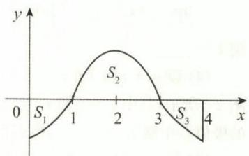
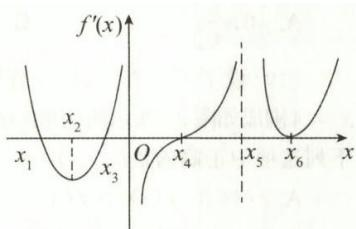
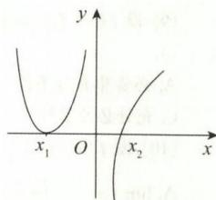

# 第二章 一元函数微分学及其应用

## 综合题

### 一、选择题

**(1)** 设 $f(x)$ 在 $(1-\delta,1+\delta)(\delta>0)$ 内存在导数， $f'(x)$ 严格单调减少，且 $f(1)=f'(1)=1$ ，则（　）.

A. 在 $(1-\delta,1)$ 和 $(1,1+\delta)$ 内，均有 $f(x)<x$  
B. 在 $(1-\delta,1)$ 和 $(1,1+\delta)$ 内，均有 $f(x)>x$  
C. 在 $(1-\delta,1)$ 内， $f(x)<x$ ；在 $(1,1+\delta)$ 内， $f(x)>x$  
D. 在 $(1-\delta,1)$ 内， $f(x)>x$ ；在 $(1,1+\delta)$ 内， $f(x)<x$

**(2)** 设 $f(x)$ 在 $[0,+\infty)$ 上二阶可导， $f(0)=0$ ， $f''(x)<0$ ，当 $0<a<x<b$ 时，有（　）.

A. $af(x)>xf(a)$  
B. $bf(x)>xf(b)$  
C. $xf(x)>bf(b)$  
D. $xf(x)>af(a)$

**(3)** 设 $f(x)=(x-a)\ln x-x$ 有两个极值点，则实数 $a$ 的取值范围为（　）.

A. $\left[-\dfrac{1}{\mathrm{e}},+\infty\right)$  
B. $\left(-\dfrac{1}{\mathrm{e}},+\infty\right)$  
C. $\left[-\dfrac{1}{\mathrm{e}},0\right)$  
D. $\left(-\dfrac{1}{\mathrm{e}},0\right)$

**(4)** 设 $f(x)$ 在 $x=0$ 的某邻域内有定义，则 $F(x)=f(x)|\sin x|$ 在 $x=0$ 处可导的充分必要条件是（　）.

A. $\lim_{x\to0}f(x)$ 存在  
B. $\lim_{x\to0}f(x)=f(0)$  
C. $f(x)$ 在 $x=0$ 处可导  
D. $\lim_{x\to0^{-}}f(x)$ 和 $\lim_{x\to0^{+}}f(x)$ 均存在, 且 $\lim_{x\to0^{-}}f(x)=-\lim_{x\to0^{+}}f(x)$

**(5)** 设 $f(x)$ 在 $(-\infty,+\infty)$ 内是连续的奇函数， $F(x)=\int_{0}^{|x|}f(t)dt$ ，则下列选项中正确的是（　）.

A. $F(x)$ 是不可导的奇函数  
B. $F(x)$ 是可导的偶函数  
C. $F(x)$ 是不可导的偶函数  
D. $F(x)$ 是可导的奇函数

**(6)** 设 $f(x)$ 在 $(-1,1)$ 内可导, 且 $\lim_{x\to0}\dfrac{f(x)}{x^2}=1$ , 则 （　）.

A. $\lim_{x\to0}\dfrac{f'(x)}{x}$ 存在  
B. $\lim_{x\to0}\dfrac{f'(x)}{x}$ 不存在  
C. $f'(0)=0,f''(0)=2$  
D. $f(0)$ 是 $f(x)$ 的极小值

**(7)** 下列结论中正确的是（　）.

① 若 $f(x)$ 在 $x=a$ 处连续，且 $\lim_{x\to0}\dfrac{f(a+x^3)-f(a)}{x^2}$ 存在，则 $f'(a)$ 存在；

②若 $\lim_{n\to\infty}n\left[f\left(a+\dfrac{1}{n}\right)-f(a)\right](n$ 为正整数)存在，则 $f^{\prime}(a)$ 存在；

③若 $f(x)=(x-a)\varphi(x)$ ，其中 $\varphi(x)$ 在x=a处连续，则 $f'(a)$ 存在；

④存在 $\delta>0$ ，对 $\forall x\in(a-\delta,a+\delta)$ ，有 $|f(x)|\leqslant L|x-a|^a$ ，其中 $L>0$ ， $a>1$ 为常数，则 $f'(a)$ 存在.

A. ①②  
B. ②③  
C. ②④  
D. ③④

**(8)** 下列函数在 $x=0$ 处不可导的是 （　）.

A. $|x|\int_{0}^{x}\sin t^{2}dt$  
B. $|\sin(x-\sin x)|$  
C. $\int_{-1}^{x}\sqrt{|t|}\ln|t|dt$  
D. $\sqrt{\mathrm{e}^{|x|}}$

**(9)** $y=f(x)$ 在 $x_{0}$ 的某邻域内有四阶连续导数, 且 $f'(x_{0})=f''(x_{0})=f'''(x_{0})=0,f^{(4)}(x_{0})<0$ , 则 （　）.

A. $f(x)$ 在 $x_{0}$ 处取得极小值  
B. $f(x)$ 在 $x_{0}$ 处取得极大值  
C. $(x_{0},f(x_{0}))$ 是 $y=f(x)$ 的拐点  
D. $f(x)$ 在 $x_{0}$ 的某邻域内单调减少

**(10)** 设 $f(x)$ 在 $[a,b]$ 上可导, $f(x)$ 在 $x=a$ 处取得最小值, 在 $x=b$ 处取得最大值. $F(x)=\int_{0}^{x}f(t)dt,x\in[a,b]$ , 则 （　）.

A. $F_{+}^{\prime\prime}(a)>0$ 且 $F_{-}^{\prime\prime}(b)<0$  
B. $F_{+}^{\prime\prime}(a)\geqslant0$ 且 $F_{-}^{\prime\prime}(b)\geqslant0$  
C. $F_{+}^{\prime\prime}(a)<0$ 且 $F_{-}^{\prime\prime}(b)<0$  
D. $F_{+}^{\prime\prime}(a)<0$ 且 $F_{-}^{\prime\prime}(b)>0$

**(11)** 设 $f(x)$ 在 $x_0$ 的某邻域内连续, 且 $\lim_{x\to x_0}\dfrac{f(x)-f(x_0)}{(x-x_0)^n}=1$ , 则 （　）.

A. 当 $n$ 为奇数时, $x_0$ 是 $f(x)$ 的极大值点  
B. 当 $n$ 为奇数时, $x_0$ 是 $f(x)$ 的极小值点  
C. 当 $n$ 为偶数时, $x_0$ 是 $f(x)$ 的极小值点  
D. 当 $n$ 为偶数时, $x_0$ 是 $f(x)$ 的极大值点

**(12)** 设 $f(x)$ 在 $(1,+\infty)$ 内可导，且 $\lim_{x\to+\infty}[2f(x)+f'(x)]=1$ ，则下列结论中正确的是（　）.

① $\lim_{x\to+\infty}e^{2x}f(x)=0$ ;

② $\lim_{x\to+\infty}e^{2x}f(x)=+\infty$ ;

③ $\lim_{x\to+\infty}f'(x)=+\infty$ ;

④ $\lim_{x\to+\infty}f'(x)=0$ .

A. ①③  
B. ①④  
C. ②③  
D. ②④

**(13)** 设 $f(x)$ 在 $x=0$ 处二阶可导, $f(0)=0$ , 且 $\lim_{x\to0}\dfrac{f(x)+f'(x)}{x}=1$ , 则存在 $\delta>0$ , 使得 （　）.

A. 曲线 $y=f(x)$ 在 $(-\delta,\delta)$ 内是凸的  
B. 曲线 $y=f(x)$ 在 $(-\delta,\delta)$ 内是凹的  
C. $f(x)$ 在 $(-\delta,0)$ 内单调递增, 在 $(0,\delta)$ 内单调递减  
D. $f(x)$ 在 $(-\delta,0)$ 内单调递减, 在 $(0,\delta)$ 内单调递增

**(14)** 设 $f(x)$ 在 $(-\infty,+\infty)$ 内可导，则下列命题中正确的是（　）.

A. 若 $\lim_{x\to-\infty}f(x)=-\infty$ ，则必有 $\lim_{x\to-\infty}f'(x)=-\infty$  
B. 若 $\lim_{x\to+\infty}f'(x)=-\infty$ ，则必有 $\lim_{x\to+\infty}f(x)=-\infty$  
C. 若 $\lim_{x\to+\infty}f(x)=+\infty$ ，则必有 $\lim_{x\to+\infty}f'(x)=+\infty$  
D. 若 $\lim_{x\to+\infty}f'(x)=+\infty$ ，则必有 $\lim_{x\to+\infty}f(x)=+\infty$

**(15)** 设 k > 0，则方程 $\ln x-\dfrac{x}{e}+k=0$ 在 $(0,+\infty)$ 内的不同实根的个数为（　）.

A. 0  
B. 1  
C. 2  
D. 3

**(16)** 设当 $x\neq0$ 时, 方程 $kx+\dfrac{1}{x^2}=1$ 有且仅有一个实根, 则 （　）.

A. $|k|>\dfrac{2}{9}\sqrt{3}$  
B. $|k|<\dfrac{2}{9}\sqrt{3}$  
C. $k=\dfrac{2}{9}\sqrt{3}$  
D. $k=-\dfrac{2}{9}\sqrt{3}$

**(17)** 设方程 $x^{n}+nx=k(n=1,2,\cdots)$ 在 $x\in(0,+\infty)$ 内的实根为 $x_{n}$ ，其中 k > 0，则 $\lim_{n\to\infty}(1+x_{n})^{n}=(\quad)$ .

A. e  
B. $e^{k}$  
C. $e^{-k}$  
D. $e^{-1}$

**(18)** 设可导函数 $f(x)(x\in[0,1])$ 满足 $f'(x)\geqslant M>0$ , 且 $f\left(\dfrac{1}{2}\right)\geqslant0$ , 则在区间 （　） 上, 有 $f(x)\geqslant\dfrac{1}{4}M$ .

A. $\left[0,\dfrac{1}{4}\right]$  
B. $\left[\dfrac{1}{4},\dfrac{1}{2}\right]$  
C. $\left[\dfrac{1}{2},\dfrac{3}{4}\right]$  
D. $\left[\dfrac{3}{4},1\right]$

**(19)** 设 $f'(x)$ 在 $[0,4]$ 上连续, 曲线 $y=f'(x)$ 与 $x=0,y=0,x=4$ 围成如图所示的三个区域, 其面积 $S_1,S_2,S_3$ 满足 $S_2>S_1>S_3$ , 则下列选项中正确的是 （　）.

A. $f(1)>f(3)>f(4)$  
B. $f(4)>f(3)>f(1)$  
C. $f(3)>f(4)>f(1)$  
D. $f(4)>f(1)>f(3)$

**(20)** 设 $f(x)$ 在 $[0,1]$ 上二阶可导, 且 $f''(x)>0,f(0)=f(1)$ . 当 $x\in(0,1)$ 时, 下列选项中结论正确的是 （　）. ① $(1-x)[f(x)-f(0)]<x[f(1)-f(x)]$ ; ② $(1-x)[f(x)-f(0)]>x[f(1)-f(x)]$ ; ③ $x[f(x)-f(0)]<(1-x)[f(1)-f(x)]$ ; ④ $x[f(x)-f(0)]>(1-x)[f(1)-f(x)]$ .

A. ①④  
B. ②③  
C. ②④  
D. ①③

**(21)** 设 $f(x)$ 在 $[-1,1]$ 上有定义，则“ $\dfrac{f(x)-f(1)}{x-1}$ 在 $[-1,1)$ 上严格单调递增”是“ $y=f(x)$ 的图形在 $[-1,1]$ 上是凹的”的（　）.

A. 充分必要条件  
B. 充分非必要条件  
C. 必要非充分条件  
D. 既非充分条件又非必要条件

**(22)** 设在 $[0,+\infty)$ 上的可导函数 $y=f(x)$ 满足 $y'-p(x)y>0$ , 且 $f(0)\geqslant0$ , 其中 $p(x)$ 在 $[0,+\infty)$ 上为正值连续函数. 当 $0<a<b$ 时, 下列选项中正确的是 （　）.

A. $f(0)<f(a)<f(b)$  
B. $f(b)<f(a)<f(0)$  
C. $f(b)<f(0)<f(a)$  
D. $f(a)<f(0)<f(b)$

**(23)** 设 $\lim_{x\to x_{0}^{-}}f'(x)=\lim_{x\to x_{0}^{+}}f'(x)=1$ ，则（　）.

A. $f(x)$ 在 $x=x_{0}$ 处必可导且 $f'(x_{0})=1$  
B. $f(x)$ 在 $x=x_{0}$ 处必连续但不可导  
C. $f(x)$ 在 $x=x_{0}$ 处必存在极限但不连续  
D. $f(x)$ 分别在 $x=x_{0}$ 处的某去心左邻域与去心右邻域内单调增加

**(24)** 设 $f(x)=\begin{cases}\dfrac{1}{(x-1)^a}\sin\dfrac{1}{(x-1)^\beta},&x>1,\\0,&x\leqslant1\end{cases}$ ( $\alpha<0,\beta>0$ )，若 $f'(x)$ 在 $x=1$ 处连续，则（　）.

A. $\alpha<-1$ 且 $\alpha+\beta<-1$  
B. $\alpha<-1$ 且 $\alpha+\beta\leqslant-1$  
C. $\alpha\leqslant-1$ 且 $\alpha+\beta<-1$  
D. $\alpha\leqslant-1$ 且 $\alpha+\beta\leqslant-1$

### 二、填空题

**(25)** 设函数 $f(x)=\left[\tan\left(\dfrac{\pi}{4}x\right)-1\right]\left[\tan\left(\dfrac{\pi}{4}x^2\right)-2\right]\cdots\left[\tan\left(\dfrac{\pi}{4}x^{100}\right)-100\right]$ ，则 $f'(1)=$ \_\_\_\_.

**(26)** 设 $f(x)=3x^{2}+kx^{-3}$ ，若对任意 $x\in(0,+\infty)$ ，都有 $f(x)\geqslant20$ ，则 $k$ 至少为 \_\_\_\_.

**(27)** 已知 $f(x)$ 在 $(-\infty,+\infty)$ 内可导, 且 $\lim_{x\to\infty}f'(x)=\mathrm{e},\lim_{x\to\infty}\left(\dfrac{x+k}{x-k}\right)^x=\lim_{x\to\infty}[f(x)-f(x-1)]$ , 则 $k=$ \_\_\_\_.

**(28)** 设 $y=f(x)$ 在 $(-\infty,\infty)$ 内连续, 且其导函数 $f'(x)$ 的图形如图所示, 其中 $x=0$ 和 $x=x_5$ 是 $f'(x)$ 的铅直渐近线, 则 $y=f(x)$ 的极值点个数为 \_\_\_\_, 拐点个数为 \_\_\_\_.

**(29)** 设 $y=f(x)$ 在 $x_0$ 处有三阶连续导数, $f'(x_0)=1,f''(x_0)=2,f'''(x_0)=3,y=f(x)$ 有反函数 $x=g(y)$ , 且 $y_0=f(x_0)$ , 则 $g'''(y_0)=$ \_\_\_\_.

**(30)** 设 $f(x)$ 为 $(-1,+\infty)$ 内的连续函数, $f(x)=\int_{0}^{x}\mathrm{e}^{-f(t)}dt$ , 若 $g(x)=xf(x+1)$ , 则 $g^{(n)}(0)(n>2)=\underline{\quad}$ .

**(31)** 设 $f(x)=(x^2-4x+3)^n$ ，则 $f^{(n)}(1)=$ \_\_\_\_.

### 三、解答题

**(32)** 已知 $f(x)$ 是周期为 5 的连续函数， $f(x)$ 在 $x=1$ 的某邻域内满足

$$
f(1+\sin x)-3f(1-\sin x)=8x+\alpha(x),
$$

其中 $\alpha(x)$ 是当 $x\to0$ 时比 x 高阶的无穷小, 且 $f(x)$ 在 x = 1 处可导, 求曲线 $y=f(x)$ 在点 $(6,f(6))$ 处的切线方程.

**(33)** 设 $f(x)$ 在 $[0,1]$ 上二阶可导, 且 $\lim_{x\to0^{+}}\dfrac{f(x)}{x}=\lim_{x\to1^{-}}\dfrac{f(x)}{x-1}=1$ , 证明:

(I) 至少存在一点 $\xi\in(0,1)$ ，使得 $f(\xi)=0$ ;

(II) 至少存在一点 $\eta\in(0,1)$ , 使得 $f''(\eta)=f(\eta)$ .

**(34)** 在 $x=0$ 的右邻域内，用多项式 $\mathrm{e}+ax+bx^2$ 近似表示函数 $f(x)=(1+x)^{1/x}$ ，使其误差是比 $x^2$ 高阶的无穷小 $(x\to0^+)$ ，求 $a,b$ 的值.

(I) 若 $f_{+}^{\prime}(a)f_{-}^{\prime}(b)<0$ , 则存在 $\xi\in(a,b)$ , 使得 $f^{\prime}(\xi)=0$ ;

**(35)** 设 $f(x)$ 在 $[a,b]$ 上可导，证明：

(II) 若 $f_{+}^{\prime}(a)\neq f_{-}^{\prime}(b)$ , 则对介于 $f_{+}^{\prime}(a)$ 和 $f_{-}^{\prime}(b)$ 之间的每个实数 $\mu$ , 都存在 $\xi\in(a,b)$ , 使得 $f^{\prime}(\xi)=\mu$ .

**(36)** 设 $f(x)$ 在 $[0,1]$ 上具有二阶导数, 且 $|f(x)|\leqslant a,|f''(x)|\leqslant b$ , 其中 $a,b$ 都是非负常数, $c$ 是 $(0,1)$ 内任一点.

(I) 试写出 $f(x)$ 在 x = c 处带拉格朗日余项的一阶泰勒公式;

(II) 证明: $|f'(c)|\leqslant2a+\dfrac{b}{2}$ .

**(37)** 证明下列结论:

(I) 设 $f(x)=\int_{0}^{x}\dfrac{dt}{1+t^2}+\int_{0}^{1/x}\dfrac{dt}{1+t^2}(x>0)$ , 则 $f(x)=\dfrac{\pi}{2}$ ;

(II) 当 $x\geqslant1$ 时, $\arctan x-\dfrac{1}{2}\arccos\dfrac{2x}{1+x^2}=\dfrac{\pi}{4}$ .

**(38)** 设函数 $f(x)$ 有二阶连续导数，且 $(x-1)f''(x)=1-\mathrm{e}^{1-x}+2(x-1)f'(x)$ ，证明：当 $x=x_0$ 是 $f(x)$ 的极值点时， $f(x)$ 在 $x_0$ 处取得极小值.

**(39)** 设 $f(x)=nx(1-x)^n$ ( $n$ 为正整数), 求 $f(x)$ 在 $[0,1]$ 上的最大值 $M(n)$ 和 $\lim_{n\to\infty}M(n)$ .

**(40)** 设 $f(x)=\arctan x$ , 求 $f^{(n)}(0)$ .

**(41)** 已知 $f(x)$ 可导, 证明: 曲线 $y=f(x)(f(x)>0)$ 与曲线 $y=f(x)\sin x$ 在交点处相切.

**(42)** 设 $f(x)$ 有二阶连续导数, $f(0)=f'(0)=0,f''(0)>0,u=u(x)$ 是曲线 $y=f(x)$ 在点 $(x,f(x))$ 处的切线在 $x$ 轴上的截距, 求 $\lim_{x\to0}\dfrac{x}{u(x)}$ .

**(43)** 设 $f(x)$ 在区间 $(a,b)$ 内可导, $f'(x)$ 在 $(a,b)$ 内严格单调增加, 对任意的 $x_1,x_2\in(a,b)$ , 且 $x_1\neq x_2$ , 证明: $f[\lambda x_1+(1-\lambda)x_2]<\lambda f(x_1)+(1-\lambda)f(x_2)$ , 其中 $0<\lambda<1$ .

**(44)** 设函数 $f(x)$ 在区间 $(a,b)$ 内可导，行列式 $|A|=\begin{vmatrix}1&x_1&f(x_1)\\1&x_2&f(x_2)\\1&x_3&f(x_3)\end{vmatrix}$ . 证明: 导函数 $f'(x)$ 在 $(a,b)$ 内严格单调增加的充分必要条件是对 $(a,b)$ 内任意的 $x_1<x_2<x_3$ ，有 $|A|>0$ .

**(45)** 设 $f(x)$ 在 $[0,1]$ 上连续，在 $(0,1)$ 内可导，且 $f(0)=0,f(1)=1$ . 证明:

(I) 存在 $\xi_{1}$ 与 $\xi_{2}$ 满足 $0<\xi_{1}<\xi_{2}<1$ , 使得 $f'(\xi_{1})+f'(\xi_{2})=2$ .

(II) 在 $(0,1)$ 内存在 $\xi$ 与 $\eta$ ，使得 $\eta f'(\xi)=f(\eta)f'(\eta)$ .

## 拓展题

### 一、选择题

**(1)** 设 $f(x)=\begin{cases}\dfrac{1-\cos x}{\sqrt{x}},&x>0,\\x^2\cdot\varphi(x),&x\leqslant0,\end{cases}$ 其中 $\varphi(x)$ 是有界函数，则 $f(x)$ 在 $x=0$ 处（　）.

A. 可导  
B. 连续,但不可导  
C. 极限存在,但不连续  
D. 极限不存在

**(2)** 设 $f'(x)$ 存在， $a,b$ 为任意实数，则 $\lim_{\Delta x\to0}\dfrac{f(x+a\Delta x)-f(x-b\Delta x)}{\Delta x}=(\quad)$ .

A. $(a+b)f'(x)$  
B. $(a-b)f'(x)$  
C. $af'(x)$  
D. $bf'(x)$

**(3)** 下列函数中, 在 $x=0$ 处不可导的是 （　）.

A. $f(x)=|x|\sin|x|$  
B. $f(x)=|x|\sin\sqrt{|x|}$  
C. $f(x)=\cos|x|$  
D. $f(x)=\cos\sqrt{|x|}$

**(4)** 设 $f(-x)=-f(x)$ ，且在 $(0,+\infty)$ 内， $f'(x)>0$ ， $f''(x)>0$ ，则 $f(x)$ 在 $(-\infty,0)$ 内必有（　）.

A. $f'(x)<0,f''(x)<0$  
B. $f'(x)<0,f''(x)>0$  
C. $f'(x)>0,f''(x)<0$  
D. $f'(x)>0,f''(x)>0$

**(5)** 设 $f(x)$ 在 $[-1,1]$ 上二阶可导, 且 $f''(x)>0,\int_{-1}^{1}f(x)\,\mathrm{d}x=2$ , 则 $f(0)$ 的取值范围为 （　）.

A. $(-\infty,0]$  
B. $(0,+\infty)$  
C. $(-\infty,1)$  
D. $(1,+\infty)$

**(6)** 设 $f(x)$ 在 $x=0$ 的某邻域内连续, $f(0)=0$ , $\lim_{x\to0}\dfrac{f(x)}{1-\cos x}=2$ , 则 $f(x)$ 在 $x=0$ 处 （　）.

A. 不可导  
B. 可导且 $f'(0)\neq0$  
C. 有极小值  
D. 有极大值

**(7)** $y=(x-1)^{2}(x-3)^{2}$ 的拐点个数为（　）.

A. 0  
B. 1  
C. 2  
D. 3

**(8)** 设 $f'(x_0)=f''(x_0)=0,f'''(x_0)>0$ , 则下列选项正确的是 （　）.

A. $x_0$ 是 $f(x)$ 的极值点  
B. $f(x_0)$ 是 $f(x)$ 的极大值  
C. $f(x_0)$ 是 $f(x)$ 的极小值  
D. $(x_0,f(x_0))$ 是 $y=f(x)$ 的拐点

**(9)** 设 $f(x)$ 有一阶连续导数, $F(x)=f(x)(1+|\sin x|)$ , 则 $f(0)=0$ 是 $F(x)$ 在 $x=0$ 处可导的 （　）.

A. 必要非充分条件  
B. 充分非必要条件  
C. 充分必要条件  
D. 既非充分又非必要条件

**(10)** 设 $f(x)$ 在 $x=a$ 处连续, 则 $f(x)$ 在 $x=a$ 处可导的一个充分条件是 （　）.

A. $\lim_{x\to\infty}|x|\left[f\left(a+\dfrac{1}{|x|}\right)-f(a)\right]$ 存在  
B. $\lim_{x\to0}\dfrac{f(a+x^3)-f(a)}{x^2}$ 存在  
C. $\lim_{\Delta x\to0}\dfrac{f(a+\Delta x)-f(a-\Delta x)}{2\Delta x}$ 存在  
D. $\lim_{x\to0}\dfrac{f(a+x^3)-f(a)}{\tan x^3}$ 存在

**(11)** 设 $f(x)$ 有任意阶导数，且 $f'(x)=f^2(x)$ ，则 $f^{(n)}(x)=(\quad)(n>3)$ .

A. $n!f^{n+1}(x)$  
B. $nf^{n+1}(x)$  
C. $f^{2n}(x)$  
D. $n!f^{2n}(x)$

**(12)** 设 $\delta>0,f(x)$ 在 $(-\delta,\delta)$ 内有定义, 当 $x\in(-\delta,\delta)$ 时, 有 $|f(x)|\leqslant x^2$ , 则 $x=0$ 是 $f(x)$ 的 （　）.

A. 间断点  
B. 连续但不可导点  
C. 可导点且 $f'(0)=0$  
D. 可导点且 $f'(0)\neq0$

**(13)** 设 $f(x)$ 连续, 且 $f'(x_0)>0$ , 则存在 $\delta>0$ , 使得 （　）.

A. 对任意 $x\in(x_0-\delta,x_0)$ , 有 $f(x)>f(x_0)$  
B. 对任意 $x\in(x_0,x_0+\delta)$ , 有 $f(x)>f(x_0)$  
C. $f(x)$ 在 $(x_0-\delta,x_0)$ 内单调减少  
D. $f(x)$ 在 $(x_0,x_0+\delta)$ 内单调增加

**(14)** 已知 $y=x^{3}+ax^{2}+bx+c$ 在 x = -2 处取得极值, 且与直线 $y=-3x+3$ 相切于点 $(1,0)$ , 则 （　）.

A. $a=1,b=-8,c=6$  
B. $a=-1,b=-8,c=-6$  
C. $a=1,b=8,c=-6$  
D. $a=-1,b=8,c=-6$

**(15)** 下列选项中正确的是（　）.

A. 设 $f(x)$ 在 $(-a,a)(a>0)$ 内为偶函数, 则 $x=0$ 是 $f(x)$ 的极值点  
B. 设 $x_0\in(a,b),(a,b)$ 上的函数 $f(x)$ 满足: 当 $x\in(a,x_0)$ 时, $f'(x)>0$ , 当 $x\in(x_0,b)$ 时 $f'(x)<0$ , 则 $f(x)$ 在 $x_0$ 处取得最大值  
C. 设 $f(x)$ 在 $x=x_0$ 处取得极大值, 则存在 $x_0$ 的邻域 $(x_0-\sigma,x_0+\sigma)$ , 使得 $f(x)$ 在 $(x_0-\sigma,x_0)$ 内单调递增, 在 $(x_0,x_0+\sigma)$ 内单调递减  
D. 设 $f(x)$ 在 $(-a,a)(a>0)$ 内可导且为偶函数, 则 $f'(0)=0$

**(16)** 曲线 $y=\dfrac{1}{|x|-1}+\ln(1+\mathrm{e}^{-x})$ 的渐近线的条数为 （　）.

A. 1  
B. 2  
C. 3  
D. 4

**(16)** 设 $f(x)$ 为连续函数，且 $\lim_{x\to+\infty}\mathrm{e}^x[1+x+f(x)]$ 存在，则曲线 $y=f(x)$ 有斜渐近线（　）.

A. $y=x$  
B. $y=-x$  
C. $y=x+1$  
D. $y=-x-1$

### 二、填空题

**(17)** 设 $f(x)$ 在 $x=0$ 处可导, 且 $f'(0)=2,f(0)=0$ , 则 $\lim_{x\to0}\dfrac{f(1-\cos x)}{\ln(1+x^2)}=$ \_\_\_\_.

**(18)** 设 $f(x)$ 连续， $\lim_{x\to0}\dfrac{\ln\left[f(x+1)+\mathrm{e}^{x^2}\right]}{x}=1$ ，则 $\lim_{x\to0}\dfrac{f\left[(1+\tan x)^2\right]-f(1+\tan x)}{x}=$ \_\_\_\_.

**(19)** 设 $y=f(x)$ 由方程 $x=\int_{1}^{y-x}\sin^{2}\left(\dfrac{\pi t}{4}\right)dt$ 确定，则 $\lim_{n\to\infty}n\left[f\left(\dfrac{1}{n}\right)-1\right]=$ \_\_\_\_.

**(20)** 设函数 $f(x)$ 有连续导数，且 $\lim_{x\to0}\left[\dfrac{\sin x}{x^2}+\dfrac{f(x)}{x}\right]=2$ ，则 $f(x)$ 的一阶麦克劳林展开式为 \_\_\_\_.

**(21)** 设函数 $f(x)$ 在 $(-\infty,+\infty)$ 内连续， $f''(x)$ 的图形如图所示，则曲线 $y=f(x)$ 的拐点个数为 \_\_\_\_.

**(22)** 设 $f'(0)$ 存在, $f(0)=0$ , 且 $\lim_{x\to0}\left[1+\dfrac{1-\cos f(x)}{\sin x}\right]^{1/x}=\mathrm{e}$ , 则 $f'(0)=$ \_\_\_\_.

**(23)** 当 $x\to0$ 时, $\mathrm{e}^x+\ln(1-x)-1$ 与 $x^n$ 是同阶无穷小, 则 $n=\underline{\hspace{2cm}}$ .

**(24)** 设 $f(x)=n^2\mathrm{e}^{x/n}-(1+n)x$ 在 $x=x_n$ 处有水平切线, 则 $\lim_{n\to\infty}e^{x_n}=$ \_\_\_\_.

**(25)** 设 $\dfrac{d}{dx}[f(x^{3})]=\dfrac{1}{x}$ ，则 $f'(x)=$ \_\_\_\_.

**(26)** 设 $f(x)=\ln\left(\sqrt{1+x^2}-x\right)$ ，则 $f^{(5)}(0)=$ \_\_\_\_.

**(27)** 设 $\lim_{x\to+\infty}\left(\sqrt{ax^{2}-x+3}-2x\right)=b$ ，其中 a，b 为常数，a>0，则曲线 $y=\sqrt{ax^{2}-x+3}$ 在 $(0,+\infty)$ 内的斜渐近线方程为 \_\_\_\_.

**(28)** 设 $f(x)=\cos|x|+x^2|x|$ 在 $x=0$ 处存在的最高阶导数的阶数为 \_\_\_\_.

**(29)** 设函数 $y=y(x)$ 二阶可导, $\dfrac{\mathrm{d}y}{\mathrm{d}x}=(3-y)y^b(b>0)$ , 若曲线 $y=y(x)$ 有一个拐点为 $(a,2)$ , 则 $b=$ \_\_\_\_.

**(30)** 设 $f(x)$ 在 $(-\infty,+\infty)$ 内有定义, 且对任意的 $x,y$ , 有 $f(x+y)-f(x)=[f(x)-1]y+a(y)$ , 其中 $\lim_{y\to0}\dfrac{a(y)}{y}=0$ , 且 $f(0)=2$ , 则 $f(x)=$ \_\_\_\_.

**(31)** 设函数 $y=y(x)$ 由方程 $\arctan\dfrac{x}{y}=\ln\sqrt{\dfrac{x^2+y^2}{2}}+\dfrac{\pi}{4}(x>0,y>0)$ 确定, 则 $y(x)$ 的极大值为 \_\_\_\_.

### 三、解答题

**(32)** 计算下列函数的导数:

$$
(I)y=\dfrac{1}{\sqrt[3]{x\cdot\sqrt[3]{x}}};
$$

$$
(II)y=x^{a^{a}}+a^{x^{a}}+a^{a^{x}}(a>0);
$$

$$
(III)y=2^{|\sin x|};
$$

$$
(IV)y=\ln|\tan x+\sec x|.
$$

**(33)** 已知函数 $f(x)$ 在 $[0,+\infty)$ 上有二阶连续导数, $f(0)=f'(0)=0$ , 且 $x\in[0,+\infty)$ , 有 $f''(x)>0$ , 设 $F(x)$ 是曲线 $y=f(x)$ 上任一点 $(x,f(x))$ 处的切线在 $x$ 轴上的截距 $(x>0)$ , 求 $\lim_{x\to0^+}[F(x)+F'(x)]$ .

**(34)** 求下列函数的导数:

$$
(I)y=(1+x^{2})^{\sin x};
$$

$$
(II)y=\ln\dfrac{1}{\sqrt{x+\sqrt{x^{2}+1}}}.
$$

**(35)** 设 $f(x)$ 在 $[a,b]$ 上有二阶连续导数，且 $f(a)=f(b)=0,M=\max_{a\leqslant x\leqslant b}|f''(x)|$ . 证明：

$(I)\max_{a\leqslant x\leqslant b}|f(x)|\leqslant\dfrac{1}{8}M(b-a)^2;$

$(II)\max_{a\leqslant x\leqslant b}|f'(x)|\leqslant\dfrac{1}{2}M(b-a).$

**(36)** 求下列函数的微分:

(I) 设 $y=\varphi\left(\arctan\dfrac{1}{x}\right)$ ，其中 $\varphi$ 可导，求 dy;

(II) 设 $y=y(x)$ 由方程 $e^{x+y}-y\sin x=0$ 确定, 求 dy.

**(37)** 设 $f(x)$ 在 $[0,1]$ 上连续, 且 $\int_{0}^{1}f(x)\,\mathrm{d}x=A\neq0$ .

(I) 证明: 存在 $x_{1}$ 和 $x_{2}$ 满足 $0<x_{1}<x_{2}<1$ , 使得 $f(x_{1})+f(x_{2})=2A$ ;

(II) 记 $M=\max_{x\in[0,1]}\{|f(x)|\}$ , 证明: 在 $(0,1)$ 内, 存在不同的 $\xi$ 和 $\eta$ , 使得 $\left|\dfrac{1}{f(\xi)}+\dfrac{1}{f(\eta)}\right|\geqslant\dfrac{2}{M}$ .

**(38)** 设 $y=y(x)$ 由方程 $\sqrt{x^2+y^2}=\mathrm{e}^{\arctan\dfrac{y}{x}}$ 确定, 求 $\dfrac{d^2y}{\mathrm{d}x^2}$ .

**(39)** 设 $f(x)$ 在 $(0,+\infty)$ 内满足 $f(xy)=f(x)+f(y)$ ，且 $f'(1)=1$ ，证明： $f(x)$ 在 $(0,+\infty)$ 内可导，并求 $f(x)$ .

**(40)** 设 $f(x)=\begin{cases}\mathrm{e}^{-\dfrac{1}{x^2}},&x\neq0,\\0,&x=0,\end{cases}$ 求 $f^{(n)}(0)$ .

**(41)** 设 $f(x)$ 二阶可导, $f(0)=0,f'(0)=1,f''(0)=2$ , 求 $\lim_{x\to0}\dfrac{f(x)-x}{x^2}$ .

**(42)** 设函数 $f(x)$ 在 $x=0$ 处连续, 且 $\lim_{x\to0}\dfrac{xf(x)-(1+x)^{2x}+1}{x^2}=1$ . 证明: $f(x)$ 在 $x=0$ 处可导, 并求 $f'(0)$ .

**(43)** 设 $f(x)$ 在 $[a,b]$ 上连续, 在 $(a,b)$ 内可导, $0<a<b$ , 且 $f(a)=f(b)=0$ , 证明:

(I) 至少存在一点 $\xi\in(a,b)$ , 使得 $2f(\xi)+\xi f'(\xi)=0$ ;

(II) 至少存在一点 $\eta\in(a,b)$ , 使得 $2\eta f(\eta)-f'(\eta)=0$ .

**(44)** 设 $f(x)$ 在 $[0,+\infty)$ 上连续，在 $(0,+\infty)$ 内可导，且 $f(0)=0$ ， $\lim_{x\to+\infty}f(x)=0$ ，证明：至少存在一点 $\xi\in(0,+\infty)$ ，使得 $f'(\xi)=0$ .

**(45)** 设 $f(x)$ 在 $[0,1]$ 上可导, $f(0)=0,f(1)=1$ , 且 $f(x)$ 不恒等于 $x$ , 证明: 存在一点 $\xi\in(0,1)$ , 使得 $f'(\xi)>1$ .

**(46)** 设 $f(x)$ 在 $[0,1]$ 上连续, 在 $(0,1)$ 内可导, 且 $f(0)=0,f(1)=1$ . 证明:

(I) 存在 $x_{0}\in(0,1)$ ，使得 $f(x_{0})=2(1-x_{0})$ ;

(II) 存在两点 $\xi,\eta\in(0,1)$ , 且 $\xi\neq\eta$ , 使得 $f'(\xi)[1+f'(\eta)]=2$ .

**(47)** 设 $f(x)$ 在 $[0,1]$ 上连续, 在 $(0,1)$ 内可导, 已知在 $(0,1)$ 内, 对任意 $x_1<x_2$ , 有 $f\left(\dfrac{x_1+x_2}{2}\right)\geqslant\dfrac{f(x_1)+f(x_2)}{2}$ , 证明: 在 $(0,1)$ 内存在 $\xi_1<\xi_2$ , 使得 $f'(\xi_1)\geqslant f'(\xi_2)$ .

**(48)** 设 $f(x)$ 在 $[0,1]$ 上二阶可导， $|f''(x)|\leqslant1$ ， $f(x)$ 在 $(0,1)$ 内取得最小值，证明： $|f'(0)|+|f'(1)|\leqslant1$ .

**(49)** 设 $f(x)$ 在 $[0,1]$ 上二阶可导, 且 $f(0)=f(1)=2\int_{1/2}^{1}f(x)\,\mathrm{d}x$ , 证明:

(I) 至少存在一点 $\xi\in(0,1)$ ，使得 $f''(\xi)=0$ ;

(II) 对 $\forall\lambda\in R$ , 至少存在一点 $\eta\in(0,1)$ , 使得 $f''(\eta)-\lambda f'(\eta)=0$ .

**(50)** 设 $a,b$ 为正数, 证明: 至少存在一点 $\xi\in(a,b)$ , 使得 $\dfrac{ae^b-be^a}{a-b}=\mathrm{e}^{\xi}(1-\xi)$ .

**(51)** 证明下列不等式:

(I) 当 $0<x<\pi$ 时, 有 $\sin\dfrac{x}{2}>\dfrac{x}{\pi}$ ;

(II) 当 e < a < b 时, 有 $a^{b}>b^{a}$ ;

(III) 当 x > 0 时, 有 $(x^{2}-1)\ln x\geqslant(x-1)^{2}$ ;

$(IV)$ 若 $\lim_{x\to0}\dfrac{f(x)}{x}=1$ ，且 $f''(x)>0$ ，则有 $f(x)\geqslant x.$

**(52)** 设 x > 0, 证明: $\left(1+\dfrac{1}{2x}\right)\left(1+\dfrac{1}{x}\right)^{x}>e.$

**(53)** 求函数 $y=(x-1)\mathrm{e}^{\dfrac{\pi}{2}+\arctan x}$ 的单调区间和极值, 并求其渐近线.

**(54)** 设 $f(x)=\begin{cases}x^{2x},&x>0,\\x+2,&x\leqslant0,\end{cases}$ 求 $f(x)$ 的单调区间和极值.

**(55)** 求曲线 $y=\sqrt{4x^2+x}\ln\left(2+\dfrac{1}{x}\right)$ 的全部渐近线.

**(56)** 讨论曲线 $y=4\ln x+k$ 与 $y=4x+\ln^{4}x$ 交点的个数.

