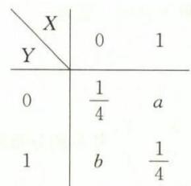

# 第十七章 多维随机变量及其分布

## 基础题

### 一、选择题

**(1)** 设二维随机变量 $(X,Y)$ 的分布函数为 $F(x,y)$ ，则 $P\{X>x_{0},Y>y_{0}\}=(\quad)$ .

A. $1+F(x_{0},y_{0})-F(x_{0},+\infty)-F(+\infty,y_{0})$  
B. $F(x_{0},y_{0})-1+F(x_{0},+\infty)+F(+\infty,y_{0})$  
C. $1-F(x_{0},+\infty)-F(+\infty,y_{0})$  
D. $1-F(x_{0},y_{0})$

**(2)** 设两个相互独立的随机变量 $X$ 与 $Y$ 分别服从 $N(0,1)$ 与 $N(1,1)$ ，则（　）.

A. $P\{X+Y\leqslant1\}=\dfrac{1}{2}$  
B. $P\{X+Y\leqslant0\}=\dfrac{1}{2}$  
C. $P\{X-Y\leqslant1\}=\dfrac{1}{2}$  
D. $P\{X-Y\leqslant0\}=\dfrac{1}{2}$

**(3)** 设随机变量 $X_{1}$ 与 $X_{2}$ 同分布， $Y_{1}$ 与 $Y_{2}$ 同分布，则（　）.

A. $X_{1}+Y_{1}$ 与 $X_{2}+Y_{2}$ 同分布  
B. $X_{1}-Y_{1}$ 与 $X_{2}-Y_{2}$ 同分布  
C. $(X_{1},Y_{1})$ 与 $(X_{2},Y_{2})$ 同分布  
D. $kX_{1}$ 与 $kX_{2}$ 同分布， $kY_{1}$ 与 $kY_{2}$ 同分布 (常数 $k\neq0$ )

### 二、填空题

**(4)** 设二维随机变量 $(X,Y)$ 的分布律为

且事件 $\{X=0\}$ 与 $\{X+Y=1\}$ 相互独立，则 a= \_\_\_\_ ， b= \_\_\_\_ 。

**(5)** 设 X 与 Y 相互独立且均服从参数为 $\lambda$ 的指数分布，则 $Z=\min\{X,Y\}$ 的分布函数 $F_{Z}(z)=$ \_\_\_\_ .

**(6)** 设随机变量 $X,Y$ 均服从区间为 $[0,4]$ 的均匀分布, $P\{\max\{X,Y\}\leqslant3\}=\dfrac{9}{16}$ , 则 $P\{\min\{X,Y\}>3\}=\underline{\hspace{2cm}}$ .

### 三、解答题

**(7)** 设二维随机变量 $(X,Y)$ 的联合分布律为

<table><tr><td>X Y</td><td>0</td><td>1</td></tr><tr><td>-1</td><td> $\dfrac{3}{16}$ </td><td> $\dfrac{9}{16}$ </td></tr><tr><td>1</td><td> $\dfrac{1}{16}$ </td><td> $\dfrac{3}{16}$ </td></tr></table>

(I) 求 $2X+Y,\max\{X,Y\},\min\{X,Y\}$ 的分布律;

(II) 求 $P\{\min\{X,Y\}\geqslant0\}$ ;

(III) 问 X 与 Y 是否相互独立? 并说明理由.

**(8)** 设二维随机变量 $(X,Y)$ 的概率密度为 $f(x,y)=\left\{\begin{aligned}\lambda^{2}\mathrm{e}^{-\lambda x},&0<y<x,\\0,&\text{其他}\end{aligned}\right.$ $(\lambda>0)$ .

(I) 证明: Y 服从参数为 $\lambda$ 的指数分布;

(II) 问 X 与 Y 是否相互独立? 并说明理由.

**(9)** 设随机变量 $(X,Y)$ 的概率密度为 $f(x,y)=\begin{cases}1,&0<x<1,-x<y<x,\\0,&\text{其他}.\end{cases}$ 求:

(I) 边缘概率密度 $f_{X}(x)$ , $f_{Y}(y)$ ;

(II) 条件概率密度 $f_{X|Y}(x|y)$ , $f_{Y|X}(y|x)$ ;

(III) $P\left\{X>\dfrac{1}{2}\mid Y>0\right\}$ .

**(10)** 设二维随机变量 $(X,Y)$ 的概率密度为 $f(x,y)=\left\{\begin{aligned}ke^{-(4x+3y)},&x>0,y>0,\\0,&\text{其他.}\end{aligned}\right.$ 求:

(I) 常数 $k$ 的值, 并判别 $X$ 与 $Y$ 是否相互独立, 说明理由;

(II) $Z=X+Y$ 的概率密度 $f_{Z}(z)$ .

**(11)** 设随机变量 $X$ 与 $Y$ 相互独立, 其概率密度分别为

$$
f_{X}(x)=\left\{\begin{array}{ll}\lambda_{1}\mathrm{e}^{-\lambda_{1}x},&x>0,\\0,&x\leqslant0,\end{array}\right.\quad f_{Y}(y)=\left\{\begin{array}{ll}\lambda_{2}\mathrm{e}^{-\lambda_{2}y},&y>0,\\0,&y\leqslant0,\end{array}\right.
$$

其中 $\lambda_{1}>0,\lambda_{2}>0$ 为常数, 令 $Z=\begin{cases}1,&X\leqslant Y,\\0,&X>Y,\end{cases}$ 求 Z 的分布律和分布函数.

**(12)** 设二维随机变量 $(X,Y)$ 的概率密度为 $f(x,y)=\begin{cases}xe^{-y},&0<x<y<+\infty,\\0,&\text{其他}.\end{cases}$ 求:

(I)X与Y的边缘概率密度,并判别X与Y是否相互独立;

$(II)(X,Y)$ 的分布函数 $F(x,y)$ ;

(III) $Z=X+Y$ 的概率密度 $f_{Z}(z)$ .

**(13)** 设随机变量 X 与 Y 相互独立，且服从同一分布，其概率密度为 $f(x)=\left\{\begin{aligned}&\dfrac{2}{x^{2}},&x>2,\\&0,&\text{其他},\end{aligned}\right.$ 求 $Z=\dfrac{X}{Y}$ 的分布函数和概率密度.

**(14)** 设 $X$ 与 $Y$ 相互独立, $X$ 服从参数为 $\dfrac{1}{2}$ 的指数分布, $Y$ 服从参数为 $\dfrac{1}{3}$ 的指数分布, 求 $Z=X+Y$ 的概率密度.

**(15)** 设 $(X,Y)$ 服从区域 $G=\{(x,y)\mid0\leqslant x\leqslant2,0\leqslant y\leqslant1\}$ 上的均匀分布, 求 $Z=XY$ 的分布函数和概率密度.

**(16)** 设二维随机变量 $(X,Y)$ 的概率密度为 $f(x,y)=\dfrac{1}{k}(1+xy)\mathrm{e}^{-\dfrac{1}{2}(x^2+y^2)}(k>0,(x,y)\in R^2)$ .

(I) 求 k 的值, 并判别 X 与 Y 是否相互独立;

(II) 若 Z 服从 $[-π,π]$ 上的均匀分布, 且 X 与 Z 相互独立, 求 $U=X+Z$ 的概率密度 (可用 $\Phi(x)$ 表示).

**(17)** 设随机变量 X 与 Y 相互独立，X 服从 p = 0.6 的 0 - 1 分布，Y 的分布函数为

$$
F_{Y}(y)=\left\{\begin{array}{ll}1-\mathrm{e}^{-y},&y\geqslant0,\\0,&y<0,\end{array}\right.
$$

记 Z = X - Y. 求:

(I) $P\left\{Z\leqslant-\dfrac{1}{2}\mid X=0\right\}$ ;

(II)Z的分布函数.

## 综合题

### 一、选择题

**(1)** 设随机变量 X 与 Y 独立同分布, 均服从 $P\{X=k\}=p(1-p)^{k-1}(k=1,2,\cdots;0<p<1)$ , 则 $P\{X=Y\}=(\quad)$ .

A. $\dfrac{p}{1-p}$  
B. $\dfrac{1-p}{2-p}$  
C. $\dfrac{2p}{1-p}$  
D. $\dfrac{p}{2-p}$

**(2)** 设二维随机变量 $(X_{1},X_{2})$ 的概率密度为 $f_{1}(x_{1},x_{2}),Y_{1}=2X_{1},Y_{2}=3X_{2}$ ，则 $(Y_{1},Y_{2})$ 的概率密度 $f_{2}(y_{1},y_{2})=(\quad)$ .

A. $f_{1}(2y_{1},3y_{2})$  
B. $f_{1}\left(\dfrac{1}{2}y_{1},\dfrac{1}{3}y_{2}\right)$  
C. $\dfrac{1}{2}f_{1}(2y_{1},3y_{2})$  
D. $\dfrac{1}{6}f_{1}\left(\dfrac{1}{2}y_{1},\dfrac{1}{3}y_{2}\right)$

**(3)** 设随机变量 $X$ ， $Y$ 均服从 $N(0,1)$ ，且 $X$ 与 $Y$ 相互独立，则（　）.

A. $P\{X-Y\geqslant0\}=\dfrac{1}{4}$  
B. $P\{X+Y\geqslant0\}=\dfrac{1}{4}$  
C. $P\{\min\{X,Y\}\geqslant0\}=\dfrac{1}{4}$  
D. $P\{\max\{X,Y\}\geqslant0\}=\dfrac{1}{4}$

**(4)** 设随机变量 X 与 Y 相互独立, $X\sim N(0,1)$ . Y 的概率分布为 $P\{Y=0\}=\dfrac{1}{4}$ , $P\{Y=1\}=\dfrac{3}{4}$ , 记 Z = XY, 则对于 Z 的分布函数 $F(z)$ 有 （　）.

A. $\lim_{z\to0^{-}}F(z)=\dfrac{3}{8}$ , $\lim_{z\to0^{+}}F(z)=\dfrac{5}{8}$  
B. $\lim_{z\to0^{-}}F(z)=\lim_{z\to0^{+}}F(z)=\dfrac{1}{2}$  
C. $\lim_{z\to0^{-}}F(z)=\dfrac{1}{4}$ , $\lim_{z\to0^{+}}F(z)=\dfrac{3}{4}$  
D. $\lim_{z\to0^{-}}F(z)=\dfrac{3}{4}$ , $\lim_{z\to0^{+}}F(z)=\dfrac{5}{8}$

### 二、填空题

**(5)** 设随机变量 X 与 Y 相互独立，X 服从二项分布 $B\left(4,\dfrac{1}{2}\right)$ ，Y 服从 $\lambda=1$ 的泊松分布，则概率 $P\{1<\max\{X,Y\}\leqslant3\}=$ \_\_\_\_ .

**(6)** 设随机变量 X 与 Y 相互独立，X 服从参数为 $\lambda=1$ 的指数分布，Y 服从参数为 0.6 的 0 - 1 分布，则 $P\{X+Y\geqslant1.6\}=$ \_\_\_\_ .

**(7)** 设随机变量 X 与 Y 均服从 $N(0,\sigma^{2})$ ，且 $P\{X\leqslant1,Y\leqslant-1\}=\dfrac{1}{4}$ ，则 $P\{X>1,Y>-1\}=$ \_\_\_\_ .

**(8)** 设 $D=\{(x,y)\mid0\leqslant x\leqslant a,0\leqslant y\leqslant a\}$ , 向 $D$ 上均匀地投掷随机点, $(X,Y)$ 表示随机点的坐标, $0<b<a$ , 则 $P\{|X-Y|\leqslant b\}-P\{\min(X,Y)\leqslant b\}=\underline{\hspace{2cm}}$ .

### 三、解答题

**(9)** 在区间 $[0,1]$ 上随机地掷两点, 求这两点间距离的概率密度.

**(10)** 设二维随机变量 $(X,Y)$ 在 $D=\left\{(x,y)\mid0\leqslant x\leqslant2,0\leqslant y\leqslant1\right\}$ 上服从均匀分布, 令 $U=\left\{\begin{aligned}&0,&X\leqslant Y,\\&1,&X>Y,\end{aligned}\right.$ $V=\left\{\begin{aligned}&0,&X\leqslant2Y,\\&1,&X>2Y,\end{aligned}\right.$ 求 $(U,V)$ 的联合分布律, 并判别 U 与 V 是否相互独立.

**(11)** 设随机变量 X 和 Y 都在 $[a,b]$ 上服从均匀分布, 且 X 与 Y 相互独立. 求:

$(I)Z_{1}=\max\{X,Y\}$ 和 $Z_{2}=\min\{X,Y\}$ 的概率密度;

$(II)(Z_{1},Z_{2})$ 的联合概率密度.

**(12)** 设随机变量 $X$ 与 $Y$ 均服从 $N(2,\sigma^2)(\sigma>0)$ ，且 $X$ 与 $Y$ 相互独立，若 $P\{X\leqslant-1\}=\dfrac{1}{3}$ ，求 $P\{\max(X,Y)\leqslant2,\min(X,Y)\leqslant-1\}$ .

**(13)** 设二维随机变量 $(X,Y)$ 服从 $D=\{(x,y)\mid y\geqslant0,x^2+y^2\leqslant1\}$ 上的均匀分布, 令

$$
U=\left\{\begin{array}{ll}0,&X<0,\\1,&0\leqslant X<Y,V=\left\{\begin{array}{ll}0,&X\geqslant\sqrt{3}Y,\\1,&X<\sqrt{3}Y.\end{array}\right.\\2,&Y\leqslant X,\end{array}\right.
$$

求:

$(I)(U,V)$ 的联合概率分布;

(II) $P\{UV\neq0\}$ .

**(14)** 设 $(X,Y)$ 的概率密度为 $f(x,y)=\left\{\begin{aligned}&\dfrac{1}{4}(1+xy),&|x|<1,|y|<1,\\&0,&\text{其他.}\end{aligned}\right.$

(I) 求 X 和 Y 的边缘概率密度, 并判别 X 与 Y 是否相互独立;

(II) 记 $Z_{1}=X^{2},Z_{2}=Y^{2}$ ，求 $Z_{1},Z_{2}$ 的分布函数及 $(Z_{1},Z_{2})$ 的联合分布函数.

**(15)** 设随机变量 X 的概率密度为 $f(x)=\dfrac{k}{\mathrm{e}^{x}+\mathrm{e}^{-x}}(-\infty<x<+\infty)$ ，对 X 作两次独立观察，其观测值分别记为 $x_{1},x_{2}$ ，令 $Y_{i}=\begin{cases}1,&x_{i}\leqslant1,\\0,&x_{i}>1\end{cases}$ (i=1,2). 求:

(I) k 的值及 $P\{X_{1}<0,X_{2}<1\}$ ;

(II) $(Y_{1},Y_{2})$ 的概率分布.

**(16)** 设随机变量 X 与 Y 相互独立，其中 X 的概率密度为 $f(x)=\left\{\begin{aligned}x,&0\leqslant x<1,\\2-x,&1\leqslant x<2,Y\text{服从参数为2的指}\\0,&\text{其他},\end{aligned}\right.$ 数分布. $F(x)$ 为 X 的分布函数, 记 $Z=F(X)+Y$ . 求:

(I) $F(X)$ 的分布函数与概率密度;

(II)Z的概率密度 $f_{Z}(z)$ .

**(17)** 设随机变量 $X$ 与 $Y$ 相互独立且服从同一分布, 当 $x\leqslant0$ 时, $X$ 的概率密度 $f(x)=0$ ; 当 $x>0$ 时, $f(x)$ 满足方程 $f'(x)+2xf(x)=0,Z=\sqrt{X^2+Y^2}$ , 求:

(I)Z的分布函数和概率密度;

(II)DZ.

**(18)** 设某手机一个月的需求量 $X$ 是随机变量, 其概率密度为 $f(x)=\begin{cases}xe^{-x},&x>0,\\0,&x\leqslant0.\end{cases}$ 记 $k$ 个月的需求量为 $Y_k$ , 设各个月的需求量相互独立.

(I) 求 $Y_{2}$ 和 $Y_{3}$ 的概率密度函数 $f_{2}(x)$ 和 $f_{3}(x)$ ;

(II) 记连续三个月中的月最大需求量为 Y, 求 Y 的概率密度函数.

## 拓展题

### 三、解答题

**(1)** 设某手机一个月的需求量 $X$ 是随机变量, 其概率密度为 $f(x)=\begin{cases}xe^{-x},&x>0,\\0,&x\leqslant0.\end{cases}$ 记 $k$ 个月的需求总量为 $Y_{k}$ , 设各个月的需求量相互独立.

(I) 求 $Y_{2}$ 和 $Y_{3}$ 的概率密度 $f_{2}(x)$ 与 $f_{3}(x)$ ;

(II) 记连续三个月中的月最大需求量为 Y, 求 Y 的概率密度.

**(2)** 设随机变量 X 与 Y 相互独立，X 的概率密度为 $f_{X}(x)=\left\{\begin{aligned}&1,&0\leqslant x\leqslant1,\\&0,&\text{其他},\end{aligned}\right.$ Y 的分布函数为 $F_{Y}(y)$ ，令 $Z=\left\{\begin{aligned}Y,&X\leqslant\dfrac{1}{2},\\X,&X>\dfrac{1}{2},\end{aligned}\right.$ 求 Z 的分布函数 $F_{Z}(z)$ .

**(3)** 在区间 $(0,a)(a>0)$ 的中点左边随机取一点 X，右边随机取一点 Y. 求:

$(I)(X,Y)$ 的概率密度和分布函数;

(II)Z=XY的概率密度.

