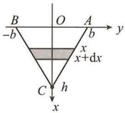
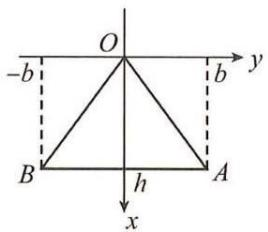
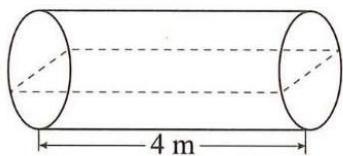
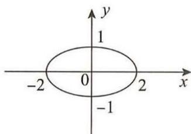

# 第三章 一元函数积分学及其应用

## 基础题

### 一、选择题

**(1)** 设 $f(x)$ 是连续函数，且 $f(x)\neq0$ ，若 $\int xf(x)\,\mathrm{d}x=\arcsin x+C$ ，则 $\int\dfrac{\mathrm{d}x}{f(x)}=(\quad)$ .

A. $\dfrac{1}{3}(1-x^2)^{3/2}+C$  
B. $\dfrac{2}{3}(1-x^2)^{3/2}+C$  
C. $-\dfrac{1}{3}(1-x^2)^{3/2}+C$  
D. $-\dfrac{2}{3}(1-x^2)^{3/2}+C$

**(2)** 设 $f(x)$ 是连续函数， $F(x)$ 是 $f(x)$ 的原函数，则（　）.

A. 当 $f(x)$ 为奇函数时， $F(x)$ 必为偶函数  
B. 当 $f(x)$ 为偶函数时， $F(x)$ 必为奇函数  
C. 当 $f(x)$ 为周期函数时， $F(x)$ 必为周期函数  
D. 当 $f(x)$ 为单调函数时， $F(x)$ 必为单调函数

**(3)** 设 $\int_{-\infty}^{+\infty}f(x)\,dx=a$ (a 为常数), $f(x)$ 为偶函数, $F(x)=\int_{-\infty}^{x}f(t)dt$ , 则对任意 $x_{0}\in(-\infty,+\infty)$ , $F(-x_{0})=(\quad)$ .

A. $-F(x_{0})$  
B. $F(x_{0})$  
C. $\dfrac{a}{2}-\int_{0}^{x_{0}}f(x)dx$  
D. $a-\int_{0}^{x_{0}}f(x)dx$

**(4)** 设 $F(x)$ 是 $\sin x^2$ 的一个原函数，则 $d[F(x^2)]=(\quad)$ .

A. $\sin(x^4)\mathrm{d}x$  
B. $\sin(x^2)d(x^2)$  
C. $2x\sin(x^2)\mathrm{d}x$  
D. $2x\sin(x^4)\mathrm{d}x$

**(5)** 设 $f(x)=\begin{cases}\sin x,&0\leqslant x<\pi,\\2,&\pi\leqslant x\leqslant2\pi,\end{cases}$ $F(x)=\int_{0}^{x}f(t)dt$ , 则 （　）.

A. $x=\pi$ 是 $F(x)$ 的跳跃间断点  
B. $x=\pi$ 是 $F(x)$ 的可去间断点  
C. $F(x)$ 在 $x=\pi$ 处连续但不可导  
D. $F(x)$ 在 $x=\pi$ 处可导

**(6)** $f(x)=\left\{\begin{aligned}&x^{2}+1,\quad x\leqslant0,\\&\cos x,\quad x>0\end{aligned}\right.$ 的一个原函数为（　）.

A. $F(x)=\left\{\begin{aligned}&\dfrac{1}{3}x^{3}+x,\quad x\leqslant0\\&\sin x+1,\quad x>0\end{aligned}\right.$  
B. $F(x)=\left\{\begin{aligned}&\dfrac{1}{3}x^{3}+x+1,\quad x\leqslant0\\&\sin x+2,\quad x>0\end{aligned}\right.$  
C. $F(x)=\left\{\begin{aligned}&\dfrac{1}{3}x^{3}+x+1,\quad x\leqslant0\\&\sin x,\quad x>0\end{aligned}\right.$  
D. $F(x)=\left\{\begin{aligned}&\dfrac{1}{3}x^{3}+x,\quad x\leqslant0\\&\sin x,\quad x>0\end{aligned}\right.$

**(7)** $\lim_{n\to\infty}\sum_{k=1}^{n}\int_{k}^{k+1}\dfrac{\mathrm{d}x}{x\sqrt{x-1}}=(\quad)$ .

A. 1  
B. $\dfrac{\pi}{2}$  
C. $\pi$  
D. $2\pi$

**(8)** 设 $f(x)$ 在 $[0,1]$ 上连续, $f(x)>0,f'(x)<0,f''(x)>0$ , 记 $M=\int_{0}^{1}f(x)\,\mathrm{d}x,N=f(1)$ , $P=\dfrac{1}{2}[f(0)+f(1)]$ , 则 （　）.

A. $M<N<P$  
B. $N<M<P$  
C. $P<M<N$  
D. $P<N<M$

**(9)** 设 $f(x)$ 在 $[0,+\infty)$ 上连续, 且 $f(x)>\int_{0}^{x}f(t)dt(x\geqslant0)$ , 当 $0<a<b$ 时, 下列选项正确的是 （　）.

A. $\int_{0}^{b}f(x)\mathrm{d}x>\int_{0}^{a}f(x)\mathrm{d}x>\int_{0}^{\dfrac{a+b}{2}}f(x)\mathrm{d}x$  
B. $\int_{0}^{a}f(x)\mathrm{d}x>\int_{0}^{b}f(x)\mathrm{d}x>\int_{0}^{\dfrac{a+b}{2}}f(x)\mathrm{d}x$  
C. $\int_{0}^{a}f(x)\mathrm{d}x>\int_{0}^{\dfrac{a+b}{2}}f(x)\mathrm{d}x>\int_{0}^{b}f(x)\mathrm{d}x$  
D. $\int_{0}^{b}f(x)\mathrm{d}x>\int_{0}^{\dfrac{a+b}{2}}f(x)\mathrm{d}x>\int_{0}^{a}f(x)\mathrm{d}x$

**(10)** 设 $I_{1}=\int_{0}^{\pi}\dfrac{x\sin^{2}x}{1+\mathrm{e}^{\cos^{2}x}}\,\mathrm{d}x,I_{2}=\int_{0}^{\pi}\dfrac{\sin^{2}x}{1+\mathrm{e}^{\cos^{2}x}}\,\mathrm{d}x,I_{3}=\int_{0}^{\pi/2}\dfrac{\cos^{2}x}{1+\mathrm{e}^{\sin^{2}x}}\,\mathrm{d}x,$ 则（　）

A. $I_{1}>I_{2}>I_{3}$  
B. $I_{3}>I_{2}>I_{1}$  
C. $I_{2}>I_{1}>I_{3}$  
D. $I_{3}>I_{1}>I_{2}$

**(11)** 设 $f(x)$ 在 $[0,1]$ 上是凹函数, 且非负连续, $f(0)=0$ , 则下列选项正确的是 （　）.

A. $4\int_{0}^{1/2}f(x)\mathrm{d}x\leqslant\int_{0}^{1}f(x)\mathrm{d}x$  
B. $4\int_{0}^{1/2}f(x)\mathrm{d}x\geqslant\int_{0}^{1}f(x)\mathrm{d}x$  
C. $8\int_{0}^{1/2}f(x)\mathrm{d}x\leqslant\int_{0}^{1}f(x)\mathrm{d}x$  
D. $8\int_{0}^{1/2}f(x)\mathrm{d}x\geqslant\int_{0}^{1}f(x)\mathrm{d}x$

**(12)** 设 $f(x)$ 在 $[0,1]$ 上可导， $f'(x)>0$ ， $F(x)=\int_{0}^{1}|f(x)-f(t)|dt$ ，则在 $[0,1]$ 上有（　）.

A. $F\left(\dfrac{1}{2}\right)\geqslant F(0)$  
B. $F(1)\leqslant F\left(\dfrac{1}{2}\right)$  
C. $F(x)\geqslant F\left(\dfrac{1}{2}\right)$  
D. $F(x)\leqslant F\left(\dfrac{1}{2}\right)$

**(13)** 设 $\lim_{x\to0}\dfrac{1}{\sin x-ax}\int_{b}^{x}\dfrac{t^{2}}{\sqrt{1+t^{2}}}dt=c$ ，且 $c\neq0$ ，则（　）.

A. $a=1,b=0,c=-2$  
B. $a=1,b=-2,c=-2$  
C. a=0, b=1, c=-2  
D. a=1, b=1, c=1

**(14)** 设函数 $y=f(x)$ 由 $\begin{cases}x=\int_{0}^{t}2\mathrm{e}^{-u^2}\mathrm{d}u,\\y=\int_{0}^{t}\sin(t-u)\mathrm{d}u\end{cases}$ 确定, 则当 $x\to0$ 时, $f(x)$ 是 $x^2$ 的 （　）.

A. 高阶无穷小  
B. 等价无穷小  
C. 同阶但不等价无穷小  
D. 低阶无穷小

**(15)** 设 $f(t)=\int_{0}^{1}\ln\sqrt{x^2+t^2}\,\mathrm{d}x$ ，则 $f(t)$ 在 $t=0$ 处（　）.

A. 极限不存在  
B. 极限存在但不连续  
C. 连续但不可导  
D. 可导

**(16)** 下列反常积分收敛的是（　）.

A. $\int_{1}^{+\infty}\dfrac{\mathrm{d}x}{x^2\sqrt{1+x}}$  
B. $\int_0^1\dfrac{\mathrm{d}x}{\ln(1+x)}$  
C. $\int_{-1}^{1}\dfrac{\mathrm{d}x}{\sin x}$  
D. $\int_{-\infty}^{+\infty}\dfrac{x}{\sqrt{1+x^2}}\mathrm{d}x$

**(17)** 已知 $\int_{1}^{+\infty}\left(\dfrac{2x^{2}+ax+b}{2x^{2}+bx}-1\right)\mathrm{d}x=1(b>0)$ ，则 （　）.

A. $a=e-1,b=e$  
B. $a=b=2(e-1)$  
C. $a=e,b=e-1$  
D. $a=b=2e-1$

**(18)** 已知积分 $I=\int_{2}^{+\infty}\left(\mathrm{e}^{\dfrac{\ln x}{x^a}}-1\right)\,\mathrm{d}x$ 收敛，则 $a$ 的取值范围为 （　）.

A. $(-\infty,0)$  
B. $(0,1]$  
C. $(1,+\infty)$  
D. $[1,+\infty)$

### 二、填空题

**(19)** 设 $F(x)$ 是 $f(x)$ 的一个原函数, $F\left(\dfrac{\pi}{4}\right)=0$ , 当 $\dfrac{\pi}{4}<x<\dfrac{\pi}{2}$ 时, $F(x)>0,F(x)f(x)=\dfrac{\ln(\tan x)}{\sin x\cos x}$ , 则 $f(x)=$ \_\_\_\_.

**(20)** 设对任意 $x$ ，有 $f(x+4)=f(x)$ ，且 $f'(x)=1+|x|,x\in(-2,2],f(0)=1$ ，则 $f(9)=$ \_\_\_\_.

**(21)** 设 $f(x)=\int_{0}^{x}\sin(x-t)^{2}dt$ , 则 $f'(x)=$ \_\_\_\_.

**(22)** 设 $F(x)=\int_{0}^{x}tf(x^{2}-t^{2})dt,f(x)$ 是连续函数，则 $F'(x)=$ \_\_\_\_.

**(23)** 设 $F(x)=\int_{0}^{x}tf(x^{2}-t^{2})dt,f(x)$ 在 $x=0$ 某邻域内可导, 且 $f(0)=0,f'(0)=1$ , 则 $\lim_{x\to0}\dfrac{F(x)}{x^{4}}=$ \_\_\_\_.

**(24)** 设 $f(x)$ 可导, 对任意 $x,y$ , 有 $f(x+y)=\int_{x}^{x+y}\dfrac{t(t^2+1)}{f(t)}dt+f(x)$ , 且 $f(1)=\sqrt{2}$ , 则 $f(x)=$ \_\_\_\_.

**(25)** 设 $f(x)$ 在 $[0,+\infty)$ 上可导, $f(0)=0,y=f(x)$ 的反函数为 $g(x)$ , 若 $\int_{x}^{x+f(x)}g(t-x)dt=x^2\ln(1+x)$ , 则 $f(1)=$ \_\_\_\_.

**(26)** 设 $\alpha(x)=\int_{0}^{5x}\dfrac{\sin t}{t}dt,\beta(x)=\int_{0}^{\sin x}(1+t)^{1/t}dt$ , 则 $\lim_{x\to0}\dfrac{\alpha(x)}{\beta(x)}=$ \_\_\_\_.

**(27)** 极限 $\lim_{x\to0}\dfrac{\int_{\cos x}^{1}t\ln tdt}{x^{4}}=\underline{\quad}$ .

**(28)** 极限 $\lim_{x\to0}\dfrac{\int_{0}^{x}\left[\int_{0}^{u^{2}}\arctan(1+t)dt\right]du}{x(1-\cos x)}=$ \_\_\_\_.

**(29)** 极限 $\lim_{x\to+\infty}\dfrac{\int_{0}^{x}|\sin t|dt}{x}=$ \_\_\_\_.

**(30)** 设 $\int_{1}^{+\infty}\dfrac{\mathrm{d}x}{x(a+x^{3})}=\dfrac{1}{3}\ln2(a>0)$ ，则 a= \_\_\_\_.

**(31)** 函数 $y=\dfrac{x^{2}}{\sqrt{1-x^{2}}}$ 在 $\left[\dfrac{1}{2},\dfrac{\sqrt{3}}{2}\right]$ 上的平均值为 \_\_\_\_.

**(32)** 设 $f(x)=\int_{0}^{a-x}\mathrm{e}^{t(2a-t)}dt(a>0),x\in[0,a]$ , 则曲线 $y=f(x)$ 与两坐标轴所围成图形的面积为 \_\_\_\_.

**(33)** 曲线 $y=\dfrac{\sqrt{x}}{1+x^2}$ 绕 $x$ 轴旋转一周所得的旋转体, 将它在 $x=0$ 与 $x=\xi(\xi>0)$ 之间部分的体积记为 $V(\xi)$ , 且 $V(a)=\dfrac{1}{2}\lim_{\xi\to+\infty}V(\xi)$ , 则 $a=$ \_\_\_\_.

**(34)** 曲线 $r=a\sin^3\dfrac{\theta}{3}(a>0,0\leqslant\theta\leqslant3\pi)$ 的弧长 $s=$ \_\_\_\_.

**(35)** 曲线 $y=\int_{-\dfrac{\pi}{2}}^{x}\sqrt{\cos t}dt$ 的全长 s= \_\_\_\_.

**(36)** 由曲线 $y=\ln x$ 与两直线 $y=(e+1)-x$ 及 y = 0 所围平面图形的面积 S = \_\_\_\_.

**(37)** 设 D 是由曲线 $y=\sin x+1$ 与直线 $x=0,x=\pi,y=0$ 所围平面图形, 则 D 绕 x 轴旋转一周所得旋转体的体积 V = \_\_\_\_.

**(38)** 设 n 为正数， $\lim_{x\to0}\left(\dfrac{n-x}{n+x}\right)^{2/x}=\int_{1/n}^{+\infty}xe^{-4x}dx$ ，则 n= \_\_\_\_.

**(39)** 设在 $x$ 轴的区间 $[0,1]$ 上有一根长度为 1 的细棒, 若其线密度 $\rho(x)=2x+1$ , 则该细棒的质心坐标 $\bar{x}=$ \_\_\_\_.

**(40)** 极限 $\lim_{n\to\infty}\sum_{k=1}^{n}\dfrac{1}{n}\ln\dfrac{n+2k}{3n-2k}=$ \_\_\_\_.

**(41)** 设质点以速度 $\sqrt{t}e^{-\sqrt{t}}(t\geqslant0)m/s$ 作直线运动，则质点从开始运动到停止运动经过的路程为 m，它在 t = 0 到 t = 4s 时间段内的平均速度为 \_\_\_\_ m/s.

### 三、解答题

**(42)** 求下列积分:

(I) $\int\dfrac{2^{x}\cdot3^{x}}{9^{x}-4^{x}}dx;$

$(II)\int\dfrac{\mathrm{d}x}{x^2(1-x^4)};$

(III) $\int\dfrac{\mathrm{d}x}{x^4(1+x^2)}$ ;

$(IV)\int\dfrac{\arctan x}{x^2(1+x^2)}\mathrm{d}x;$

$(V)\int\dfrac{x+\ln(1-x)}{x^2}\mathrm{d}x.$

**(43)** 求下列积分:

(I) $\int\dfrac{dx}{x(1+\sqrt{x})}$ ;

(II) $\int\dfrac{xe^x}{\sqrt{\mathrm{e}^x-1}}\,\mathrm{d}x$ ;

(III) $\int\dfrac{x^3}{\sqrt{1+x^2}}\mathrm{d}x;$

$$
(IV)\int\dfrac{\mathrm{d}x}{(2x^{2}+1)\sqrt{1+x^{2}}};
$$

$$
(V)\int\dfrac{\arctan\sqrt{x-1}}{x\sqrt{x-1}}\mathrm{d}x;
$$

$$
(VI)\int\dfrac{x}{\sqrt{1-x\sqrt{x}}}\mathrm{d}x.
$$

**(44)** 求下列积分:

$(I)\int\dfrac{\mathrm{d}x}{\sin^{2}x\cos^{4}x};$

$$
(II)\int\dfrac{\mathrm{d}x}{1+\sin x};
$$

$$
(III)\int\dfrac{\sin x}{\sin x+\cos x}\mathrm{d}x;
$$

$$
(IV)\int\dfrac{3\sin x+\cos x}{\sin x+2\cos x}\mathrm{d}x;
$$

$$
(V)\int\dfrac{\mathrm{d}x}{\sin2x+2\sin x};
$$

$$
(VI)\int\dfrac{\mathrm{d}x}{a^{2}\sin^{2}x+b^{2}\cos^{2}x}\left(a^{2}+b^{2}>0\right).
$$

**(45)** 求下列积分:

(I) $\int\arctan\sqrt{x}dx;$

$(II)\int\dfrac{\ln x}{(1-x)^{2}}\mathrm{d}x;$

(III) $\int\dfrac{x^2\mathrm{e}^x}{(x+2)^2}\mathrm{d}x;$

$(IV)\int\sin(\ln x)\mathrm{d}x;$

$(V)\int\dfrac{1}{x^2}\sqrt{\dfrac{1-x}{1+x}}\mathrm{d}x;$

$(VI)\int\mathrm{e}^{2x}(1+\tan x)^{2}\mathrm{d}x.$

**(46)** 求下列积分:

$(I)\int_{-\dfrac{\pi}{4}}^{\pi/4}\left(x^{2}\ln\dfrac{1+x}{1-x}-\cos x\right)\mathrm{d}x;$

$$
(II)\int_{-1}^{1}(2+\sin x)\sqrt{1-x^{2}}\mathrm{d}x;
$$

$$
(III)\int_{-2}^{2}(x+|x|)\mathrm{e}^{-|x|}\mathrm{d}x;
$$

$$
(IV)\int_{-1}^{1}\dfrac{2x^{2}+x(\mathrm{e}^{x}+\mathrm{e}^{-x})}{1+\sqrt{1-x^{2}}}\mathrm{d}x.
$$

**(47)** 求下列积分:

$$
(I)\int_{0}^{2}(x-1)^{2}\sqrt{2x-x^{2}}\mathrm{d}x;
$$

$$
(II)\int_{0}^{\pi}(\mathrm{e}^{-\cos x}-\mathrm{e}^{\cos x})\mathrm{d}x.
$$

**(48)** 求下列积分:

$$
(I)\int_{-3}^{2}\min\{2,x^{2}\}\mathrm{d}x;
$$

$$
(II)\int_{-1}^{x}(1-|t|)dt(x\geqslant-1);
$$

$$
(III)\int_{-1}^{1}|x-y|\mathrm{e}^{x}\mathrm{d}x(|y|\leqslant1);
$$

$$
(IV)\int_{0}^{\pi}\sqrt{1-\sin x}\mathrm{d}x.
$$

**(49)** 求下列积分:

$(I)\int_{-\dfrac{\pi}{2}}^{\pi/2}(x+\sin^2x)\cos^2x\mathrm{d}x;$

$(II)\int_{0}^{1}x(1-x^{4})^{3/2}\mathrm{d}x;$

(III) $\int_0^\pi t\sin tdt$ ;

$$
(IV)\int_{0}^{1}\left[\sqrt{2x-x^{2}}+\sqrt{\left(1-x^{2}\right)^{3}}\right]\mathrm{d}x.
$$

**(50)** 计算下列积分:

$(I)\int_{1}^{+\infty}\dfrac{\mathrm{d}x}{\mathrm{e}^{x+1}+\mathrm{e}^{3-x}};$

$(II)\int_{1/2}^{3/2}\dfrac{\mathrm{d}x}{\sqrt{\left|x-x^2\right|}}.$

**(51)** 设 $f(x)=\int_{0}^{\pi/2}|x-t|\sin tdt,x\in(-\infty,+\infty)$ , 求 $f(x)$ 的单调区间与极值.

**(52)** 设 $f(x)$ 在 $[0,\pi]$ 上有二阶连续导数， $f(0)=2,f(\pi)=1$ ，计算 $I=\int_{0}^{\pi}[f(x)+f''(x)]\sin x\,\mathrm{d}x$ .

**(53)** 设 $\displaystyle F(x)=\int_0^{|\sin x|}f(tx^2)\,dt$，其中 $f(x)$ 为连续函数，求 $F'(x)$，并讨论 $F'(x)$ 在 $x=0$ 处的连续性.

**(54)** 设 $f(x)$ 在 $[0,a]$ 上具有二阶导数 $(a>0)$ ，且 $f(x)>0,f''(x)>0$ ，证明：

$$
\int_{0}^{a}f(x)\mathrm{d}x>af\Big(\dfrac{a}{2}\Big).
$$

**(55)** 设 $f(x)$ 在 $[a,b]$ 上连续且单调增加, 证明: $\int_{a}^{b}xf(x)\mathrm{d}x\geqslant\dfrac{a+b}{2}\int_{a}^{b}f(x)\mathrm{d}x$ .

**(56)** 求 $f(x)=\int_{0}^{x}\dfrac{2t-1}{t^2-t+1}dt$ 在 $[-1,1]$ 上的最大值与最小值.

**(57)** 设点 $A(a,0)(a>0)$ , 梯形 $OABC$ 的面积为 $S$ , 曲边梯形 $OABC$ 的面积为 $S_{1}$ , 其曲边由 $y=\dfrac{1}{2}+x^{2}$ 确定, 证明: $\dfrac{S}{S_{1}}<\dfrac{3}{2}$ .

**(58)** 设曲线 $y=\sin x\left(0\leqslant x\leqslant\dfrac{\pi}{2}\right)$ , 直线 $y=k(0\leqslant k\leqslant1)$ 与 $x=0$ 所围面积为 $S_1,y=\sin x\left(0\leqslant x\leqslant\dfrac{\pi}{2}\right)$ , $y=k$ 与 $x=\dfrac{\pi}{2}$ 所围面积为 $S_2$ , 求 $S=S_1+S_2$ 的最小值.

**(59)** 设曲线 $y=\sin x\left(0\leqslant x\leqslant\dfrac{\pi}{2}\right)$ , $y=1$ 及 $x=0$ 所围平面图形为 $D_1,y=\sin x(0\leqslant x\leqslant\pi)$ 及 $y=0$ 所围平面图形为 $D_2$ .

(I) 求 $D_{1}$ 绕直线 $x=\dfrac{\pi}{2}$ 旋转一周所得体积 $V_{1}$ ;

(II) 求 $D_{2}$ 绕 y 轴旋转一周所得体积 $V_{2}$ .

**(60)** 设星形线 $\left\{\begin{aligned}x&=a\cos^{3}t,\\y&=a\sin^{3}t\end{aligned}\right.$ ( $0\leqslant t\leqslant2\pi,a>0$ ).

(I) 求所围面积 A;

(II) 求弧长 L;

(III) 绕 x 轴旋转一周所得体积 V 和表面积 S.

**(61)** 设立体图形的底是介于 $y=x^2-1$ 和 $y=0$ 之间的平面区域，而它的垂直于 $x$ 轴的任一截面是等边三角形, 求立体体积 $V$ .

**(62)** 求曲线 $x=\dfrac{1}{4}y^2-\dfrac{1}{2}\ln y$ 在 $y\in[1,\mathrm{e}]$ 上的弧长 $s$ .

## 综合题

### 一、选择题

**(1)** 设在 $(-1,1)$ 内 $f(x)$ 是奇函数, $F(x)$ 是 $f(x)$ 在 $(-1,1)$ 内的一个原函数, 则在 $(-1,1)$ 内 $f(x)+F(x)$ .

A. 是可导的偶函数  
B. 是连续的奇函数  
C. 存在原函数  
D. 存在原函数且原函数为奇函数

**(2)** 设 $f(x)=\lim_{n\to\infty}\dfrac{\ln(e^n+x^n)}{n}(x>0)$ ，则 $F(x)=\int_{1}^{x}f(t)dt$ 在区间 $[1,+\infty)$ 上（　）.

A. 不连续  
B. 连续但不可导  
C. 可导但二阶不可导  
D. 二阶可导

**(3)** 设 $F(x)=\int_{x}^{x+2\pi}\mathrm{e}^{\sin t}\cdot\sin tdt$ ，则下列选项正确的是（　）.

A. $F(x)$ 为正的常数  
B. $F(x)$ 为负的常数  
C. $F(x)$ 不是常数  
D. $F(x)$ 恒为零

**(4)** 设 $\delta>0$ ，在 $(-\delta,\delta)$ 内有 $|f(x)|\leqslant x^2,f''(x)>0$ ， $I=\int_{-\delta}^{\delta}f(x)\,\mathrm{d}x$ ，则（　）.

A. $I=0$  
B. $I>0$  
C. $I<0$  
D. 不能确定

**(5)** 设 $I_{1}=\int_{0}^{\pi/2}\sin(\sin x)\mathrm{d}x,I_{2}=\int_{0}^{\pi/2}\cos(\sin x)\mathrm{d}x$ ，则（　）.

A. $I_{1}<1<I_{2}$  
B. $I_{2}<1<I_{1}$  
C. $1<I_{1}<I_{2}$  
D. $I_{1}<I_{2}<1$

**(6)** 设 $I_{1}=\int_{0}^{1}\ln(1+x)\,\mathrm{d}x,I_{2}=\int_{0}^{1}\dfrac{\arctan x}{1+x}\,\mathrm{d}x,I_{3}=\int_{0}^{1}\sqrt{\ln(1+x)}\,\mathrm{d}x$ , 则 （　）.

A. $I_{3}>I_{1}>I_{2}$  
B. $I_{3}>I_{2}>I_{1}$  
C. $I_{1}>I_{2}>I_{3}$  
D. $I_{2}>I_{3}>I_{1}$

**(7)** 设 $I_{1}=\int_{0}^{\pi/2}\dfrac{\cos x}{1+x^{2}}\mathrm{d}x,I_{2}=\int_{0}^{\pi/2}\dfrac{\sin x}{1+x^{2}}\mathrm{d}x,I_{3}=\int_{0}^{\pi/2}\dfrac{\sin x}{(1+x)^{2}}\mathrm{d}x$ , 则 （　）.

A. $I_{2}>I_{1}>I_{3}$  
B. $I_{3}>I_{2}>I_{1}$  
C. $I_{1}>I_{2}>I_{3}$  
D. $I_{2}>I_{3}>I_{1}$

**(8)** 设 $f(x)$ 为可导函数，且 $f'(x)<0$ ，则下列命题正确的是（　）.

①当 $0<t<1$ 时， $\int_0^tf(x)\mathrm{d}x<\int_0^1tf(x)\mathrm{d}x;$ ②当 $0<t<1$ 时， $\int_0^tf(x)\mathrm{d}x>\int_0^1tf(x)\mathrm{d}x;$ ③当 $x\geqslant0$ 时， $\int_0^xxf(t)dt\geqslant2\int_0^xtf(t)dt;$ ④当 $x\geqslant0$ 时， $\int_0^xxf(t)dt\leqslant2\int_0^xtf(t)dt.$

A. ①④  
B. ②③  
C. ②④  
D. ①③

**(9)** 设 $f(x)$ 在 $[0,1]$ 上可导, $f(x)>0,f'(x)<0,F(x)=\int_{0}^{x}f(t)dt$ , 则在 $x\in(0,1)$ 内, 有 （　）.

A. $xF(1)>2\int_{0}^{1}F(x)\,\mathrm{d}x$  
B. $F(1)>2\int_{0}^{1}F(x)\,\mathrm{d}x$  
C. $F(x)<2\int_{0}^{1}F(x)\,\mathrm{d}x$  
D. $F(x)>2\int_{0}^{1}F(x)\,\mathrm{d}x$

**(10)** 设函数 $f(x)$ 在 $[0,a](a>0)$ 上有二阶连续导数, 且 $f(0)=0,f''(x)>0$ , 则下列选项正确的是 （　）.

A. $3\int_{0}^{a}xf(x)\,\mathrm{d}x<2\int_{0}^{a}af(x)\,\mathrm{d}x$  
B. $3\int_{0}^{a}xf(x)\,\mathrm{d}x>2\int_{0}^{a}af(x)\,\mathrm{d}x$  
C. $2\int_{0}^{a}xf(x)\,\mathrm{d}x>3\int_{0}^{a}af(x)\,\mathrm{d}x$  
D. $2\int_{0}^{a}xf(x)\,\mathrm{d}x<3\int_{0}^{a}af(x)\,\mathrm{d}x$

**(11)** 设 $f(x)$ 二阶可导，则下列结论正确的是（　）.

①当 $f'(x)<0$ 时， $\int_{-\pi}^{\pi}f(x)\sin x\,dx<0$ ; ②当 $f'(x)<0$ 时， $\int_{-\pi}^{\pi}f(x)\sin x\,dx>0$ ;

③当 $f''(x)>0$ 时， $\int_{-\pi}^{\pi}f(x)\cos x\,dx>0$ ; ④当 $f''(x)>0$ 时， $\int_{-\pi}^{\pi}f(x)\cos x\,dx<0$ .

A. ②③  
B. ①②  
C. ②④  
D. ①④

**(12)** 设反常积分 $\int_{1}^{+\infty}x^{k}\left(e^{-\cos\dfrac{1}{x}}-e^{-1}\right)dx$ 收敛，则下列选项正确的是（　）.

A. k > -1  
B. k < -1  
C. k > 1  
D. k < 1

**(13)** 设连续函数 $f(x)$ 满足 $f(x)=f(2a-x)(a\neq0)$ ， $b$ 为常数，则 $I=\int_{-b}^{b}f(a-x)\,\mathrm{d}x=(\quad)$ .

A. $2\int_{0}^{b}f(2a-x)\,\mathrm{d}x$  
B. $2\int_{-b}^{b}f(2a-x)\,\mathrm{d}x$  
C. $2\int_{0}^{b}f(a-x)\,\mathrm{d}x$  
D. 0

**(14)** 设螺线 $r=\theta(0\leqslant\theta\leqslant2\pi)$ 与极轴所围区域的面积为 $A$ , 则 $A=(\quad)$

A. $\lim_{n\to\infty}\sum_{i=1}^{n}\dfrac{4\pi^3i^2}{n^3}$  
B. $\lim_{n\to\infty}\sum_{i=1}^{n}\dfrac{4\pi^3i^2}{n^2}$  
C. $\lim_{n\to\infty}\sum_{i=1}^{n}\dfrac{8\pi^3i^2}{n^3}$  
D. $\lim_{n\to\infty}\sum_{i=1}^{n}\dfrac{2\pi^3i^2}{n^2}$

**(15)** 设 $f(x)$ 有连续导数, $f(0)=0,f'(0)=6,\alpha(x)=\int_{0}^{x^3}f(t)dt,\beta(x)=\left[\int_{0}^{x}f(t)dt\right]^3$ , 则当 $x\to0$ 时, $\alpha(x)$ 与 $\beta(x)$ 是 （　）.

A. 同阶但非等价无穷小  
B. 等价无穷小  
C. 高阶无穷小  
D. 低阶无穷小

**(16)** 设 $I=\dfrac{1}{s}\int_{0}^{st}f\left(t+\dfrac{x}{s}\right)\mathrm{d}x,s>0,t>0$ ，则下列选项正确的是（　）.

A. $I$ 仅依赖于 $s$  
B. $I$ 仅依赖于 $t$  
C. $I$ 依赖于 $s,t$  
D. $I$ 依赖于 $s,t,x$

**(17)** 已知方程 $\int_{1}^{x}\dfrac{\ln t}{1+t}dt+\int_{1}^{1/x}\dfrac{\ln t}{1+t}dt=a(x>0)$ 有实根, 则 a 的取值范围为 （　）.

A. $(0,+\infty)$  
B. $[0,+\infty)$  
C. $(0,1)$  
D. $[1,+\infty)$

**(18)** 下列积分存在且不为零的是（　）.

A. $\int_0^1\dfrac{1}{(4x-1)^3}\mathrm{d}x$  
B. $\int_{-\infty}^{+\infty}\dfrac{x}{\sqrt{1+x^2}}\mathrm{d}x$  
C. $\int_{-1}^{1}x\ln\dfrac{2+x}{2-x}\mathrm{d}x$  
D. $\int_{-\dfrac{\pi}{2}}^{\pi/2}\mathrm{e}^{x^2}\sin x\mathrm{d}x$

**(19)** 设反常积分 $\int_{0}^{+\infty}\dfrac{\ln(1+x)}{x^{p}}dx$ 收敛，则 （　）.

A. 0 < p < 2  
B. 1 < p < 2  
C. $0<p\leqslant1$  
D. p > 1

**(20)** 设积分 $I=\int_{1}^{+\infty}\dfrac{\mathrm{d}x}{x^p\ln^qx}(p>0,q>0)$ 收敛，则 （　）.

A. $p>1$ 且 $q<1$  
B. $p>1$ 且 $q>1$  
C. $p<1$ 且 $q<1$  
D. $p<1$ 且 $q>1$

**(21)** 设积分 $\int_{0}^{+\infty}\dfrac{x^{1-p}\arctan x}{2+x^{p}}\mathrm{d}x(p>0)$ 收敛，则 p 的取值范围为 （　）.

A. 1 < p < 3  
B. 2 < p < 3  
C. $1\leqslant p<2$  
D. 0 < p < 3

**(22)** 已知 $I=\int_{0}^{+\infty}\left(\dfrac{1}{\sqrt{x^2+4}}-\dfrac{a}{x+2}\right)\,\mathrm{d}x$ 收敛，则 （　）.

A. $a=1,I=\ln4$  
B. $a>1,I=\ln2$  
C. $a=1,I=\ln2$  
D. $a<1,I=\ln4$

### 二、填空题

**(23)** $\lim_{n\to\infty}\sum_{k=1}^{n}\left[\dfrac{k}{2n^{2}+k}+\ln\left(\dfrac{n+k}{n}\right)^{1/n}\right]=$ \_\_\_\_.

**(24)** 设 $f(x)$ 在 $[a,b]$ 上连续，若 $x_0\in[a,b],x\in[a,b]$ ，则极限

$\lim_{\Delta x\to0}\dfrac{1}{\Delta x}\int_{x_0}^x[f(t+\Delta x)-f(t)]dt=\_$

**(25)** 设 $f(x)$ 在 $\left(0,\dfrac{\pi}{2}\right)$ 内可导, $f(x)>0$ , $\lim_{x\to0^{+}}f(x)=1$ , 且 $\lim_{t\to0}\left[\dfrac{f(x+t\sin x)}{f(x)}\right]^{1/t}=\mathrm{e}^{\dfrac{\sin x-x\cos x}{x}}$ , 则 $f(x)=$ \_\_\_\_.

**(26)** 由曲线 $y=x(x-1)(2-x)$ 与 x 轴围成的平面图形的面积 A = \_\_\_\_.

**(27)** 双纽线 $(x^{2}+y^{2})^{2}=x^{2}-y^{2}$ 围成的平面图形的面积为 \_\_\_\_.

**(28)** 心形线 $r=1+\cos\theta$ 的全长为 \_\_\_\_.

**(29)** 曲线 $\theta=\dfrac{1}{2}\left(r+\dfrac{1}{r}\right)$ 在区间 $r\in[1,3]$ 上的弧长为 \_\_\_\_.

**(30)** 闭曲线 $(x^{2}+y^{2})^{3}=x^{4}+y^{4}$ 所围区域的面积 S= \_\_\_\_.

**(31)** 已知 $f'(\mathrm{e}^x)=xe^{-x}$ ，且 $f(1)=0$ ，则 $f(x)=$ \_\_\_\_.

**(32)** 已知曲线 $y=y(x)$ 上任一点 $(x,y)$ 处的切线的斜率为 $\dfrac{1}{x\sqrt{x^{2}-1}}$ ，且曲线通过点 $(-2,0)$ ，则该曲线方程为 y = \_\_\_\_.

**(33)** 设 $f(x)$ 连续, $g(x)=\int_{0}^{x}xf(t)dt$ , 且 $g(1)=1,g'(1)=5$ , 则 $f(1)=$ \_\_\_\_.

**(34)** 设 $f(x)$ 在 $(0,+\infty)$ 内可导，且 $f'(1)=3$，$f(x)$ 的反函数为 $g(x)$，且
$$
\int_2^{f(\ln x+1)}g(t)\,dt=x\ln x,
$$
则 $g'(3)=\underline{\qquad}$.

**(35)** 设 $f(2)=\dfrac{1}{2},f'(2)=0$ ，且 $\int_0^2f(x)\,\mathrm{d}x=1$ ，则 $I=\int_0^1x^2f''(2x)\,\mathrm{d}x=$ \_\_\_\_.

**(36)** 设 $f(x)=\int_{0}^{x}\mathrm{e}^{\cos t}dt$ ，则 $I=\int_{0}^{\pi}f(x)\cos x\,\mathrm{d}x=$ \_\_\_\_.

**(37)** 设 $f(x)$ 在 $[0,+\infty)$ 上可导, $\ln(1+x)$ 是 $f(x)$ 的一个原函数, 且

$F(x)=\lim_{t\to\infty}t^{2}\left[f\left(2x+\dfrac{1}{t}\right)-f(2x)\right]\sin\dfrac{x}{t}$ ，则 $F(x)$ 在 $[0,1]$ 上的平均值为\_\_\_\_.

**(38)** 已知 $\int_{0}^{+\infty}\dfrac{\sin x}{x}dx=\dfrac{\pi}{2}$ ，则 $I=\int_{0}^{+\infty}\dfrac{\sin^{2}x}{x^{2}}dx=$ \_\_\_\_.

**(39)** $\int_{0}^{+\infty}\dfrac{x\ln x}{(1+x^{2})^{2}}dx=$ \_\_\_\_.

**(40)** $\int_{1}^{+\infty}\dfrac{1}{\sqrt{x}}\ln\dfrac{x+1}{x}dx=$ \_\_\_\_.

**(41)** $\lim_{x\to0^{+}}\dfrac{1}{\ln\dfrac{1}{x}}\int_{x}^{+\infty}\dfrac{\mathrm{e}^{-t}}{t}dt=$ \_\_\_\_.

**(42)** $\int_{1}^{2}\left[\dfrac{1}{x\ln^{2}x}-\dfrac{1}{(x-1)^{2}}\right]\mathrm{d}x=$ \_\_\_\_.

**(43)** 设 $f(x)$ 满足 $\int_{0}^{x}f(t-x)dt=x+\dfrac{1}{2}x^2+\ln|1-x|$ ，则 $y=f(x)$ 的斜渐近线方程为 \_\_\_\_.

**(44)** 设 $f(t)=\lim_{n\to\infty}\sum_{i=1}^{n}\dfrac{t-1}{[n+(t-1)\mathrm{i}]\sqrt{\dfrac{t-1}{n}i}}$ ( $t>1$ )，则 $\lim_{t\to+\infty}f(t)=$ \_\_\_\_.

### 三、解答题

**(45)** 求下列积分:

(I) 设 $f(x)=\int_{1}^{x}\dfrac{dt}{\sqrt{1+t^4}}$ , 求 $I=\int_{0}^{1}x^2f(x)\,\mathrm{d}x$ ;

(II) 设 $f(x)=\int_{1}^{x^2}\mathrm{e}^{-t^2}dt$ , 求 $I=\int_{0}^{1}xf(x)\,\mathrm{d}x$ .

**(46)** 设 $f(\sin^2x)=\dfrac{x}{\sin x}$ ，求 $I=\int\dfrac{\sqrt{x}}{\sqrt{1-x}}f(x)\,\mathrm{d}x$ .

**(47)** 计算积分 $I=\int\mathrm{e}^{\sin x}\cdot\dfrac{x\cos^{3}x-\sin x}{\cos^{2}x}\mathrm{d}x.$

**(48)** 计算 $I=\int\dfrac{e^{-\sin x}\cdot\sin2x}{\sin^{4}\left(\dfrac{\pi}{4}-\dfrac{x}{2}\right)}dx.$

**(49)** 设 $f(\ln x)=\dfrac{\ln(1+x)}{x}$ , 求 $I=\int f(x)\,\mathrm{d}x$ .

**(50)** 设 $f'(x)=\arctan(x-1)^2,f(0)=0$ , 求 $I=\int_{0}^{1}f(x)\,\mathrm{d}x$ .

**(51)** 求极限 $\lim_{x\to0}\dfrac{\dfrac{1}{2}\int_{0}^{2}x\sqrt{4-x^{2}u^{2}}\mathrm{d}u-2x}{\sqrt{1+2x^{3}}-1}$ .

**(52)** 设 $f(x)$ 连续, $\lim_{x\to0}\dfrac{f(x)}{x}=2$ , 求 $\lim_{x\to0}\dfrac{\int_{0}^{x}f(x)f(x-t)dt}{\int_{0}^{x}tf(x-t)dt}$ .

**(53)** 设 $f(x)$ 在 $(-\infty,0]$ 上连续, 且满足 $\int_{0}^{x}tf(t^{2}-x^{2})dt=\dfrac{x^{2}}{1+x^{2}}-\dfrac{1}{2}\ln(1+x^{2})$ , 求函数 $f(x)$ 及其极值.

**(54)** 设 $f(x)$ 在 $[1,+\infty)$ 上可导, $f(1)=2$ , 且满足 $\lim_{t\to0}\dfrac{f[(x+t)^2]-f(x^2+t)}{(2x-1)t}=1-2\ln x$ , 求 $f(x)$ 及 $f(x)$ 的极值.

**(55)** 计算 $\lim_{x\to0}\dfrac{\int_{0}^{2x}\left|1-\dfrac{t}{x}\right|\sin tdt}{x^{2}}$ .

**(56)** 设 $f(x)$ 在 $(0,+\infty)$ 内一阶可导, $g(x)$ 为 $f(x)$ 的反函数, 且 $g(x)$ 连续, 若

$$
\int_{1}^{f(x)}g(t)dt=x^{2}\mathrm{e}^{x}-4\mathrm{e}^{2}-\int_{1}^{x-1}f(t+1)dt,f(2)=1,
$$

求 $f(x)$ 的表达式.

**(57)** 设可导函数 $y=f(x)$ 由方程 $\mathrm{e}^{x-2y}-x^2y=1$ 确定，计算 $\lim_{x\to1^+}\dfrac{\sin(x-1)}{\sqrt{(x-1)^3}}\int_0^1f(t\sqrt{x-1})dt$ .

**(58)** 设 $f(x)$ 满足 $\mathrm{e}^{-x}-\dfrac{x^2}{2}=1+\int_0^xf(t-x)dt$ , 求 $f(x)$ 在 $(-\infty,+\infty)$ 内的最值.

**(59)** 求 $f(x)=\int_{0}^{x^2}(2-t)\mathrm{e}^{-t}dt$ 的最大值和最小值.

**(60)** 证明: $\lim_{n\to\infty}\int_{0}^{1}\dfrac{x^n}{1+x}\mathrm{d}x=0.$

**(61)** 求极限 $\lim_{n\to\infty}\left(\dfrac{2^{1/n}}{n+1}+\dfrac{2^{2/n}}{n+\dfrac{1}{2}}+\cdots+\dfrac{2^{n/n}}{n+\dfrac{1}{n}}\right)$ .

**(62)** 求极限 $\lim_{n\to\infty}\dfrac{1}{n}\sqrt[n]{n(n+1)(n+2)\cdots(2n-1)}$ .

**(63)** 设 $f(x)=x^2,f[g(x)]=-x^2+2x+3$ , 且 $g(x)\geqslant0$ .

(I) 求 $g(x)$ 的定义域与值域;

(II) 求 $\lim_{n\to\infty}\sum_{k=1}^{n}\dfrac{k}{n}e^{k/n}\cdot\dfrac{1}{n+g(x)}$ .

**(64)** 设 $f(x)$ 是连续的偶函数，函数 $g(x)$ 连续，且满足 $g(x)\cdot g(-x)=1$ .

(I) 证明: $\int_{-a}^{a}\dfrac{f(x)}{1+g(x)}\,\mathrm{d}x=\int_{0}^{a}f(x)\,\mathrm{d}x$ ;

(II) 计算 $\int_{-\dfrac{\pi}{4}}^{\pi/4}\dfrac{\mathrm{d}x}{(1+\mathrm{e}^{x})\cos^{2}x}$ .

**(65)** 设 $\int_{0}^{+\infty}f(x)\mathrm{d}x$ 收敛，且 $f(x)=\dfrac{1}{1+x^2}-\dfrac{\mathrm{e}^{-x}}{1+\mathrm{e}^x}\int_{0}^{+\infty}f(x)\mathrm{d}x,$ 求 $\int_{0}^{+\infty}f(x)\mathrm{d}x.$

**(66)** 设 $a_{n}=\int_{0}^{\pi/4}\tan^{n}x\,\mathrm{d}x$ , 证明: $\dfrac{1}{2(n+1)}<a_{n}<\dfrac{1}{2(n-1)}(n\geqslant2)$ .

**(67)** 设 $a_{n}=\int_{0}^{\pi}x\sin^{n}x\mathrm{d}x(n=1,2,\cdots)$ .

(I) 证明: $a_{n}=\dfrac{n-1}{n}a_{n-2}(n=3,4,\cdots)$ ;

(II) 求 $\lim_{n\to\infty}\dfrac{a_{n}}{a_{n-1}}$ .

**(68)** 求积分 $I_{n}=\int_{0}^{1}x\ln^{n}x\,\mathrm{d}x(n\geqslant0$ 且为整数) 的递推关系, 并计算 $I_{n}$ .

**(69)** (I) 求积分 $I_{n}=\int\dfrac{1}{(x^{2}+a^{2})^{n}}\,\mathrm{d}x(n\geqslant1,a>0)$ 的递推关系;

(II) 计算 $I=\int\dfrac{3x+4}{(x^2+2x+2)^2}\,\mathrm{d}x$ .

**(70)** 证明: $f(x)=\int_{0}^{x}(t-t^2)\sin^{2n}tdt(x>0)$ 的最大值为 $f(1)$ , 且 $f(1)\leqslant\dfrac{1}{(2n+2)(2n+3)}$ .

**(71)** 设 $f(x)$ 在 $[a,b]$ 上有二阶连续导数，且 $f(b)=f'(b)=0$ ，证明：

$$
\int_{a}^{b}f(x)\mathrm{d}x=\dfrac{1}{2}\int_{a}^{b}f^{\prime\prime}(x)(x-a)^{2}\mathrm{d}x.
$$

$$
f\Big(\dfrac{a+b}{2}\Big)<\dfrac{1}{b-a}\int_{a}^{b}f(x)\mathrm{d}x<\dfrac{f(a)+f(b)}{2}.
$$

**(72)** 设 $f(x)$ 在 $[a,b]$ 上二阶可导, 且 $f''(x)>0$ , 证明:

**(73)** 设 $f(x)$ 在 $[a,b](a<b)$ 上连续, 并且 $\int_{a}^{b}f(x)\mathrm{d}x=\int_{a}^{b}xf(x)\mathrm{d}x=0$ . 证明: 至少存在不同的 $\xi_1,\xi_2\in(a,b)$ , 使得 $f(\xi_1)=f(\xi_2)=0$ .

**(74)** 设 $y=f(x)$ 在 $[0,1]$ 上是非负连续函数.

(I) 证明: 存在 $x_{0}\in(0,1)$ ，使得在 $[0,x_{0}]$ 上以 $f(x_{0})$ 为高的矩形面积，等于在 $[x_{0},1]$ 上以 $y=f(x)$ 为曲边的曲边梯形面积；

(II) 又设 $f(x)$ 在 (0,1) 内可导, 且 $f'(x)>-\dfrac{2f(x)}{x}$ , 证明: (I) 中的 $x_0$ 是唯一的.

**(75)** 设曲线 $y=f(x)$ 上任一点 $(x,f(x))$ 处的切线斜率为 $a^{2}x^{2}-4ax+3$ ，且 $y=f(x)$ 在 x = 1 处取得极小值 0.

(I) 求 $f(x)$ 及 $f(x)$ 的其他极值;

(II) 证明: $0\leqslant\int_{0}^{1}\sqrt{f(ut)}dt\leqslant\dfrac{2}{3u},u\in(0,1)$ .

**(76)** 设 $f(x)$ 在 $(-\infty,+\infty)$ 内连续，且满足 $f(x+T)=f(x)$ ， $T>0$ ， $f(-x)=f(x)$ .

(I) 证明: $\int_{0}^{nT}xf(x)\mathrm{d}x=\dfrac{n^{2}T}{2}\int_{0}^{T}f(x)\mathrm{d}x$ (n 为正整数);

(II) 计算 $I=\int_{0}^{n\pi}x|\cos x|dx.$

**(77)** 设 $f(x)$ 在 $(-\infty,+\infty)$ 内有连续导数, 证明: $\lim_{a\to0^{+}}\dfrac{1}{4a^{2}}\int_{-a}^{a}[f(t+a)-f(t-a)]dt=f'(0)$ .

**(78)** 设曲线 $y=a\sqrt{x}(a>0)$ 与 $y=\ln\sqrt{x}$ 在点 $(x_0,y_0)$ 处有公切线.

(I) 求常数 a 及点 $(x_{0},y_{0})$ ;

(II) 求两曲线与 x 轴所围图形绕 x 轴旋转一周所得旋转体的体积.

**(79)** 求曲线 $4y=\int_{0}^{2}x\sqrt{12-x^2u^2}\,\mathrm{d}u(x\geqslant0)$ 的全长.

**(80)** 设平面图形 $D$ 由 $x^{2}+y^{2}\leqslant2x$ 与 $y\geqslant x$ 确定，求图形 $D$ 绕直线 $x=2$ 旋转一周所得旋转体的体积.

**(81)** 求曲线 $y=e^{-x}\sqrt{\sin x}(x\geqslant0)$ 绕 x 轴旋转所得旋转体的体积.

**(82)** 设摆线 $\left\{\begin{aligned}x&=a(t-\sin t),\\y&=a(1-\cos t)\end{aligned}\right.$ ( $0\leqslant t\leqslant2\pi,a>0$ ) 与 x 轴所围平面图形为 D.

(I) 求 D 绕 x 轴, y 轴各旋转一周所得旋转体的体积;

(II) 求 D 绕直线 y = 2a 旋转一周所得旋转体的体积.

**(83)** 求圆 $(x-2)^{2}+y^{2}=1$ 绕 y 轴旋转一周所得旋转体的表面积.

**(84)** 求双纽线 $r^{2}=a^{2}\cos2\theta(a>0)$ 绕极轴旋转所成旋转曲面的面积.

**(85)** 设平面区域 $D=\left\{(x,y)\mid\dfrac{1-x}{1+x}\leqslant y\leqslant\sqrt{1-x^2},0\leqslant x\leqslant1\right\}$ , 求 $D$ 绕 $y$ 轴旋转一周所得旋转体的体积 $V$ .

**(86)** 设 $f(x)=x^{n}\sqrt{1-x^{2}},x\in[0,1]$ 与 y=0 所围平面区域的面积为 $S_{n},g(x)=\sin^{n/2}x,x\in\left[0,\dfrac{\pi}{2}\right]$ 与 y=0 所围平面区域绕 x 轴旋转一周所得体积为 $V_{n}(n=1,2,\cdots)$ ，求极限 $\lim_{n\to\infty}\dfrac{\pi S_{n}}{V_{n}}$ .

**(87)** 设 $f(x)=\begin{cases}\lim_{t\to+\infty}\dfrac{x}{1+x^2-\mathrm{e}^{tx}},&x\neq0,\\0,&x=0,\end{cases}$ 曲线 $y=f(x)$ 与 $y=\dfrac{1}{2}x$ 以及 $x=1$ 所围图形为 $D$ .

(I) 求 D 的面积.

(II) 求 D 绕 x 轴旋转一周所得旋转体的体积.

**(88)** 设曲线 $y=\sin x$ 在 $x\in[0,n\pi](n=1,2,\cdots)$ 上与 x 轴所围成的区域为 D, D 绕 y 轴旋转一周所得旋转体的体积为 $a_{n}$ .

(I) 求 $a_{n}$ ;

(II) 求极限 $\lim_{n\to\infty}\sum_{k=1}^{n}\dfrac{2k\pi^{2}}{a_{n}}\sin\dfrac{k\pi}{2n}$ .

**(89)** 将半径为 R 的球沉入水中, 它与水面相切, 设球的密度与水的密度相等, 现将球从水中取出, 问至少需要做功多少?

**(90)** 设图所示的三角形薄板为同一等腰三角形薄板, 已知其底为 $2b$ 、高为 $h$ , 将其垂直放入静水中, 图 $(a)$ 是其底与水面相齐, 图 $(b)$ 是其顶点与水面相齐, 设图 $(a)$ 与图 $(b)$ 薄板一侧所受压力分别为 $P_{1}$ 和 $P_{2}$ , 求 $\dfrac{P_{2}}{P_{1}}$ .

  
(a)

  
(b)

**(91)** 已知曲线 L 的极坐标方程为 $r=1+\cos\theta\left(0\leqslant\theta\leqslant\dfrac{\pi}{2}\right)$ .

(I) 求曲线 L 在 $\theta=\dfrac{\pi}{4}$ 对应点处的切线 T 的直角坐标方程;

(II) 求曲线 L、切线 T 与 x 轴所围图形的面积.

**(92)** 求曲线 $y=3-|x^{2}-1|$ 与 x 轴围成封闭图形绕直线 y = 3 旋转所得旋转体的体积.

**(93)** 设心形线 $r=4(1+\cos\theta)$ 与 $\theta=0,\theta=\dfrac{\pi}{2}$ 所围图形为 $D$ , 求 $D$ 绕极轴旋转一周所得旋转体的体积.

**(94)** 设 $D$ 是位于曲线 $y=\dfrac{1}{x(\ln x)^{\alpha+1}}(a>0,2\leqslant x<+\infty)$ 下方、 $x$ 轴上方的无界区域. 求:

(I)D 的面积 $S(\alpha)$ ;

$(II)S(\alpha)$ 的最小值.

**(95)** 设 $f(x)$ 连续且严格单调递减.

(I) 证明: 当 $x\in(0,1)$ 时, 有 $x\int_{0}^{1}f(t)dt<\int_{0}^{x}f(t)dt<xf(0)$ ;

(II) 若 $\int_{0}^{1}f(t)dt\geqslant0,f(0)\leqslant1,x_{0}\in(0,1),x_{n}=\int_{0}^{x_{n-1}}f(t)dt(n=1,2,\cdots)$ . 证明: $\lim_{n\to\infty}x_{n}$ 存在, 并求其值.

**(96)** 求心形线 $r=1+\cos\theta$ 与 $r=3\cos\theta$ 所围公共部分图形的面积.

**(97)** 设曲线 $L:y=\tan x^{2}\left(0\leqslant x\leqslant\dfrac{\sqrt{\pi}}{2}\right)$ .

(I) 求由 y=1 与曲线 L 以及 y 轴围成的图形 D 绕 y 轴旋转一周所得旋转体的体积 V;

(II) 设 (I) 中旋转体内盛满水, 问将水抽完至少需要做多少功? 用 W 表示所做的功, 用 $\rho$ 表示水的密度, 用 g 表示重力加速度.

**(98)** 设有一质量为 $m$ 的均匀杆 $AB,A$ 、 $B$ 的坐标分别为 $\left(-\dfrac{l}{2},0\right)$ 与 $\left(\dfrac{l}{2},0\right)$ ，单位质量的质点 $C$ 的坐标为 $(0,a)(a>0)$ .

(I) 求杆 AB 与质点 C 的相互吸引力;

(II) 当质点 C 沿 y 轴正向移向无穷远处时, 求克服吸引力所做的功.

**(99)** 设非负函数 $f(x)$ 在区间 $[0,1]$ 上有连续的二阶导数, 且 $f(0)=1,f''(x)<0$ , 证明:

(I) 当 $x\in[0,1]$ 时, 有 $\int_{0}^{x}f(t)dt\geqslant\dfrac{1}{2}[xf(x)+x]$ ;

$(II)\int_{0}^{1}\left(\dfrac{2}{3}-x\right)f(x)\mathrm{d}x\geqslant\dfrac{1}{6}.$

## 拓展题

### 三、解答题

**(1)** 设 $y=f(x)$ 在 $[0,+\infty)$ 上非负连续，曲边梯形 $D(t)=\{(x,y)\mid0\leqslant x\leqslant t,0\leqslant y\leqslant f(x)\}$ , $D(t)$ 所围图形的面积 $S(t)=te^t$ , $D(t)$ 绕直线 $x=t$ 旋转一周所得旋转体的体积为 $V(t)$ ，求 $V(t)$ 的表达式.

**(2)** 如图 (a) 所示，在水平放置的椭圆底柱形容器内存放液体，密度为 $\rho(\text{单位:kg/m}^{3})$ ，容器长为 4m，椭圆方程为 $\dfrac{x^{2}}{4}+y^{2}=1$ (单位:m)，即如图 (b) 所示.

  
(a)

  
(b)

(I) 当液面在过点 $(0,y)(-1\leqslant y\leqslant1)$ 处的水平线时, 容器内液体的体积是多少?

(II) 当容器内存满了液体后, 平均每分钟从容器顶端抽出 $0.16m^{3}$ 的液体, 当液面降至 y=0 处时, 求液体下降的速度.

(III) 问抽出全部液体需要做多少功?

$$
0<f(x)<\dfrac{2}{b-a}\int_{a}^{b}f(x)\mathrm{d}x.
$$

**(3)** 设 $f(x)$ 在 $[a,b]$ 上有二阶导数, 且 $f(a)=f(b)=0,f''(x)<0$ , 证明: 当 $x\in(a,b)$ 时, 有

**(4)** 设 $f(x)$ 在 $[a,b]$ 上有连续的二阶导数.

(I) 证明: $\int_{a}^{b}f(x)\mathrm{d}x=\dfrac{1}{2}(b-a)[f(a)+f(b)]+\dfrac{1}{2}\int_{a}^{b}(x-a)(x-b)f''(x)\mathrm{d}x;$

(II) 记 $M=\max_{x\in[a,b]}\{|f''(x)|\}$ , 证明: $\left|\int_{a}^{b}f(x)\,\mathrm{d}x-\dfrac{1}{2}(b-a)[f(a)+f(b)]\right|\leqslant\dfrac{(b-a)^3}{12}M$ .

**(5)** 设 $f(x)$ 有连续的二阶导数, $f(0)=f(1)=1,M=\max_{x\in[0,1]}\{|f''(x)|\}$ .

(I) 证明: 当 $x\in[0,1]$ 时, 有 $|f'(x)|\leqslant\dfrac{1}{2}M$ ;

(II) 在第 (I) 问的基础上, 证明: $\left|\int_{0}^{1}f(x)\mathrm{d}x\right|\leqslant1+\dfrac{1}{8}M.$

**(6)** 设 $f(x)$ 在 $[0,+\infty)$ 上有连续的二阶导数, 且 $|f''(x)|\leqslant1$ .

(I) 证明: $\left|\int_{0}^{1}f(x)\mathrm{d}x-f\left(\dfrac{1}{2}\right)\right|\leqslant\dfrac{1}{24};$

(II) 若对任意的 $x\in[0,+\infty)$ , 有 $f(x)=f(x+1),n$ 为正整数. 证明: $\left|\int_0^nf(x)\mathrm{d}x\right|\leqslant n\left[\dfrac{1}{6}+|f(0)|\right]$ .

