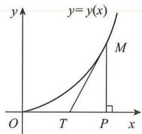

# 第六章 微分方程及其应用

## 基础题

### 一、选择题

**(1)** 下列选项中(C为任意常数)，是微分方程 $\dfrac{dy}{dx}+\dfrac{x}{y}=0$ 通解的是（　）.

A. $x^{2}+y^{2}=C^{2}$  
B. $x^{2}-y^{2}=C^{2}$  
C. $x^{2}+y^{2}=C$  
D. $x^{2}-y^{2}=C$

**(2)** 设 $y'+P(x)y=0$ 的一个特解为 $y=\cos2x$ ，则该方程满足 $y(0)=2$ 的特解为（　）.

A. $2\cos x$  
B. $2\cos2x$  
C. $\cos2x$  
D. $\cos2x+1$

**(3)** 微分方程 $y''+2y'-3y=\mathrm{e}^{-x}+x$ 的一个特解形式为 （　）.

A. $ae^{-x}+bx+c$  
B. $axe^{-x}+x(bx+c)$  
C. $axe^{-x}+bx+c$  
D. $ae^{x}+x(bx+c)$

**(4)** 设 $y_1(x),y_2(x)$ 是 $y'+P(x)y=0$ 的两个不同特解, 其中 $P(x)$ 在 $(-\infty,+\infty)$ 内连续, 且 $P(x)$ 不恒为 0, 则下列结论错误的是 （　）.

A. $y_1(x)-y_2(x)=$ 常数  
B. $C[y_1(x)-y_2(x)]$ 是方程的通解  
C. $y_1(x)-y_2(x)$ 在任一点不为 0  
D. $\dfrac{y_2(x)}{y_1(x)}\equiv$ 常数 $(y_1(x)\neq0)$

**(5)** 设 $y_1(x),y_2(x),y_3(x)$ 是微分方程 $y''+p(x)y'+q(x)y=f(x)$ 的三个线性无关的解, $f(x)\neq0$ , 则该方程的通解为 （　）.

A. $C_1y_1(x)+C_2y_2(x)+y_3(x)$  
B. $C_1y_1(x)+(1-2C_1)y_2(x)+C_1y_3(x)$  
C. $(C_1-C_2)y_1(x)+C_2y_2(x)+y_3(x)$  
D. $C_1y_1(x)+C_2y_2(x)+C_3y_3(x)(C_1+C_2+C_3=1)$

**(6)** 设 $y_1=\mathrm{e}^{-x},y_2=2x$ 是常系数齐次线性微分方程 $y'''+ay''+by'+cy=0$ 的两个解, 则该方程的通解是 （　）.

A. $c_1\mathrm{e}^{-x}+c_2+c_3x$  
B. $c_1\mathrm{e}^{-x}+c_2\mathrm{e}^x+c_3x$  
C. $c_1\mathrm{e}^{-x}+c_2\mathrm{e}^x+c_3$  
D. $c_1\mathrm{e}^{-x}+c_2xe^x+c_3$

**(7)** 设 $f(x)$ 在 $[0,+\infty)$ 上可导, $\lim_{x\to+\infty}f(x)=b(b\neq0),y(x)$ 为方程 $y'+ay=f(x)(a>0)$ 的任一解, 则 $y=y(x)$ 有水平渐近线 （　）.

A. $y=ab$  
B. $y=-ab$  
C. $y=\dfrac{b}{a}$  
D. $y=\dfrac{a}{b}$

### 二、填空题

**(8)** 微分方程 $(y-x\sin x)\mathrm{d}x+x\mathrm{d}y=0$ 的通解为 \_\_\_\_.

**(9)** 微分方程 $(1+y^{2})\mathrm{d}x+(2x-1)y\mathrm{d}y=0$ 的通解为 \_\_\_\_.

**(10)** $y'=\dfrac{y}{x}+\tan\dfrac{y}{x}$ 满足 $y(1)=\dfrac{\pi}{6}$ 的特解为 \_\_\_\_.

**(11)** 微分方程 $xy'=\sqrt{x^{2}+y^{2}}+y$ 的通解为 \_\_\_\_.

**(12)** 方程 $y''+2y'+y=xe^{x}$ 满足 $y(0)=0,y'(0)=0$ 的特解为 \_\_\_\_.

**(13)** 方程 $y''-3y'+2y=10e^{-x}\sin x$ 满足当 $x\to+\infty$ 时， $y(x)\to0$ 的特解为 \_\_\_\_.

**(14)** 方程 $(1-x^{2})y''-xy'=0$ 满足 $y(0)=0,y'(0)=1$ 的特解为 \_\_\_\_.

**(15)** 设二阶线性非齐次微分方程 $y''+p(x)y'+q(x)y=f(x)$ 有三个特解为 $x,e^{x},e^{-x}$ ，则该方程的通解为 \_\_\_\_.

**(16)** 设二阶常系数线性微分方程 $y''+ay'+by=ce^x$ 有特解 $y^*=\mathrm{e}^{-x}(1+xe^{2x})$ ，则该方程的通解为 \_\_\_\_.

### 三、解答题

**(17)** 求 $x^{2}y''-y'^{2}=0$ 过点 $P(1,0)$ ，且在点 P 与 y = x - 1 相切的积分曲线.

**(18)** 设 $f(x)$ 是连续函数，且 $f(x)=\cos x-\int_{0}^{x}(x-t)f(t)dt$ ，求 $f(x)$ .

**(19)** 设 $f(x)$ 可导, 对任何实数 $x,y$ 满足 $f(x+y)=\mathrm{e}^xf(y)+\mathrm{e}^yf(x)$ , 且 $f'(0)=\mathrm{e}$ , 求 $f(x)$ .

**(20)** 求微分方程 $y'''-y'=0$ 的一条积分曲线，使此积分曲线在原点处有拐点，且以直线 $y=2x$ 为切线.

**(21)** 设 $f(u)$ 有二阶连续导数, $z=f\left(\sqrt{x^2+y^2}\right)$ 满足 $\dfrac{\partial^2z}{\partial x^2}+\dfrac{\partial^2z}{\partial y^2}=x^2+y^2$ , 求 $z$ 的表达式.

**(22)** 设 $f(u)$ 在 $(0,+\infty)$ 内具有二阶导数, $z=xf\left(\dfrac{y}{x}\right)+yf\left(\dfrac{y}{x}\right)$ 满足

$$
x\dfrac{\partial^{2}z}{\partial x\partial y}+2y\dfrac{\partial^{2}z}{\partial y^{2}}=\dfrac{y}{x},z(x,x)=x,\dfrac{\partial z}{\partial x}\Big|_{(x,x)}=-\dfrac{3}{2}.
$$

求 $f(u)$ .

**(23)** 利用变换 $u=\mathrm{e}^x$ , 求微分方程 $y''-(2\mathrm{e}^x+1)y'+\mathrm{e}^{2x}y=\mathrm{e}^{3x}$ 的通解.

**(24)** 设 L 是一条平面曲线, 其上任意一点 $P(x,y)(x>0)$ 到原点的距离恒等于该点处的切线在 y 轴上的截距, 且 L 过点 $\left(\dfrac{1}{2},0\right)$ . 求:

(I) 曲线 L 的方程;

(II)L位于第一象限部分的一条切线,使该切线与L以及两坐标轴所围的面积最小.

**(25)** 设 $\hat{OA}$ 是连接 $O(0,0)$ 和 $A(1,1)$ 的一段向上凸的曲线弧, $P(x,y)$ 为 $\hat{OA}$ 上任一点, 曲线弧 $\hat{OP}$ 与有向线段 $\overline{OP}$ 所围图形的面积为 $x^{2}$ , 求曲线弧 $\hat{OA}$ 的方程.

**(26)** 设 $y=y(x)$ 满足 $xy'-(2x^{2}-1)y=x^{3}(x\geqslant1)$ , $y(1)=a$ .

(I) 求 $y(x)$ ;

(II) 若 $\lim_{x\to+\infty}\dfrac{y(x)}{x}$ 存在, 求曲线 $y=y(x)$ 的斜渐近线方程.

**(27)** 设 $f(x)$ 满足 $xf'(x)-f(x)=a(1-\ln x)+x^2\ (x>0,a\ne0),f(1)=1-a$.
**(I)** 求 $f(x)$ 的表达式；
**(II)** 若方程 $f'(x)=0$ 在 $x\in(0,+\infty)$ 内有唯一实根，求 $a$ 的取值范围.

## 综合题

### 一、选择题

**(1)** 下列方程中，以 $y=C_{1}e^{x}+C_{2}\cos x+C_{3}\sin x(C_{1},C_{2},C_{3}$ 为任意常数) 为通解的是 （　）.

A. $y'''-y''+y'-y=0$  
B. $y'''+y''+y'-y=0$  
C. $y'''+y''-y'-y=0$  
D. $y'''-y''-y'-y=0$

**(2)** 若二阶常系数线性齐次微分方程 $y''+py'+qy=0$ 的通解为 $y=C_{1}e^{x}+C_{2}xe^{x}$ ，则非齐次微分方程 $y''+py'+qy=x$ 满足 $y(0)=2,y'(0)=0$ 的特解为 $y=(\quad)$ .

A. $xe^{x}-x-2$  
B. $xe^{x}-x+2$  
C. $-xe^{x}+x+2$  
D. $-xe^{x}-x+2$

**(3)** 设 $C$ 为任意常数, 则以 $y=\mathrm{e}^{Cx+x^2}$ 为通解的一阶微分方程为 （　）.

A. $xy'-y\ln y=x^2y$  
B. $xy'+y\ln y=xy^2$  
C. $xy'-y\ln y^2=xy$  
D. $xy'+y\ln y=xy$

**(4)** 设 $y_{1},y_{2}$ 是一阶线性非齐次微分方程 $y'+P(x)y=Q(x)$ 的两个解，若常数 $\lambda,\mu$ ，使得 $\lambda y_{1}+\mu y_{2}$ 是该方程的解， $\lambda y_{1}-\mu y_{2}$ 是对应的齐次微分方程的解，则（　）.

A. $\lambda=-\dfrac{1}{2},\mu=-\dfrac{1}{2}$  
B. $\lambda=\dfrac{1}{2},\mu=\dfrac{1}{2}$  
C. $\lambda=\dfrac{1}{3},\mu=\dfrac{2}{3}$  
D. $\lambda=\dfrac{2}{3},\mu=\dfrac{2}{3}$

**(5)** 设 $y_{1}(x)$ 与 $y_{2}(x)$ 是非齐次微分方程 $y'+P(x)y=Q(x)$ 的两个解. 若 $\lambda y_{1}(x)+\mu y_{2}(x)$ 仍是该方程的解, 则 $\mathrm{e}^{\lambda^3+\mu^3}$ 的最小值为 （　）.

A. $\mathrm{e}^{-1}$  
B. $\mathrm{e}^{1/2}$  
C. $\mathrm{e}^{1/4}$  
D. $\mathrm{e}^{1/3}$

**(6)** 设 $y=y(x)$ 是 $y''+ay'+by=0$ 的解, 其中 $a,b$ 为正常数, 则 （　）.

A. $\lim_{x\to+\infty}y(x)=0$  
B. $\lim_{x\to+\infty}y(x)=+\infty$  
C. $\lim_{x\to+\infty}y(x)=-\infty$  
D. $\lim_{x\to+\infty}y(x)$ 不存在, 且不为 $\infty$

**(7)** 设 $f(x)$ 是定义在 $R$ 上的偶函数, 且 $f(x)+f'(x)=2\mathrm{e}^x$ , 若 $a[f(x)-\mathrm{e}^x]\leqslant x$ 在 $R$ 上恒成立, 则 $a$ 的取值范围为 （　）.

A. $(-\infty,0]$  
B. $\left(-\infty,-\dfrac{1}{\mathrm{e}}\right]$  
C. $(-\infty,-1)$  
D. $(-\infty,-\mathrm{e}]$

### 二、填空题

**(8)** 微分方程 $y'=\dfrac{y}{x+(y+1)^{2}}$ (y 不为常函数) 的通解为 \_\_\_\_.

**(9)** 微分方程 $y''-y=\sin x$ 满足 $y(0)=0,y'(0)=\dfrac{3}{2}$ 的特解为 \_\_\_\_.

**(10)** 微分方程 $y'=\dfrac{y^{2}-x}{2y(x+1)}$ 的通解为 \_\_\_\_.

**(11)** 微分方程 $\dfrac{dy}{dx}=\dfrac{y-x}{y+x}$ 满足 $y(1)=0$ 的特解为 \_\_\_\_.

**(12)** 微分方程 $y'\sec^{2}y+\dfrac{x}{1+x^{2}}\tan y=x$ 满足 $y(0)=0$ 的特解为 \_\_\_\_.

**(13)** 微分方程 $y''+y=x+\cos x$ 的通解为 \_\_\_\_.

**(14)** 微分方程 $y''-y=\sin^{2}x$ 的通解为 \_\_\_\_.

**(15)** 设 $f(x)$ 有连续导数, 对任意 $a$ 满足 $f(x+a)=\int_{x}^{x+a}\dfrac{t(t^2+1)}{f(t)}dt+f(x)$ , 且 $f(1)=\sqrt{2}$ , 则 $f(x)=$ \_\_\_\_.

**(16)** 设函数 $y(x)$ 满足 $y''+2ay'+b^2y=0(a>b>0)$ ，且 $y(0)=1,y'(0)=1$ ，则 $\int_{0}^{+\infty}y(x)\,\mathrm{d}x=$ \_\_\_\_.

**(17)** 设微分方程 $y''+ay'+y=0$ 的每一个解 $y(x)$ 在 $[0,+\infty)$ 上有界, 则实数 $a$ 的取值范围为 \_\_\_\_.

### 三、解答题

**(18)** 设 $f(x)$ 满足 $f(x+y)=\dfrac{f(x)+f(y)}{1-f(x)f(y)}$ , 且 $f'(0)$ 存在, 求 $f'(x)$ 及 $f(x)$ .

**(19)** 设 $y=y(x)$ 满足 $x^2y'+y=x^2\mathrm{e}^{1/x}(x>0)$ ，且 $y(1)=3\mathrm{e}$ .

(I) 求 $y=y(x)(x>0)$ 的全部渐近线方程;

(II) 讨论曲线 $y=y(x)(x>0)$ 与 $y=k(k>0)$ 不同交点的个数.

**(20)** 利用变量替换 $x=\sin t,y=y(t)\left(0<t<\dfrac{\pi}{2}\right)$ 化简方程 $(1-x^2)\dfrac{d^2y}{dx^2}-x\dfrac{dy}{dx}+y=0$ , 并求该方程的通解.

**(21)** 设微分方程 $\dfrac{d^{2}y}{dx^{2}}+\dfrac{dy}{dx}+e^{-2x}y=e^{-3x}.$

(I) 利用变换 $t=e^{-x}$ 将微分方程化为 y 关于 t 的方程, 并求原方程的通解 $y(x)$ ;

(II) 若 (I) 中的 $y(x)$ 满足 $\lim_{x\to+\infty}y(x)=1,y(0)=1$ ，求 $y(x)$ .

(I) 若视 x 为因变量, y 为自变量, 化简该方程;

**(22)** 设 $y''+(4x+e^{2y})y'^{3}=0.$

(II) 求该方程的通解.

**(23)** 设二阶常系数非齐次线性微分方程 $y''+ay'+by=(cx+d)\mathrm{e}^{2x}$ 有特解 $y=2\mathrm{e}^x+(x^2-1)\mathrm{e}^{2x}$ ，求该方程的通解，并求 $a,b,c,d$ 的值.

**(24)** 设 $y(x)$ 在 $[x_0,+\infty)$ 上有一阶连续导数, 且 $\lim_{x\to+\infty}[y'(x)+y(x)]=k$ , 求 $\lim_{x\to+\infty}y(x)$ .

**(25)** 设 $f(x),g(x)$ 满足 $f'(x)=g(x),g(x)=\int_{0}^{x}[1-f(t)]dt+1$ ，且 $f(0)=1$ ，求 $I=\int_{0}^{\pi/2}\mathrm{e}^{-x}[g(x)-f(x)]\,\mathrm{d}x$ .

**(26)** 设 $f'(x)=1+\int_{0}^{x}[-6\cos2t-f(t)]dt$ ，且 $f(0)=1$ . 计算 $I=\int_{0}^{\pi}\left[\dfrac{f(x)}{x+1}+f'(x)\ln(1+x)\right]\mathrm{d}x$ .

**(27)** 设 $y=y(x)$ 有一阶连续导数， $y(0)=1$ ，且满足 $y'(x)+3\int_{0}^{x}y'(t)dt+2x\int_{0}^{1}y(xu)\,\mathrm{d}u+\mathrm{e}^{-x}=0$ ，求 $y=y(x)$ .

**(28)** 设 $f(x)$ 有二阶连续导数, 且 $f(x)=\int_{0}^{x}f(1-t)dt+1$ , 求 $f(x)$ .

**(29)** 设 $f(x)$ 在 $(0,+\infty)$ 内有定义， $f'(1)=1$ ，当 $x,y\in(0,+\infty)$ 时，满足 $f(xy)=yf(x)+xf(y)$ .

(I) 证明: $f(x)$ 在 $(0,+\infty)$ 内可导, 且 $f'(x)=\dfrac{f(x)}{x}+1$ ;

(II) 求函数 $f(x)$ 的极值.

**(30)** 设 $f(x)$ 满足 $f'(x)=\dfrac{1}{x}f(x)+x\cos x(x>0)$ , 且 $\lim_{x\to0^+}\dfrac{f(x)}{x}=0$ .

(I) 求 $f(x)$ 的表达式;

(II) 若 $y=f(x)$ 在 $[0,n\pi]$ 上与 x 轴所围图形的面积为 $A_{n}(n=1,2,\cdots)$ ，求 $\lim_{n\to\infty}\dfrac{A_{n}}{(n+1)^{2}}$ .

**(31)** 设 $f(x)$ 满足 $\mathrm{e}^{f(x)}[f'(x)-1]=x-1(x\geqslant0)$ , $f(0)=0$ , 数列 $\{a_{n}\}$ 满足 $a_{1}=1$ , $a_{n+1}=f(a_{n})$ ( $n=1,2,\cdots$ ).

(I) 证明: $\lim_{n\to\infty}a_{n}$ 存在, 并求其值;

(II) 求 $\lim_{n\to\infty}\dfrac{a_{n+1}}{a_{n}^{2}}$ .

**(32)** 设 $f(t)$ 有二阶连续导数, $f(1)=f'(1)=1$ , 在 $x>0$ 的平面区域内, 存在函数 $u(x,y)$ , 使得

$$
\mathrm{d}u(x,y)=\left[\dfrac{y^{2}}{x}+xf\left(\dfrac{y}{x}\right)\right]\mathrm{d}x+\left[y-xf^{\prime}\left(\dfrac{y}{x}\right)\right]\mathrm{d}y.
$$

求 $f(t)$ 及 $f(t)$ 的极值.

**(33)** 设 $f(t)$ 在 $(0,+\infty)$ 内有二阶连续导数, 记 $g(x,y)=f\left(\dfrac{y}{x}\right)$ . 若 $g(x,y)$ 满足

$$
x^{3}\dfrac{\partial^{2}g}{\partial x^{2}}+x^{2}y\dfrac{\partial^{2}g}{\partial x\partial y}+xy^{2}\dfrac{\partial^{2}g}{\partial y^{2}}=y,\text{且}g(y,y)=1,\dfrac{\partial g}{\partial y}\Big|_{(y,y)}=\dfrac{2}{y},
$$

求 $f(t)$ .

**(34)** 设 $f(x)$ 在 $(-\infty,+\infty)$ 内有连续导数, $f(x)>0$ , 且满足 $(1+x^2)f'(x)+2nxf(x)=0$ ( $n$ 为大于 1 的正整数), $f(0)=1$ ,

(I) 求 $f(x)$ ;

(II) 记 $S_{n}$ 为曲线 $y=f(x)$ 与 $x$ 轴之间的无界区域的面积, 求 $\lim_{n\to\infty}\left(\dfrac{S_{n}}{S_{n-1}}\right)^{n}$ .

**(35)** 设 $f(x)$ 在 $[0,1]$ 上有连续导数, $f(0)=1,f_{+}^{\prime}(0)=1$ , 且

$$
\iint_{D}f^{\prime\prime}(x+y)\mathrm{d}x\mathrm{d}y=\iint_{D}\left[f(x+y)+(x-y)^{3}\right]\mathrm{d}x\mathrm{d}y.
$$

其中 $D=\left\{(x,y)\mid0\leqslant y\leqslant t-x,0\leqslant x\leqslant t\right\}(0<t\leqslant1)$ ，求 $f(x)$ .

**(36)** 设 $f(x)$ 满足 $f'(x)+f(x)=\mathrm{e}^{-x},f(0)=0$ .

(I) 求 $y=f(x)$ 的极值与拐点;

(II) 当 $0<x_{1}<1<x_{2}$ 时, 有 $f(x_{1})=f(x_{2})$ , 证明: $x_{1}+x_{2}>2$ .

**(37)** 设上凸曲线 $y=y(x)(y>0)$ 上任一点 $M(x,y)$ 处的切线与 x 轴交于点 N，且满足 $|OM|=|ON|$ ， $y(0)=1,y'(x)>0$ ，求 $y=y(x)$ .

**(38)** 设 $y=y(x)$ 是向上凸的连续曲线，其上任一点 $(x,y)$ 处的曲率为 $\dfrac{1}{\sqrt{1+y'^2}}$ ，且此曲线上点 (0,1) 处的切线方程为 $y=x+1$ ，求该曲线的方程.

**(39)** 设曲线 $y=y(x)(y>0)$ 在点 (0,2) 处有水平切线，曲线上任一点 $(x,y)$ 处的曲率

$$
K=\dfrac{1}{2\sqrt{2}}\dfrac{1}{\sqrt{y}\left(1+y^{\prime2}\right)},y^{\prime\prime}(x)>0.
$$

记 $y=y(x),x=0,x=2$ 及 $x$ 轴所围图形为 $D$ , 求 $y=y(x)(x\geqslant0)$ , 并求 $D$ 绕 $x=2$ 旋转一周所得旋转体的体积.

**(40)** (I) 设 $a(t)$ 在 $[0,+\infty)$ 上是非负连续函数，证明：当且仅当 $\int_0^{+\infty}a(t)dt$ 发散时，微分方程 $\dfrac{\mathrm{d}x}{dt}+a(t)x=0$ 的每一个解 $x(t)$ 满足 $\lim_{t\to+\infty}x(t)=0$ ;

(II) 设 $a>0,f(t)$ 在 $[0,+\infty)$ 上连续有界, 证明: 方程 $\dfrac{\mathrm{d}x}{\mathrm{d}t}+ax=f(t)(t\geqslant0)$ 的所有解在 $[0,+\infty)$ 上有界.

**(41)** 设曲线 $y=y(x)$ 有二阶连续导数， $y''(x)>0$ ，其上任意一点 $(x,y)$ 处的曲率 $K=\dfrac{1}{2y^2\cos\alpha}(\cos\alpha>0)$ ，其中 $\alpha$ 为该曲线在相应点处的切线的倾角，且该曲线在点 (1,1) 处取得极小值，求曲线 $y=y(x)$ .

**(42)** 设函数 $y(x)(x\geqslant0)$ 二阶可导, 且 $y'(x)>0,y(0)=1$ , 过曲线 $y=y(x)$ 上任一点 $P(x,y)$ 作曲线的切线及 $x$ 轴的垂线, 上述两条直线与 $x$ 轴所围三角形的面积记为 $S_1$ , 区间 $[0,x]$ 上以 $y=y(x)$ 为曲边的曲边梯形的面积记为 $S_2$ , 且 $2S_1-S_2=1$ , 求曲线 $y=y(x)$ .

**(43)** 设在第一象限内的曲线 $y=y(x)$ 满足 $y(0)=0$ ，且 $y'(x)>0$ ，曲线上任一点 $M(x,y)$ 处的切线段为 $\overline{MT}$ ，点 $M$ 到 $x$ 轴的垂线为 $\overline{PM}$ ，如图所示， $\triangle PMT$ 的面积与曲边三角形 $OPM$ 的面积之比恒为常数 $k\left(k>\dfrac{1}{2}\right)$ . 求 $y=y(x)$ .

**(44)** 设 $y(x)$ 在 $[0,+\infty)$ 上有二阶连续的导数，点 $P(x,y)(x>0)$ 为凹曲线 $y=y(x)$ 上任意一点，沿曲线从点 (0,1) 到点 $P(x,y)$ 的弧长在数值上等于该曲线在点 $P(x,y)$ 处的切线的斜率，且曲线在点 (0,1) 处有水平切线.

(I) 求 $y=y(x)$ 的表达式;

(II) 求曲线 $y=y(x)$ 从点 $\left(\ln2,\dfrac{5}{4}\right)$ 到点 $\left(\ln3,\dfrac{5}{3}\right)$ 的一段弧长.

**(45)** 一架质量为 4.5t 的歼击机以 600km/h 的航速开始着陆，在减速伞的作用下滑跑 500m 后速度减为 100km/h，设减速伞的阻力与飞机的速度成正比，忽略飞机所受的其他外力，求减速伞的阻力系数。若保障飞机安全着陆，跑道长度至少应为多少？

**(46)** 设一单位质量的质点沿 $x$ 轴正向运动, 所受力为 $F(x)=-2\sin2x$ , 质点的初始位置为原点, 初速度为 2. 求位移函数 $x=x(t)$ ( $t$ 表示时间), 并求质点运动的最远距离.

## 拓展题

### 三、解答题

**(1)** 设环境保持恒定温度 $20^{\circ}C$ ，有一物体的温度在 10s 内从 $100^{\circ}C$ 降到 $60^{\circ}C$ ，若物体温度下降的速度与该物体温度与环境温度之差成正比，问此物体从温度 $100^{\circ}C$ 降到 $25^{\circ}C$ 需要多少时间？

**(2)** 设 $f(t)$ 在 $[0,+\infty)$ 上连续，且满足 $f(t)=\mathrm{e}^{4\pi t^2}+\iint_{x^2+y^2\leqslant4t^2}\left[x^2-y^2+f\left(\dfrac{1}{2}\sqrt{x^2+y^2}\right)\right]\mathrm{d}x\,\mathrm{d}y$ .

(I) 求 $f(t)$ ;

(II) 求 $\lim_{t\to0^{+}}[f(t)]^{\dfrac{1}{t^{2}}}$ .

**(3)** 设 $y_1=x,y_2=xu(x)$ 是微分方程 $(x^2\ln x)y''-xy'+y=0(x>0)$ 的两个解, 若 $u(1)=1,u(\mathrm{e}^{-1})=0$ , 求 $u(x)$ , 并求该方程的通解.

